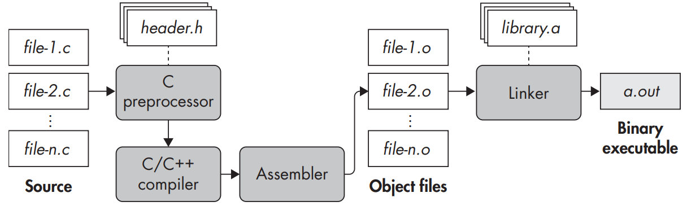
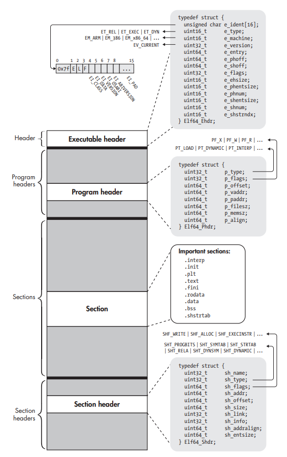
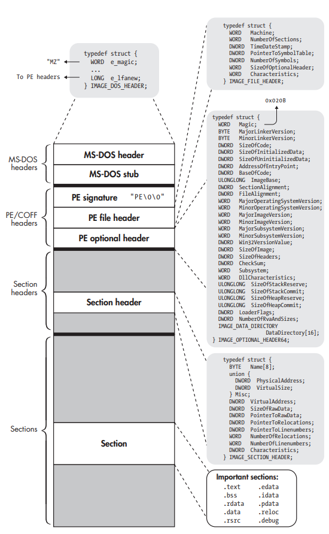

# 第一部分、二进制格式

## 1. 二进制剖析

系统运行的机器码被称作**二进制码**。包含二进制可执行程序的文件被称作**二进制可执行文件**。

### 1.1 C编译过程

C语言源代码转换为二进制文件需要四个步骤：**预处理**、**编译**、**汇编**、**链接**。



#### 1.1.1 预处理阶段

为提高编码效率，C语言通过预处理程序提供了一些语言功能，经过预处理之后的源代码才能进行真正意义上的词法分析。预处理常以'#'开头。

预处理操作包括：

- 文件包含：将被包含的文件内容复制到此处。

  ```c
  #include <文件名> // 在编译器安装目录中搜索文件
  #include "文件名" // 在当前工作目录内搜索文件
  ```

  

- 宏定义：用比较简洁的字符串替换冗长不易识别的字符串。

  ```c
  #define 标识符 符号序列 // 使指定标识符的预处理生效
  #define 标识符(参数) 符号序列 // 带参数的宏定义
  #undef 标识符 // 使指定标识符的预处理失效，宏标识符将被视为无效信息
  ```

  

- 条件编译：让编译器有选择地忽略部分代码不进行编译。

  ```c
  #if 常量表达式 / #ifdef 标识符 / #ifndef 标识符
  文本
  #elif 常量表达式 / #else
  文本
  #endif
  ```

  

### 1.1.2 编译阶段

预处理阶段完成后，将对代码进行编译。编译阶段将预处理过的代码翻译为汇编语言代码，并且大部分编译器可以在此阶段按照优化等级对汇编代码进行优化，例如gcc的-O0到-O3。并可以指定汇编代码的格式，例如gcc默认使用AT&T语法格式的汇编代码，gcc的-masm=intel使用Intel语法格式的汇编代码。


### 1.1.3 汇编阶段

汇编阶段将汇编代码转换为**目标文件**或者**模块**。目标文件是**可重定位文件**，可重定位文件不需要放置在内存的特定位置，相反，它可以随意在内存中移动。


### 1.1.4 链接阶段

链接阶段将所有目标文件链接成一个二进制可执行文件，链接阶段有时还包含额外的优化过程，称作**链接时优化**(LTO, link-time optimization)。

在链接阶段之前，还不知道引用的代码和数据的地址，所以目标文件仅包含**重定位符号**，重定位符号指示了如何处理函数和变量的引用，依赖重定位符号的引用被称作**符号引用**。

链接器会解析大部分符号引用，对库的引用取决于库的类型。库分为**静态库**和**动态库/共享库**，静态库将被合并到可执行文件中，动态库只在内存中存在一份，所以所有程序共享动态库，链接阶段不能解析对动态库的符号引用，当可执行文件加载到内存时，**动态链接器**会解析对动态库的符号引用。


## 1.2 符号和二进制文件

### 1.2.1 查看符号信息

```bash
$ readelf --syms a.out
```


二进制格式和调试信息格式：

| Binary Format | Debugging Format| Difference |
| ------------- | ---- | ---- |
| ELF | DWARF | unsually embedded within the binary |
| PE | PDB | a separate symbol file |


调试符号信息：

- 源代码和二进制指令之间的映射
- 函数的参数
- 栈帧


PDB文件的信息：

- Public symbols (typically all functions, static and global variables)
- A list of object files that are responsible for sections of code in the executable
- Frame pointer optimization information (FPO)
- Name and type information for local variables and data structures
- Source file and line number information


stripped PDB文件的信息：

- Public symbols (typically only non-static functions and global variables)
- A list of object files that are responsible for sections of code in the executable
- Frame pointer optimization information (FPO)


### 1.2.2 去掉二进制文件不必要的符号信息

```bash
$ strip --strip-all a.out
```


## 1.3 反汇编二进制文件

### 1.3.1 查看目标文件

```bash
$ objdump -sj .rodata compilation_example.o              # 查看.rodata段的内容
$ objdump -M intel -d compilataion_example.o             # 以Intel的语法格式反汇编目标文件的代码
$ objdump --relocs compilataion_example.o                # 查看目标文件的重定位信息
```


### 1.3.2 解析二进制可执行文件

```bash
$ objdump -M intel -d a.out
```

去掉不必要的符号信息后的二进制文件保留了段，但是所 有函数都被合并到了代码段。


## 1.4 加载并执行二进制文件


运行二进制文件的过程：

1. 建立一个新进程
2. 操作系统映射一个解释器到进程虚拟内存
3. 内核将控制权交给解释器，解释器开始在用户空间工作
4. 解释器将二进制文件加载到虚拟内存空间
5. 解析二进制文件，找到二进制文件所用的动态库，并将其映射到虚拟内存空间
6. 重定位，将二进制文件代码段指向动态库的引用修改为正确的地址
7. 寻找二进制程序的入口，并将控制权交给二进制程序，二进制程序开始执行


## 2. ELF格式

ELF (Executable and Linkable Format，可执行和链接格式)，ELF包含四种类型的内容：

1. 一个**可执行头部(executable header)**
2. 一系列可选的**程序头(program header)**
3. 许多**节(section)**
4. 一系列可选的**节头(section header)**


**64位ELF二进制文件概览**




### 2.1 可执行头(Executable Header)

每个ELF文件都以可执行头开始，可执行头表明这是一个ELF格式文件，并表明了它是哪一类ELF文件，以及去哪里找到其它内容。


```bash
$ readelf -h a.out
ELF Header:
  Magic:   7f 45 4c 46 02 01 01 00 00 00 00 00 00 00 00 00
  Class:                             ELF64
  Data:                              2's complement, little endian
  Version:                           1 (current)
  OS/ABI:                            UNIX - System V
  ABI Version:                       0
  Type:                              DYN (Position-Independent Executable file)
  Machine:                           Advanced Micro Devices X86-64
  Version:                           0x1
  Entry point address:               0x1060
  Start of program headers:          64 (bytes into file)
  Start of section headers:          13992 (bytes into file)
  Flags:                             0x0
  Size of this header:               64 (bytes)
  Size of program headers:           56 (bytes)
  Number of program headers:         13
  Size of section headers:           64 (bytes)
  Number of section headers:         31
  Section header string table index: 30
```


#### ELF64_Ehdr

```c
#define EI_NIDENT	16

typedef struct
{
  unsigned char e_ident[EI_NIDENT];     /* Magic number and other info */
  Elf64_Half    e_type;                 /* Object file type */
  Elf64_Half    e_machine;              /* Architecture */
  Elf64_Word    e_version;              /* Object file version */
  Elf64_Addr    e_entry;                /* Entry point virtual address */
  Elf64_Off     e_phoff;                /* Program header table file offset */
  Elf64_Off     e_shoff;                /* Section header table file offset */
  Elf64_Word    e_flags;                /* Processor-specific flags */
  Elf64_Half    e_ehsize;               /* ELF header size in bytes */
  Elf64_Half    e_phentsize;            /* Program header table entry size */
  Elf64_Half    e_phnum;                /* Program header table entry count */
  Elf64_Half    e_shentsize;            /* Section header table entry size */
  Elf64_Half    e_shnum;                /* Section header table entry count */
  Elf64_Half    e_shstrndx;             /* Section header string table index */
} Elf64_Ehdr;
```

- e_ident：前四个字节为幻数(magic value)，表明这是一个ELF格式文件。e_ident各个位的含义:

| Name          | Value | Purpose                                                      |
| ------------- | ----- | ------------------------------------------------------------ |
| EI_MAG0       | 0     | 幻数，0x7f                                                   |
| EI_MAG1       | 1     | 幻数，'E'                                                    |
| EI_MAG2       | 2     | 幻数，'L'                                                    |
| EI_MAG3       | 3     | 幻数，'F'                                                    |
| EI_CLASS      | 4     | 32位或64位的目标文件                                         |
| EI_DATA       | 5     | 大端或小端编码                                               |
| EI_VERSION    | 6     | ELF文件头的版本号                                            |
| EI_OSABI      | 7     | ABI扩展标识符，0表示UNIX System V ABI，其它值表示使用了其它操作系统的扩展 |
| EI_ABIVERSION | 8     | ABI版本                                                      |
| EI_PAD        | 9     | 填充开始位，置0，保留                                        |

- e_type：表明文件类型，文件类型有以下几种：

| Name      | Value  | Meaning      |
| --------- | ------ | ------------ |
| ET_NONE   | 0      | 无文件类型   |
| ET_REL    | 1      | 重定位文件   |
| ET_EXEC   | 2      | 可执行文件   |
| ET_DYN    | 3      | 共享目标文件 |
| ET_CORE   | 4      | 核心文件     |
| ET_LOPROC | 0xff00 | 由处理器指定 |
| ET_HIPROC | 0xffff | 由处理器指定 |

- e_machine：表明该文件所需的机器架构。

| Name           | Value | Meaning                |
| -------------- | ----- | ---------------------- |
| EM_NONE        | 0     | 无架构                 |
| EM_M32         | 1     | AT&T WE 32100          |
| EM_SPARC       | 2     | SPARC                  |
| EM_386         | 3     | Intel架构              |
| EM_64K         | 4     | Motorola 68000         |
| EM_88K         | 5     | Motorola 88000         |
| EM_860         | 7     | Intel 80860            |
| EM_MIPS        | 8     | MIPS RS3000 Big-Endian |
| EM_MIPS_RS4_BE | 10    | MIPS RS4000 Big-Endian |
| RESERVED       | 11-16 | 保留备用               |

- e_version：表明目标文件的版本。1表示文件的原始格式，更高的数字可以用来表明扩展文件的格式。

| Name       | Value | Meaning  |
| ---------- | ----- | -------- |
| EV_NONE    | 0     | 非法版本 |
| EV_CURRENT | 1     | 当前版本 |

- e_entry：指出系统应该将控制权转交给的虚拟地址，然后进程开始执行。如果文件没有入口地址，则该项为0。

- e_phoff：Program Header Table在文件中的偏移量，如果文件没有Program Header Table，则该项为0。

- e_shoff：Section Header Table在文件中的偏移量，如果文件没有Section Header Table，则该项为0。

- e_flags：与处理器架构相关的标志位。对于x86架构，e_flags常设置为0，不用标志位。对于ARM架构，e_flags可以设置文件格式惯例、栈的组织方式等关于接口的额外细节信息并告知给嵌入式操作系统。

- e_ehsize：ELF Header的大小。

- e_phentsize：Program Header Table的每一项的大小。所有表项的大小相同。

- e_phnum：Program Header Table的项目数量。e_phentsize * e_phnum表明了Program Header Table的总大小。如果文件中没有Program Header Table，则e_phnum为0。

- e_shentsize：Section Header Table的每一项的大小。所有表项的大小相同。

- e_shnum：Section Header Table的项目数量。e_shentsize * e_shnum表明了Section Header Table的总大小。如果文件中没有Section Header Table，则e_shnum为0。

- e_shstrndx：Section Name String Table(.shstrtab)节在Section Header Table里的索引下标。Section Name String Table(.shstrtab)储存着所有节的名称。

```bash
$ readelf -x .shstrtab a.out

Hex dump of section '.shstrtab':
  0x00000000 002e7379 6d746162 002e7374 72746162 ..symtab..strtab
  0x00000010 002e7368 73747274 6162002e 696e7465 ..shstrtab..inte
  0x00000020 7270002e 6e6f7465 2e676e75 2e70726f rp..note.gnu.pro
  0x00000030 70657274 79002e6e 6f74652e 676e752e perty..note.gnu.
  0x00000040 6275696c 642d6964 002e6e6f 74652e41 build-id..note.A
  0x00000050 42492d74 6167002e 676e752e 68617368 BI-tag..gnu.hash
  0x00000060 002e6479 6e73796d 002e6479 6e737472 ..dynsym..dynstr
  0x00000070 002e676e 752e7665 7273696f 6e002e67 ..gnu.version..g
  0x00000080 6e752e76 65727369 6f6e5f72 002e7265 nu.version_r..re
  0x00000090 6c612e64 796e002e 72656c61 2e706c74 la.dyn..rela.plt
  0x000000a0 002e696e 6974002e 706c742e 676f7400 ..init..plt.got.
  0x000000b0 2e706c74 2e736563 002e7465 7874002e .plt.sec..text..
  0x000000c0 66696e69 002e726f 64617461 002e6568 fini..rodata..eh
  0x000000d0 5f667261 6d655f68 6472002e 65685f66 _frame_hdr..eh_f
  0x000000e0 72616d65 002e696e 69745f61 72726179 rame..init_array
  0x000000f0 002e6669 6e695f61 72726179 002e6479 ..fini_array..dy
  0x00000100 6e616d69 63002e64 61746100 2e627373 namic..data..bss
  0x00000110 002e636f 6d6d656e 7400              ..comment.
```


### 2.2 节头(Section Headers)

ELF二进制文件将代码和数据从逻辑上划分为多个连续的、不重叠的块，这种块称之为**节(section)**。每个节都由**节头(section header)**进行描述，节头指定了节的属性和位置。**节头表(section header table)**里保存了所有节的节头信息。

节头仅用于链接阶段，故不需要链接的ELF文件可以不要节头表。相似的，程序头表，也即段表，仅用于执行阶段，故不需要执行的ELF文件可以不要程序头表。


#### Elf64_Shdr

```c
typedef struct
{
  Elf64_Word    sh_name;                /* Section name (string tbl index) */
  Elf64_Word    sh_type;                /* Section type */
  Elf64_Xword   sh_flags;               /* Section flags */
  Elf64_Addr    sh_addr;                /* Section virtual addr at execution */
  Elf64_Off     sh_offset;              /* Section file offset */
  Elf64_Xword   sh_size;                /* Section size in bytes */
  Elf64_Word    sh_link;                /* Link to another section */
  Elf64_Word    sh_info;                /* Additional section information */
  Elf64_Xword   sh_addralign;           /* Section alignment */
  Elf64_Xword   sh_entsize;             /* Entry size if section holds table */
} Elf64_Shdr;
```

- sh_name：节的名称，它的值是节的名称在字符串表(string table, .strtab)中的索引。

- sh_type：节的类型。

| Name         | Value      | Meaning                                                      |
| ------------ | ---------- | ------------------------------------------------------------ |
| SHT_NULL     | 0          | 没有相关的节与之对应，其它字段的值未定义。                   |
| SHT_PROGBITS | 1          | 该节存储着程序定义的信息，它的格式和含义仅由程序定义。       |
| SHT_SYMTAB   | 2          | 符号表，存放符号信息。参见[Elf64_Sym](####Elf64_Dyn)。       |
| SHT_STRTAB   | 3          | 字符串表，存放符号名称和程序中用到的字符串。                 |
| SHT_RELA     | 4          | 重定位节，包含重定位入口。参见[Elf64_Rela](####Elf64_Rela)。 |
| SHT_HASH     | 5          | 这样的节中包含一个符号哈希表，参与动态链接的目标文件必须有一个哈希表。 |
| SHT_DYNAMIC  | 6          | 包含动态链接的信息。参见[Elf64_Dyn](####Elf64_Dyn)。         |
| SHT_NOTE     | 7          | 标记文件的信息。                                             |
| SHT_NOBITS   | 8          | 这种节不含任何字节，也不占用文件空间，节头中的**sh_offset**字段只是概念上的偏移 |
| SHT_REL      | 9          | 重定位节，包含重定位条目。参见[Elf64_Rel](####Elf64_Rel)。   |
| SHT_SHLIB    | 10         | 保留，语义未指定。                                           |
| SHT_DYNSYM   | 11         | 用于动态链接的符号表，是symbol table的子集。                 |
| SHT_LOPROC   | 0x70000000 | 保留，由处理器指定语义。                                     |
| SHT_HIPROC   | 0x7fffffff | 保留，由处理器指定语义。                                     |
| SHT_LOUSER   | 0x80000000 | 由应用程序指定语义。                                         |
| SHT_HIUSER   | 0xffffffff | 由应用程序指定语义。                                         |

- sh_flags：表明了节的属性。

| Name          | Value      | Meaning                  |
| ------------- | ---------- | ------------------------ |
| SHF_WRITE     | 0x1        | 该节包含可写的数据       |
| SHF_ALLOC     | 0x2        | 该节占用内存空间         |
| SHF_EXECINSTR | 0x4        | 该节包含可执行的机器指令 |
| SHF_MASKPROC  | 0xf0000000 | 高四位由处理器指定语义   |

- sh_addr：如果这个节会出现在进程的内存映像中，则该项指出了节的第一个字节的内存地址。否则，该项为0。

- sh_offset：这个节在文件中的偏移量。

- sh_size：节的大小。SHT_NOBITS类型的节的sh_size可能为0，但是它所占的实际空间为0。

- sh_link：它的值为Section Header Table的索引下标。它的含义由节的类型决定。

- sh_info：它保存了额外信息。它的含义由节的类型决定。

**sh_link**和**sh_info**的含义：

| sh_type                | sh_link                                | sh_info                  |
| ---------------------- | -------------------------------------- | ------------------------ |
| SHT_DYNAMIC            | 该节中的条目所使用的字符串表的节头索引 | 0                        |
| SHT_HASH               | 哈希表所适用的符号表的节头索引         | 0                        |
| SHT_REL、SHT_RELA      | 相关符号表的节头索引                   | 需要重定位的节的节头索引 |
| SHT_SYMTAB、SHT_DYNSYM | 由操作系统指定                         | 由操作系统指定           |
| other                  | SHN_UNDEF                              | 0                        |

- sh_addralign：表明了节需要对齐的字节数。0和1表示不对齐，其它的值必须为2的指数倍。

- sh_entsize：类似符号表等节拥有固定表项大小的表，该字段指明了表项的大小。0表示该节不含有固定表项大小的表。


### 2.3 节(Sections)

ELF文件由一系列的节组成，每一节都有不同的含义，负责不同的工作。

```bash
$ readelf --setions --wide a.out
There are 31 section headers, starting at offset 0x36a8:

Section Headers:
  [Nr] Name              Type            Address          Off    Size   ES Flg Lk Inf Al
  [ 0]                   NULL            0000000000000000 000000 000000 00      0   0  0
  [ 1] .interp           PROGBITS        0000000000000318 000318 00001c 00   A  0   0  1
  [ 2] .note.gnu.property NOTE            0000000000000338 000338 000030 00   A  0   0  8
  [ 3] .note.gnu.build-id NOTE            0000000000000368 000368 000024 00   A  0   0  4
  [ 4] .note.ABI-tag     NOTE            000000000000038c 00038c 000020 00   A  0   0  4
  [ 5] .gnu.hash         GNU_HASH        00000000000003b0 0003b0 000024 00   A  6   0  8
  [ 6] .dynsym           DYNSYM          00000000000003d8 0003d8 0000a8 18   A  7   1  8
  [ 7] .dynstr           STRTAB          0000000000000480 000480 00008f 00   A  0   0  1
  [ 8] .gnu.version      VERSYM          0000000000000510 000510 00000e 02   A  6   0  2
  [ 9] .gnu.version_r    VERNEED         0000000000000520 000520 000030 00   A  7   1  8
  [10] .rela.dyn         RELA            0000000000000550 000550 0000c0 18   A  6   0  8
  [11] .rela.plt         RELA            0000000000000610 000610 000018 18  AI  6  24  8
  [12] .init             PROGBITS        0000000000001000 001000 00001b 00  AX  0   0  4
  [13] .plt              PROGBITS        0000000000001020 001020 000020 10  AX  0   0 16
  [14] .plt.got          PROGBITS        0000000000001040 001040 000010 10  AX  0   0 16
  [15] .plt.sec          PROGBITS        0000000000001050 001050 000010 10  AX  0   0 16
  [16] .text             PROGBITS        0000000000001060 001060 000121 00  AX  0   0 16
  [17] .fini             PROGBITS        0000000000001184 001184 00000d 00  AX  0   0  4
  [18] .rodata           PROGBITS        0000000000002000 002000 00000f 00   A  0   0  4
  [19] .eh_frame_hdr     PROGBITS        0000000000002010 002010 00003c 00   A  0   0  4
  [20] .eh_frame         PROGBITS        0000000000002050 002050 0000cc 00   A  0   0  8
  [21] .init_array       INIT_ARRAY      0000000000003db8 002db8 000008 08  WA  0   0  8
  [22] .fini_array       FINI_ARRAY      0000000000003dc0 002dc0 000008 08  WA  0   0  8
  [23] .dynamic          DYNAMIC         0000000000003dc8 002dc8 0001f0 10  WA  7   0  8
  [24] .got              PROGBITS        0000000000003fb8 002fb8 000048 08  WA  0   0  8
  [25] .data             PROGBITS        0000000000004000 003000 000010 00  WA  0   0  8
  [26] .bss              NOBITS          0000000000004010 003010 000008 00  WA  0   0  1
  [27] .comment          PROGBITS        0000000000000000 003010 000026 01  MS  0   0  1
  [28] .symtab           SYMTAB          0000000000000000 003038 000378 18     29  18  8
  [29] .strtab           STRTAB          0000000000000000 0033b0 0001dd 00      0   0  1
  [30] .shstrtab         STRTAB          0000000000000000 00358d 00011a 00      0   0  1
Key to Flags:
  W (write), A (alloc), X (execute), M (merge), S (strings), I (info),
  L (link order), O (extra OS processing required), G (group), T (TLS),
  C (compressed), x (unknown), o (OS specific), E (exclude),
  D (mbind), l (large), p (processor specific)
```


#### 特殊的节

| Name        | Type           | Attributes                 | Meaning                                                      |
| ----------- | -------------- | -------------------------- | ------------------------------------------------------------ |
| .bss        | SHT_NOBITS     | SHF_ALLOC+SHF_WRITE        | 存放未初始化的全局变量                                       |
| .comment    | SHT_PROGBITS   | none                       | 版本控制信息                                                 |
| .data       | SHT_PROGBITS   | SHF_ALLOC + SHF_WRITE      | 存放初始化过的全局变量                                       |
| .data1      | SHT_PROGBITS   | SHF_ALLOC + SHF_WRITE      | 存放初始化过的全局变量                                       |
| .debug      | SHT_PROGBITS   | none                       | 符号调试信息                                                 |
| .dynamic    | SHT_DYNAMIC    | SHF_ALLOC( + SHF_WRITE)    | 存放动态链接信息                                             |
| .dynsym     | SHT_DYNSYM     | SHF_ALLOC                  | 存放动态链接用的符号信息                                     |
| .dynstr     | SHT_STRTAB     | SHF_ALLOC                  | 存放动态链接用的符号名称                                     |
| .hash       | SHT_HASH       | SHF_ALLOC                  | 符号哈希表                                                   |
| .line       | SHT_PROGBITS   | none                       | 符号调试的行号信息                                           |
| .note       | SHT_NOTE       | none                       |                                                              |
| .rodata     | SHT_PROGBITS   | SHF_ALLOC                  | 存放只读数据                                                 |
| .rodata1    | SHT_PROGBITS   | SHF_ALLOC                  | 存放只读数据                                                 |
| .shstrtab   | SHT_STRTAB     | none                       | 存放节的名称                                                 |
| .strtab     | SHT_STRTAB     | (SHF_ALLOC)                | 存放字符串，主要存放符号名                                   |
| .symtab     | SHT_SYMTAB     | (SHF_ALLOC)                | 符号表，存放符号描述信息                                     |
| .text       | SHT_PROGBITS   | SHF_ALLOC \+ SHF_EXECINSTR | 存放机器指令                                                 |
| .interp     | SHT_PROGBITS   | SHF_ALLOC                  | 存放程序解释器的路径                                         |
| .plt        | SHT_PROGBITS   | SHF_ALLOC \+ SHF_EXECINSTR | 对外部函数的调用将指向该段的同名函数，以实现动态链接的懒加载 |
| .got        | SHT_PROGBITS   | SHF_ALLOC+SHF_WRITE        | 存放外部变量引用信息                                         |
| .got.plt    | SHT_PROGBITS   | SHF_ALLOC+SHF_WRITE        | 存放外部函数引用信息                                         |
| .rel.*      | SHT_RELA       | SHF_ALLOC                  | 重定位表，存放重定位信息                                     |
| .rela.*     | SHT_REL        | SHF_ALLOC                  | 重定位表，存放重定位信息                                     |
| .init       | SHT_PROGBITS   | SHF_ALLOC \+ SHF_EXECINSTR | 程序执行前的初始化代码                                       |
| .fini       | SHT_PROGBITS   | SHF_ALLOC \+ SHF_EXECINSTR | 程序执行完毕后的析构代码                                     |
| .init_array | SHT_INIT_ARRAY | SHF_ALLOC + SHF_WRITE      | 作为数据段存放自定义初始化函数的指针                         |
| .fini_array | SHT_FINI_ARRAY | SHF_ALLOC + SHF_WRITE      | 作为数据段存放自定义析构函数的指针                           |


#### 符号表(Symbol Table)

##### Elf64_Sym

```c
typedef struct elf64_sym {
  Elf64_Word st_name;		/* Symbol name, index in string tbl */
  unsigned char	st_info;	/* Type and binding attributes */
  unsigned char	st_other;	/* No defined meaning, 0 */
  Elf64_Half st_shndx;		/* Associated section index */
  Elf64_Addr st_value;		/* Value of the symbol */
  Elf64_Xword st_size;		/* Associated symbol size */
} Elf64_Sym;
```

- st_name：符号名，在字符串表的索引。

- st_info：包含符号类型和绑定信息。低4位为类型信息，其余高位为绑定信息。

```c
#define ELF_ST_BIND(x)		((x) >> 4)
#define ELF_ST_TYPE(x)		(((unsigned int) x) & 0xf)
```

**符号绑定**

| Name       | Value | Meaning                              |
| ---------- | ----- | ------------------------------------ |
| STB_LOCAL  | 0     | 局部符号，仅目标文件内部可见         |
| STB_GLOBAL | 1     | 全局符号，所有链接的目标文件都可见   |
| STB_WEAK   | 2     | 弱符号类似于全局符号，但其优先级较低 |

**符号类型**

| Name        | Value | Meaning                                                      |
| ----------- | ----- | ------------------------------------------------------------ |
| STT_NOTYPE  | 0     | 未指定符号类型。                                             |
| STT_OBJECT  | 1     | 此符号与变量、数组等数据对象关联。                           |
| STT_FUNC    | 2     | 此符号与函数或其他可执行代码关联。                           |
| STT_SECTION | 3     | 此符号与节关联。此类型的符号表各项主要用于重定位，并且通常具有 `STB_LOCAL` 绑定。 |
| STT_FILE    | 4     | 通常，符号的名称会指定与目标文件关联的源文件的名称。文件符号具有 `STB_LOCAL` 绑定和节索引 `SHN_ABS`。 |
| STT_COMMON  | 5     | 此符号标记未初始化的通用块。此符号的处理与 `STT_OBJECT` 的处理完全相同。 |
| STT_TLS     | 6     | 此符号指定线程局部存储实体。定义后，此符号可为符号指明指定的偏移，而不是实际地址。 |

- st_other：未定义，置0。

- st_shndx：符号所在节的节头索引。

**特殊的索引:**

| Name       | Value  | Meaning                                                      |
| ---------- | ------ | ------------------------------------------------------------ |
| SHN_UNDEF  | 0      | 此节表索引表示未定义符号。链接器将此目标文件与已定义该符号的另一目标文件合并时，此文件中对该符号的引用将与该定义绑定。 |
| SHN_ABS    | 0xfff1 | 此符号具有不会由于重定位而发生更改的绝对值。                 |
| SHN_COMMON | 0xfff2 | 此符号标记尚未分配的通用块。与节的 `sh_addralign` 成员类似，符号的值也会指定对齐约束。链接器在值为 `st_value` 的倍数的地址为符号分配存储空间。符号的大小会指明所需的字节数。 |

- st_value：具体含义取决于上下文，可能是一个绝对值、一个地址等。

  - 在可重定位文件中，若`st_shndx`为`SHN_COMMON`，则`st_value`为对齐约束值。

  - 在可重定位文件中，若`st_shndx`为正常的索引值，则`st_value`为该符号在`st_shndx`所标识的节中的偏移量。

  - 在可执行文件和共享文件中，`st_value`为虚拟地址。为使这些文件的符号更适用于运行时链接程序，所以节偏移替换为虚拟地址。


- st_size：符号所表示的对象的大小。


#### 重定位表(Relocation Table)

重定位是将符号引用与符号定义联系起来的过程。例如，当一个程序调用一个函数时，相关的调用指令必须在执行时将控制权转移到适当的目标地址。换句话说，可重定位文件必须有描述如何修改其部分内容的信息，从而使可执行文件和共享对象文件能够为进程映像持有正确的信息。重定位表就是这些信息。

##### Elf64_Rel

```c
typedef struct
{
  Elf64_Addr	r_offset;		/* Address */
  Elf64_Xword	r_info;			/* Relocation type and symbol index */
} Elf64_Rel;
```


##### Elf64_Rela

```c
typedef struct elf64_rela {
  Elf64_Addr r_offset;	/* Location at which to apply the action */
  Elf64_Xword r_info;	/* index and type of relocation */
  Elf64_Sxword r_addend;	/* Constant addend used to compute value */
} Elf64_Rela;
```

- r_offset：这个成员给出了重定位操作的位置。对于一个可重定位的文件，该值为从节的开始到需要重定位的存储单元的字节偏移。对于可执行文件或共享目标，该值是需要重定位的存储单元的虚拟地址。对于不同的文件类型，`r_offset`有不同的含义：

  - 在可重定位文件中，`r_offset`保存了一个在节中的偏移值。即，重定位节本身描述了如何修改另一个节，`r_offset`指明了修改另一个节中的哪个存储单元。

  - 在可执行文件和共享目标文件中，为了让重定位的条目对动态链接器更有用，所以`r_offset`保存了一个虚拟地址。


- r_info：此成员指定必须对其进行重定位的符号表索引以及要应用的重定位类型。例如，调用指令的重定位项包含所调用的函数的符号表索引。如果索引是未定义的符号索引 `STN_UNDEF`，则重定位将使用零作为符号值。可以使用`ELF64_R_TYPE` 或 `ELF64_R_SYM`获取重定位类型和符号。

```c
#define ELF64_R_SYM(i)			((i) >> 32)
#define ELF64_R_TYPE(i)			((i) & 0xffffffff)
```

- r_addend：此成员指定常量加数，用于计算将存储在可重定位字段中的值。


#### 动态节(.dynamic)

如果目标文件参与动态链接，则其程序头表将包含一个类型为 `PT_DYNAMIC` 的元素。此段包含 `.dynamic` 节。特殊符号 `_DYNAMIC` 用于标记包含以下结构的数组的节。此段包含了程序所需的依赖项，以及动态链接所需的GOT、PLT、符号哈希表、字符串表、符号表、重定位表等信息。

##### Elf64_Dyn

```c
typedef struct {
  Elf64_Sxword d_tag;		/* entry tag value */
  union {
    Elf64_Xword d_val;
    Elf64_Addr d_ptr;
  } d_un;
} Elf64_Dyn;
```

d_un的具体含义取决于d_tag，d_tag表示各个表项的类型。


#### 符号哈希表(Symbol Hash Table)

符号哈希表根据符号名通过哈希函数快速查找符号在符号表中的位置。

哈希表的结构如下：

```
+---------------------------------------------+
|                   nbucket                   |
|---------------------------------------------|
|                   nchain                    |
|---------------------------------------------|
|                  bucket[0]                  |
|                    ...                      |
|              bucket[nbucket-1]              |
|---------------------------------------------|
|                  chain[0]                   |
|                    ...                      |
|               chain[nchain-1]               |
+---------------------------------------------+
```

`bucket`数组共有`nbucket`项，`chain`数组共有`nchain`项。

符号哈希表的工作原理如下：

1. 给定`symbol name`；
2. 通过`hash function`算出哈希值`x`；
3. 令`y=bucket[x%nbucket]`；
4. 将`y`当作符号表的下标查看符号表条目是否正确，若正确，则查找完毕；若不正确，则令`y=chain[y]`。重复步骤4，直至找到正确的符号表条目或者条目的值为`STN_UNDEF`。


#### 全局偏移表(Global Offset Table)

装载时重定位是解决动态模块中含有绝对地址引用的办法之一，但是代码无法在多个进程之间共享，因为不同进程的地址空间不同，重定位后的代码所包含的绝对地址只对一个程序适用，对其它程序不适用，这样就失去了动态链接节省内存的优势。所以我们希望程序模块中共享的指令部分在装载时不需要因为装载地址的改变而改变，意在将指令中需要被修改的部分分离出来，和数据部分放在一起，这样指令部分就可以保持不变，而数据部分可以在每个进程中拥有一个副本，这种方案目前就被称为**地址无关代码(PIC, Position Independent Code)**的技术。

为了实现地址无关代码，可将指令分成四种类型：

- 模块内函数调用或跳转：通过相对地址调用。
- 模块内数据访问：通过`__i686.get_pc_thunk.cx`获取当前`PC`值，并加上一个偏移量，从而达到数据访问的”相对寻址“。
- 模块间数据访问：在数据段里建一个指向外部变量的指针数组，也被称为**全局偏移表(GOT, Global Offset Table)**，当代码需要引用该外部变量时，可以通过`GOT`中对应的项间接引用。
- 模块间函数调用或跳转：通过`__i686.get_pc_thunk.cx`获取当前`PC`值，并加上一个偏移量，从而得到外部函数地址在`GOT`中的偏移，然后间接调用。

`.got`保存的是对外部数据的引用，`.got.plt`保存的是对外部函数的引用。

`.got.plt`的前三项是有特殊含义的：

- `.got.plt[0]`: 本`ELF`的动态段(`.dynamic`)的内存地址
- `.got.plt[1]`: 本`ELF`的`link_map`数据结构描述符地址
- `.got.plt[2]`: `_dl_runtime_resolve`函数的地址

第二项和第三项由动态链接器在装载共享模块的时候负责将它们初始化。

`GOT`用于存放外部变量或函数的地址。初始时`GOT`存放的是跳转到`GOT`的那条指令的下一条指令地址，当动态链接器把外部变量或函数所在的模块装入进程内存地址空间后，修改`GOT`中对应的项，将其改为外部变量或函数的实际地址。`GOT`作为数据具有读写权限，而代码段通过相对地址的方式访问`GOT`以访问外部变量或函数，从而避免了在代码段直接使用绝对地址，从此就实现了`PIC`。


#### 延迟加载(Lazy Binding) & 过程链接表(Procedure Linkage Table)

动态链接虽然比静态链接产生的文件更小，更节省内存，但是它是以牺牲一部分性能为代价的。动态链接对于全局变量和外部数据的访问都要先进行`GOT`定位，然后间接寻址，对于模块间的定位也要先定位`GOT`，然后再进行间接跳转，如此一来，程序的运行速度必然减慢；另一个减慢速度的原因是在装载程序时，动态链接器都要进行一次链接工作，寻找并装载所需要的共享目标，然后进行符号查找和地址重定位等工作。这些原因影响着动态链接的性能。

一个程序中的很多函数可能并不会在程序刚执行时就用到，所以不必一开始就将所有函数都链接好，可以等到函数第一次被用到时才进行绑定，这种技术叫做**延迟绑定(Lazy Binding)**。ELF使用**过程链接表(PLT, Procedure Linkage Table)**来实现延迟绑定。

延迟绑定的流程：

1. 将所需要动态链接的符号在`.rel.plt`段的下标压入栈中
2. 将模块的`link_map`数据结构描述符压入栈
3. 调用动态链接器的`_dl_runtime_resolve`函数完成符号解析和重定位工作
4. `_dl_runtime_resolve`将实际地址填入到`ext_fun@got`中

```assembly
# PLT段伪代码如下：
.plt
common@plt:
  push *(GOT + 8)  # 将GOT[1]压入栈中，即本模块的link_map描述符
  jmp *(GOT + 16)  # 跳转到GOT[2]即_dl_runtime_resolve执行

ext_fun@plt:
  jmp *(ext_fun@got)
  push <ext_fun符号在.rel.plt中的下标> # 第一次调用该函数会执行以下两条指令，以后调用将不会执行以下两条指令
  jmp common@plt
  
# 动态链接前GOT段伪代码如下:
.got.plt
ext_fun@got:
  <jmp到该地址的指令的下一条指令的地址> # _dl_runtime_resolve将ext_fun的实际地址填入到这里
  
# 动态链接后GOT段伪代码如下:
.got.plt
ext_fun@got:
  <ext_fun的实际地址>
```


### 2.4 程序头(Program Headers)

与节头表(Section Header Table)把二进制文件看作是节(section)的组合相反，程序头表(Program Header Table)把二进制文件看作是段(segment)的组合。节仅用于静态链接，而段用于操作系统和动态链接器执行ELF文件，并定位相关代码和数据，以及决定把哪些段装载到虚拟内存空间中。ELF文件头中的`e_phoff`指出了程序头表的位置，`e_phentsize`指出了程序头表的表项的大小，`e_phnum`指出了程序头表的表项的个数。

由于段提供了执行视图，所以段仅用于可执行文件，而不用于不可执行的文件，比如需要重定位的目标文件。

程序头表使用`Elf64_Phdr`结构体表示程序头表的项目。

#### Elf64_Phdr

```c
typedef struct
{
  Elf64_Word	p_type;			/* Segment type */
  Elf64_Word	p_flags;		/* Segment flags */
  Elf64_Off	    p_offset;		/* Segment file offset */
  Elf64_Addr	p_vaddr;		/* Segment virtual address */
  Elf64_Addr	p_paddr;		/* Segment physical address */
  Elf64_Xword	p_filesz;		/* Segment size in file */
  Elf64_Xword	p_memsz;		/* Segment size in memory */
  Elf64_Xword	p_align;		/* Segment alignment */
} Elf64_Phdr;
```

- p_type：这个字段表明了这个段的类型，或者如何解释这个段的信息。

| Name       | Value | Meaning                                                      |
| ---------- | ----- | ------------------------------------------------------------ |
| PT_NULL    | 0     | 未用                                                         |
| PT_LOAD    | 1     | 表示这是一个可装载的段                                       |
| PT_DYNAMIC | 2     | 表示这个段含有动态链接信息                                   |
| PT_INTERP  | 3     | 指定了解释器(interpreter)的路径                              |
| PT_NOTE    | 4     | 指定了辅助信息的位置和大小                                   |
| PT_SHLIB   | 5     | 保留                                                         |
| PT_PHDR    | 6     | 说明了程序头表在文件和内存映像中的位置和大小。该表项优先于其它可装载段表项 |

- p_flags：与段权限相关的标志。

| Name        | Value      | Meaning        |
| ----------- | ---------- | -------------- |
| PF_X        | 1          | 可执行         |
| PF_W        | 2          | 可写           |
| PF_R        | 4          | 可读           |
| PF_MASKOS   | 0x0ff00000 | 由操作系统指定 |
| PF_MASKPROC | 0xf0000000 | 由处理器指定   |

- p_offset：此段在文件中的偏移量。

- p_vaddr：此段在内存中的虚拟地址。
- p_paddr：此段在与物理寻址相关的系统中的物理地址。
- p_filesz：此段在文件中的大小。
- p_memsz：此段在内存中的大小。
- p_align：可装入的进程段必须具有 `p_vaddr` 和 `p_offset` 的同余值（以页面大小为模数）。此成员可提供一个值，用于在内存和文件中根据该值对齐各段。值 `0` 和 `1` 表示无需对齐。另外，`p_align` 应为 `2` 的正整数幂，并且 `p_vaddr` 应等于 `p_offset`（以 `p_align` 为模数）。


## 3. PE格式

PE格式用于Windows，是COFF格式的变体，所以PE也被称作PE/COFF，在被ELF取代前，一直被*nix使用。64位版本的PE叫做PE32+，与原PE格式区别很小。因为PE和ELF都源于COFF，所以PE和ELF有很多相似的地方。


**PE32+格式**：



### 3.1 MS-DOS Header & Stub

Microsoft为了兼容DOS，保留了MS-DOS Header。当PE刚问世的时候，为了让用户更清晰地从MS-DOS二进制格式过渡到PE格式，Microsoft让每个PE文件都以MS-DOS头作为开始，所以从狭义上讲，PE文件可以视为MS-DOS文件。MS-DOS Header最主要地作用就是描述如何加载并执行MS-DOS Stub。在MS-DOS环境下，用户执行PE文件时，运行的不是PE的主程序，而是MS-DOS stub里的指令。MS-DOS Header中的`e_lfanew`字段指出了PE Header在文件中的位置。


### 3.2 PE/COFF头(PE/COFF Header)

PE/COFF Header分为三个部分：

- PE signature
- PE file header
- PE optional header


#### 3.2.1 PE签名(PE Signature)

与ELF Header中的`e_ident`中的幻数(magic value)相似，PE Signature的值为“PE\0\0"。表明这是一个PE格式文件。


#### 3.2.2 PE文件头(PE File Header)

PE File Header描述了文件的通用属性。


##### IMAGE_FILE_HEADER

```c
typedef struct _IMAGE_FILE_HEADER {
      WORD Machine;
      WORD NumberOfSections;
      DWORD TimeDateStamp;
      DWORD PointerToSymbolTable;
      DWORD NumberOfSymbols;
      WORD SizeOfOptionalHeader;
      WORD Characteristics;
} IMAGE_FILE_HEADER,*PIMAGE_FILE_HEADER;
```

- Machine：类似ELF的`e_machine`，说明运行该文件需要的机器架构。
- NumberOfSections：节头表中表项的数量。
- TimeDateStamp：文件创建时间戳。
- PointerToSymbolTable：符号表在文件中的偏移量。
- NumberOfSymbols：符号表中表项的数量。
- SizeOfOptionalHeader：PE Optional Header的大小。
- Characteristics：描述了二进制文件的编码方式（大端 or 小端），是否是动态链接库，是否被去除了与执行无关的信息。


#### 3.2.3 PE可选头(PE Optional Header)

尽管名字里带有Optional，但是对于可执行文件来说，这部分是必须的，对于目标文件来说，这部分可以没有。


##### IMAGE_OPTIONAL_HEADER64

```c
typedef struct _IMAGE_OPTIONAL_HEADER64 {
      WORD Magic;                       // 机器型号，判断是32位或64位
      BYTE MajorLinkerVersion;          // 链接器主要版本号
      BYTE MinorLinkerVersion;          // 链接器次要版本号
      DWORD SizeOfCode;                 // 代码节的总大小
      DWORD SizeOfInitializedData;      // 已初始化数据节的大小
      DWORD SizeOfUninitializedData;    // 未初始化数据节的大小
      DWORD AddressOfEntryPoint;        // 程序入口地址(相对虚拟地址)
      DWORD BaseOfCode;                 // 代码节的基地址(相对虚拟地址)
      ULONGLONG ImageBase;              // 程序希望的基地址
      DWORD SectionAlignment;           // 内存中的节对齐
      DWORD FileAlignment;              // 文件中的节对齐
      WORD MajorOperatingSystemVersion; // 操作系统主版本号
      WORD MinorOperatingSystemVersion; // 操作系统次版本号
      WORD MajorImageVersion;           // PE主版本号
      WORD MinorImageVersion;           // PE次版本号
      WORD MajorSubsystemVersion;       // 子系统主版本号
      WORD MinorSubsystemVersion;       // 子系统次版本号
      DWORD Win32VersionValue;          // 32位系统版本号值
      DWORD SizeOfImage;                // 程序在内存中占用的大小
      DWORD SizeOfHeaders;              // 
      DWORD CheckSum;                   // 校验和
      WORD Subsystem;                   // 文件的子系统
      WORD DllCharacteristics;          // Dll文件属性
      ULONGLONG SizeOfStackReserve;     // 预留的栈的大小
      ULONGLONG SizeOfStackCommit;      // 立即申请的栈的大小
      ULONGLONG SizeOfHeapReserve;      // 预留的堆的大小
      ULONGLONG SizeOfHeapCommit;       // 立即申请的堆的大小
      DWORD LoaderFlags;                // 调试相关的标志位
      DWORD NumberOfRvaAndSizes;        // 数据目录结构的项目数量
      IMAGE_DATA_DIRECTORY DataDirectory[IMAGE_NUMBEROF_DIRECTORY_ENTRIES]; // 数据目录
} IMAGE_OPTIONAL_HEADER64,*PIMAGE_OPTIONAL_HEADER64;
```


#### 3.2.4 节(Sections)

一些节与ELF文件中的节的作用和属性相似，比如`.text`, `.code`, `.bss`等。还有`.reloc`同`.rel`一样是重定位节，`.rdata`同`.rodata`是只读数据段。

PE特有而ELF没有的节中比较重要的是`.edata`和`.idata`。`DataDirectory`中的`Export Directory`和`Import Directory`指向这两个节。`.idata`节说明了二进制文件从共享库导入了哪些符号，`.edata`节说明了二进制文件导出了哪些符号。因此，当解析外部符号引用时，会先检查共享库是否导出了该符号。这两节有时也会被合并到`.rdata`节。

当加载器解析了依赖库之后，它会把解析的地址写到**导入地址表(IAT, Import Address Table)**中。`IAT`是`.idata`的一部分，初始时指向导入符号的名称或标识号，之后动态加载器会把它们替换成真实的指向导入函数或数据的指针。对外部函数的调用会被转换为对一个`thunk`的调用，`thunk`是对该外部函数的通过`IAT`的间接跳转。跳转的地址都存放在`.idata`的`Import Directory`中。

下例中的代码是用`MinGW`编译，所以使用了`nop`指令填充，使得代码以8字节对齐，从而使得访问时只需要一次访存即可获取整个指令。而用`MSVC`编译后的PE文件会用`int3`指令填充，该指令用于调试，在没有调试器而执行时会导致程序崩溃，但是`jmp`指令跳转到其它地方，而不会执行其之后的`int3`指令，所以可以用`int3`指令在这里填充。

```bash
$ objdump -M intel -d 3_1_pe_header.exe

...

0000000000402a40 <vfprintf>:
  402a40:       ff 25 16 59 00 00       jmp    QWORD PTR [rip+0x5916]        # 40835c <__imp_vfprintf>
  402a46:       90                      nop
  402a47:       90                      nop

0000000000402a48 <strncmp>:
  402a48:       ff 25 06 59 00 00       jmp    QWORD PTR [rip+0x5906]        # 408354 <__imp_strncmp>
  402a4e:       90                      nop
  402a4f:       90                      nop

0000000000402a50 <strlen>:
  402a50:       ff 25 f6 58 00 00       jmp    QWORD PTR [rip+0x58f6]        # 40834c <__imp_strlen>
  402a56:       90                      nop
  402a57:       90                      nop

0000000000402a58 <signal>:
  402a58:       ff 25 e6 58 00 00       jmp    QWORD PTR [rip+0x58e6]        # 408344 <__imp_signal>
  402a5e:       90                      nop
  402a5f:       90                      nop

0000000000402a60 <puts>:
  402a60:       ff 25 d6 58 00 00       jmp    QWORD PTR [rip+0x58d6]        # 40833c <__imp_puts>
  402a66:       90                      nop
  402a67:       90                      nop
 
 ...
 
 $ objdump -h 3_1_pe_header.exe
 
3_1_pe_header.exe:     file format pei-x86-64

Sections:
Idx Name          Size      VMA               LMA               File off  Algn
  0 .text         00001cc8  0000000000401000  0000000000401000  00000400  2**4
                  CONTENTS, ALLOC, LOAD, READONLY, CODE, DATA
  1 .data         000000d0  0000000000403000  0000000000403000  00002200  2**4
                  CONTENTS, ALLOC, LOAD, DATA
  2 .rdata        000004d0  0000000000404000  0000000000404000  00002400  2**5
                  CONTENTS, ALLOC, LOAD, READONLY, DATA
  3 .pdata        00000270  0000000000405000  0000000000405000  00002a00  2**2
                  CONTENTS, ALLOC, LOAD, READONLY, DATA
  4 .xdata        000001f4  0000000000406000  0000000000406000  00002e00  2**2
                  CONTENTS, ALLOC, LOAD, READONLY, DATA
  5 .bss          00000980  0000000000407000  0000000000407000  00000000  2**5
                  ALLOC
  6 .idata        0000076c  0000000000408000  0000000000408000  00003000  2**2
                  CONTENTS, ALLOC, LOAD, DATA
  7 .CRT          00000068  0000000000409000  0000000000409000  00003800  2**3
                  CONTENTS, ALLOC, LOAD, DATA
  8 .tls          00000010  000000000040a000  000000000040a000  00003a00  2**3
                  CONTENTS, ALLOC, LOAD, DATA
  9 .debug_aranges 00000050  000000000040b000  000000000040b000  00003c00  2**4
                  CONTENTS, READONLY, DEBUGGING
 10 .debug_info   00001f08  000000000040c000  000000000040c000  00003e00  2**0
                  CONTENTS, READONLY, DEBUGGING
 11 .debug_abbrev 00000149  000000000040e000  000000000040e000  00005e00  2**0
                  CONTENTS, READONLY, DEBUGGING
 12 .debug_line   00000222  000000000040f000  000000000040f000  00006000  2**0
                  CONTENTS, READONLY, DEBUGGING
 13 .debug_frame  00000048  0000000000410000  0000000000410000  00006400  2**3
                  CONTENTS, READONLY, DEBUGGING
 14 .debug_str    0000009b  0000000000411000  0000000000411000  00006600  2**0
                  CONTENTS, READONLY, DEBUGGING
```


## 参考

1. 《编译系统透视：图解编译原理》，第8章-预处理
2. [Debugging with Symbols - Win32 apps | Microsoft Docs](https://docs.microsoft.com/en-us/windows/win32/dxtecharts/debugging-with-symbols)
1. [Tool Interface Standard (TIS) Executable and Linking Format (ELF)  Specification Version 1.2](https://refspecs.linuxfoundation.org/elf/elf.pdf)
2. [ELF 应用程序二进制接口 - 链接程序和库指南](https://docs.oracle.com/cd/E26926_01/html/E25910/glcfv.html#scrolltoc)
3. 《程序员的自我修养---链接、装载与库》


