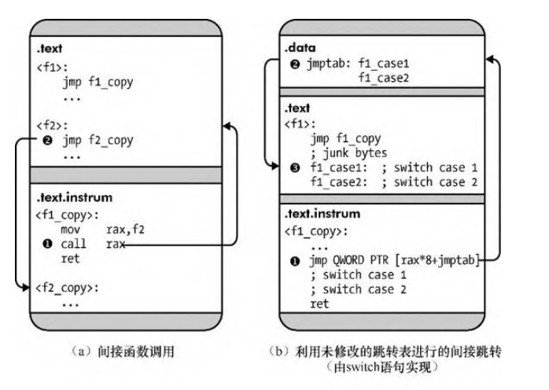

[TOC]

# 第一部分、二进制格式

## 1. 二进制剖析

系统运行的机器码被称作**二进制码**。包含二进制可执行程序的文件被称作**二进制可执行文件**。

### 1.1 C编译过程

C语言源代码转换为二进制文件需要四个步骤：**预处理**、**编译**、**汇编**、**链接**。


#### 1.1.1 预处理阶段

为提高编码效率，C语言通过预处理程序提供了一些语言功能，经过预处理之后的源代码才能进行真正意义上的词法分析。预处理常以'#'开头。

预处理操作包括：

- 文件包含：将被包含的文件内容复制到此处。

  ```c
  #include <文件名> // 在编译器安装目录中搜索文件
  #include "文件名" // 在当前工作目录内搜索文件
  ```

  

- 宏定义：用比较简洁的字符串替换冗长不易识别的字符串。

  ```c
  #define 标识符 符号序列 // 使指定标识符的预处理生效
  #define 标识符(参数) 符号序列 // 带参数的宏定义
  #undef 标识符 // 使指定标识符的预处理失效，宏标识符将被视为无效信息
  ```

  

- 条件编译：让编译器有选择地忽略部分代码不进行编译。

  ```c
  #if 常量表达式 / #ifdef 标识符 / #ifndef 标识符
  文本
  #elif 常量表达式 / #else
  文本
  #endif
  ```

  

### 1.1.2 编译阶段

预处理阶段完成后，将对代码进行编译。编译阶段将预处理过的代码翻译为汇编语言代码，并且大部分编译器可以在此阶段按照优化等级对汇编代码进行优化，例如gcc的-O0到-O3。并可以指定汇编代码的格式，例如gcc默认使用AT&T语法格式的汇编代码，gcc的-masm=intel使用Intel语法格式的汇编代码。


### 1.1.3 汇编阶段

汇编阶段将汇编代码转换为**目标文件**或者**模块**。目标文件是**可重定位文件**，可重定位文件不需要放置在内存的特定位置，相反，它可以随意在内存中移动。


### 1.1.4 链接阶段

链接阶段将所有目标文件链接成一个二进制可执行文件，链接阶段有时还包含额外的优化过程，称作**链接时优化**(LTO, link-time optimization)。

在链接阶段之前，还不知道引用的代码和数据的地址，所以目标文件仅包含**重定位符号**，重定位符号指示了如何处理函数和变量的引用，依赖重定位符号的引用被称作**符号引用**。

链接器会解析大部分符号引用，对库的引用取决于库的类型。库分为**静态库**和**动态库/共享库**，静态库将被合并到可执行文件中，动态库只在内存中存在一份，所以所有程序共享动态库，链接阶段不能解析对动态库的符号引用，当可执行文件加载到内存时，**动态链接器**会解析对动态库的符号引用。


## 1.2 符号和二进制文件

### 1.2.1 查看符号信息

```bash
$ readelf --syms a.out
```


二进制格式和调试信息格式：

| Binary Format | Debugging Format| Difference |
| ------------- | ---- | ---- |
| ELF | DWARF | unsually embedded within the binary |
| PE | PDB | a separate symbol file |


调试符号信息：

- 源代码和二进制指令之间的映射
- 函数的参数
- 栈帧


PDB文件的信息：

- Public symbols (typically all functions, static and global variables)
- A list of object files that are responsible for sections of code in the executable
- Frame pointer optimization information (FPO)
- Name and type information for local variables and data structures
- Source file and line number information


stripped PDB文件的信息：

- Public symbols (typically only non-static functions and global variables)
- A list of object files that are responsible for sections of code in the executable
- Frame pointer optimization information (FPO)


### 1.2.2 去掉二进制文件不必要的符号信息

```bash
$ strip --strip-all a.out
```


## 1.3 反汇编二进制文件

### 1.3.1 查看目标文件

```bash
$ objdump -sj .rodata compilation_example.o              # 查看.rodata段的内容
$ objdump -M intel -d compilataion_example.o             # 以Intel的语法格式反汇编目标文件的代码
$ objdump --relocs compilataion_example.o                # 查看目标文件的重定位信息
```


### 1.3.2 解析二进制可执行文件

```bash
$ objdump -M intel -d a.out
```

去掉不必要的符号信息后的二进制文件保留了段，但是所 有函数都被合并到了代码段。


## 1.4 加载并执行二进制文件


运行二进制文件的过程：

1. 建立一个新进程
2. 操作系统映射一个解释器到进程虚拟内存
3. 内核将控制权交给解释器，解释器开始在用户空间工作
4. 解释器将二进制文件加载到虚拟内存空间
5. 解析二进制文件，找到二进制文件所用的动态库，并将其映射到虚拟内存空间
6. 重定位，将二进制文件代码段指向动态库的引用修改为正确的地址
7. 寻找二进制程序的入口，并将控制权交给二进制程序，二进制程序开始执行


## 2. ELF格式

ELF (Executable and Linkable Format，可执行和链接格式)，ELF包含四种类型的内容：

1. 一个**可执行头部(executable header)**
2. 一系列可选的**程序头(program header)**
3. 许多**节(section)**
4. 一系列可选的**节头(section header)**


**64位ELF二进制文件概览**


### 2.1 可执行头(Executable Header)

每个ELF文件都以可执行头开始，可执行头表明这是一个ELF格式文件，并表明了它是哪一类ELF文件，以及去哪里找到其它内容。


```bash
$ readelf -h a.out
ELF Header:
  Magic:   7f 45 4c 46 02 01 01 00 00 00 00 00 00 00 00 00
  Class:                             ELF64
  Data:                              2's complement, little endian
  Version:                           1 (current)
  OS/ABI:                            UNIX - System V
  ABI Version:                       0
  Type:                              DYN (Position-Independent Executable file)
  Machine:                           Advanced Micro Devices X86-64
  Version:                           0x1
  Entry point address:               0x1060
  Start of program headers:          64 (bytes into file)
  Start of section headers:          13992 (bytes into file)
  Flags:                             0x0
  Size of this header:               64 (bytes)
  Size of program headers:           56 (bytes)
  Number of program headers:         13
  Size of section headers:           64 (bytes)
  Number of section headers:         31
  Section header string table index: 30
```


#### ELF64_Ehdr

```c
#define EI_NIDENT	16

typedef struct
{
  unsigned char e_ident[EI_NIDENT];     /* Magic number and other info */
  Elf64_Half    e_type;                 /* Object file type */
  Elf64_Half    e_machine;              /* Architecture */
  Elf64_Word    e_version;              /* Object file version */
  Elf64_Addr    e_entry;                /* Entry point virtual address */
  Elf64_Off     e_phoff;                /* Program header table file offset */
  Elf64_Off     e_shoff;                /* Section header table file offset */
  Elf64_Word    e_flags;                /* Processor-specific flags */
  Elf64_Half    e_ehsize;               /* ELF header size in bytes */
  Elf64_Half    e_phentsize;            /* Program header table entry size */
  Elf64_Half    e_phnum;                /* Program header table entry count */
  Elf64_Half    e_shentsize;            /* Section header table entry size */
  Elf64_Half    e_shnum;                /* Section header table entry count */
  Elf64_Half    e_shstrndx;             /* Section header string table index */
} Elf64_Ehdr;
```

- e_ident：前四个字节为幻数(magic value)，表明这是一个ELF格式文件。e_ident各个位的含义:

| Name          | Value | Purpose                                                      |
| ------------- | ----- | ------------------------------------------------------------ |
| EI_MAG0       | 0     | 幻数，0x7f                                                   |
| EI_MAG1       | 1     | 幻数，'E'                                                    |
| EI_MAG2       | 2     | 幻数，'L'                                                    |
| EI_MAG3       | 3     | 幻数，'F'                                                    |
| EI_CLASS      | 4     | 32位或64位的目标文件                                         |
| EI_DATA       | 5     | 大端或小端编码                                               |
| EI_VERSION    | 6     | ELF文件头的版本号                                            |
| EI_OSABI      | 7     | ABI扩展标识符，0表示UNIX System V ABI，其它值表示使用了其它操作系统的扩展 |
| EI_ABIVERSION | 8     | ABI版本                                                      |
| EI_PAD        | 9     | 填充开始位，置0，保留                                        |

- e_type：表明文件类型，文件类型有以下几种：

| Name      | Value  | Meaning      |
| --------- | ------ | ------------ |
| ET_NONE   | 0      | 无文件类型   |
| ET_REL    | 1      | 重定位文件   |
| ET_EXEC   | 2      | 可执行文件   |
| ET_DYN    | 3      | 共享目标文件 |
| ET_CORE   | 4      | 核心文件     |
| ET_LOPROC | 0xff00 | 由处理器指定 |
| ET_HIPROC | 0xffff | 由处理器指定 |

- e_machine：表明该文件所需的机器架构。

| Name           | Value | Meaning                |
| -------------- | ----- | ---------------------- |
| EM_NONE        | 0     | 无架构                 |
| EM_M32         | 1     | AT&T WE 32100          |
| EM_SPARC       | 2     | SPARC                  |
| EM_386         | 3     | Intel架构              |
| EM_64K         | 4     | Motorola 68000         |
| EM_88K         | 5     | Motorola 88000         |
| EM_860         | 7     | Intel 80860            |
| EM_MIPS        | 8     | MIPS RS3000 Big-Endian |
| EM_MIPS_RS4_BE | 10    | MIPS RS4000 Big-Endian |
| RESERVED       | 11-16 | 保留备用               |

- e_version：表明目标文件的版本。1表示文件的原始格式，更高的数字可以用来表明扩展文件的格式。

| Name       | Value | Meaning  |
| ---------- | ----- | -------- |
| EV_NONE    | 0     | 非法版本 |
| EV_CURRENT | 1     | 当前版本 |

- e_entry：指出系统应该将控制权转交给的虚拟地址，然后进程开始执行。如果文件没有入口地址，则该项为0。

- e_phoff：Program Header Table在文件中的偏移量，如果文件没有Program Header Table，则该项为0。

- e_shoff：Section Header Table在文件中的偏移量，如果文件没有Section Header Table，则该项为0。

- e_flags：与处理器架构相关的标志位。对于x86架构，e_flags常设置为0，不用标志位。对于ARM架构，e_flags可以设置文件格式惯例、栈的组织方式等关于接口的额外细节信息并告知给嵌入式操作系统。

- e_ehsize：ELF Header的大小。

- e_phentsize：Program Header Table的每一项的大小。所有表项的大小相同。

- e_phnum：Program Header Table的项目数量。e_phentsize * e_phnum表明了Program Header Table的总大小。如果文件中没有Program Header Table，则e_phnum为0。

- e_shentsize：Section Header Table的每一项的大小。所有表项的大小相同。

- e_shnum：Section Header Table的项目数量。e_shentsize * e_shnum表明了Section Header Table的总大小。如果文件中没有Section Header Table，则e_shnum为0。

- e_shstrndx：Section Name String Table(.shstrtab)节在Section Header Table里的索引下标。Section Name String Table(.shstrtab)储存着所有节的名称。

```bash
$ readelf -x .shstrtab a.out

Hex dump of section '.shstrtab':
  0x00000000 002e7379 6d746162 002e7374 72746162 ..symtab..strtab
  0x00000010 002e7368 73747274 6162002e 696e7465 ..shstrtab..inte
  0x00000020 7270002e 6e6f7465 2e676e75 2e70726f rp..note.gnu.pro
  0x00000030 70657274 79002e6e 6f74652e 676e752e perty..note.gnu.
  0x00000040 6275696c 642d6964 002e6e6f 74652e41 build-id..note.A
  0x00000050 42492d74 6167002e 676e752e 68617368 BI-tag..gnu.hash
  0x00000060 002e6479 6e73796d 002e6479 6e737472 ..dynsym..dynstr
  0x00000070 002e676e 752e7665 7273696f 6e002e67 ..gnu.version..g
  0x00000080 6e752e76 65727369 6f6e5f72 002e7265 nu.version_r..re
  0x00000090 6c612e64 796e002e 72656c61 2e706c74 la.dyn..rela.plt
  0x000000a0 002e696e 6974002e 706c742e 676f7400 ..init..plt.got.
  0x000000b0 2e706c74 2e736563 002e7465 7874002e .plt.sec..text..
  0x000000c0 66696e69 002e726f 64617461 002e6568 fini..rodata..eh
  0x000000d0 5f667261 6d655f68 6472002e 65685f66 _frame_hdr..eh_f
  0x000000e0 72616d65 002e696e 69745f61 72726179 rame..init_array
  0x000000f0 002e6669 6e695f61 72726179 002e6479 ..fini_array..dy
  0x00000100 6e616d69 63002e64 61746100 2e627373 namic..data..bss
  0x00000110 002e636f 6d6d656e 7400              ..comment.
```


### 2.2 节头(Section Headers)

ELF二进制文件将代码和数据从逻辑上划分为多个连续的、不重叠的块，这种块称之为**节(section)**。每个节都由**节头(section header)**进行描述，节头指定了节的属性和位置。**节头表(section header table)**里保存了所有节的节头信息。

节头仅用于链接阶段，故不需要链接的ELF文件可以不要节头表。相似的，程序头表，也即段表，仅用于执行阶段，故不需要执行的ELF文件可以不要程序头表。


#### Elf64_Shdr

```c
typedef struct
{
  Elf64_Word    sh_name;                /* Section name (string tbl index) */
  Elf64_Word    sh_type;                /* Section type */
  Elf64_Xword   sh_flags;               /* Section flags */
  Elf64_Addr    sh_addr;                /* Section virtual addr at execution */
  Elf64_Off     sh_offset;              /* Section file offset */
  Elf64_Xword   sh_size;                /* Section size in bytes */
  Elf64_Word    sh_link;                /* Link to another section */
  Elf64_Word    sh_info;                /* Additional section information */
  Elf64_Xword   sh_addralign;           /* Section alignment */
  Elf64_Xword   sh_entsize;             /* Entry size if section holds table */
} Elf64_Shdr;
```

- sh_name：节的名称，它的值是节的名称在字符串表(string table, .strtab)中的索引。

- sh_type：节的类型。

| Name         | Value      | Meaning                                                      |
| ------------ | ---------- | ------------------------------------------------------------ |
| SHT_NULL     | 0          | 没有相关的节与之对应，其它字段的值未定义。                   |
| SHT_PROGBITS | 1          | 该节存储着程序定义的信息，它的格式和含义仅由程序定义。       |
| SHT_SYMTAB   | 2          | 符号表，存放符号信息。参见[Elf64_Sym](####Elf64_Dyn)。       |
| SHT_STRTAB   | 3          | 字符串表，存放符号名称和程序中用到的字符串。                 |
| SHT_RELA     | 4          | 重定位节，包含重定位入口。参见[Elf64_Rela](####Elf64_Rela)。 |
| SHT_HASH     | 5          | 这样的节中包含一个符号哈希表，参与动态链接的目标文件必须有一个哈希表。 |
| SHT_DYNAMIC  | 6          | 包含动态链接的信息。参见[Elf64_Dyn](####Elf64_Dyn)。         |
| SHT_NOTE     | 7          | 标记文件的信息。                                             |
| SHT_NOBITS   | 8          | 这种节不含任何字节，也不占用文件空间，节头中的**sh_offset**字段只是概念上的偏移 |
| SHT_REL      | 9          | 重定位节，包含重定位条目。参见[Elf64_Rel](####Elf64_Rel)。   |
| SHT_SHLIB    | 10         | 保留，语义未指定。                                           |
| SHT_DYNSYM   | 11         | 用于动态链接的符号表，是symbol table的子集。                 |
| SHT_LOPROC   | 0x70000000 | 保留，由处理器指定语义。                                     |
| SHT_HIPROC   | 0x7fffffff | 保留，由处理器指定语义。                                     |
| SHT_LOUSER   | 0x80000000 | 由应用程序指定语义。                                         |
| SHT_HIUSER   | 0xffffffff | 由应用程序指定语义。                                         |

- sh_flags：表明了节的属性。

| Name          | Value      | Meaning                  |
| ------------- | ---------- | ------------------------ |
| SHF_WRITE     | 0x1        | 该节包含可写的数据       |
| SHF_ALLOC     | 0x2        | 该节占用内存空间         |
| SHF_EXECINSTR | 0x4        | 该节包含可执行的机器指令 |
| SHF_MASKPROC  | 0xf0000000 | 高四位由处理器指定语义   |

- sh_addr：如果这个节会出现在进程的内存映像中，则该项指出了节的第一个字节的内存地址。否则，该项为0。

- sh_offset：这个节在文件中的偏移量。

- sh_size：节的大小。SHT_NOBITS类型的节的sh_size可能为0，但是它所占的实际空间为0。

- sh_link：它的值为Section Header Table的索引下标。它的含义由节的类型决定。

- sh_info：它保存了额外信息。它的含义由节的类型决定。

**sh_link**和**sh_info**的含义：

| sh_type                | sh_link                                | sh_info                  |
| ---------------------- | -------------------------------------- | ------------------------ |
| SHT_DYNAMIC            | 该节中的条目所使用的字符串表的节头索引 | 0                        |
| SHT_HASH               | 哈希表所适用的符号表的节头索引         | 0                        |
| SHT_REL、SHT_RELA      | 相关符号表的节头索引                   | 需要重定位的节的节头索引 |
| SHT_SYMTAB、SHT_DYNSYM | 由操作系统指定                         | 由操作系统指定           |
| other                  | SHN_UNDEF                              | 0                        |

- sh_addralign：表明了节需要对齐的字节数。0和1表示不对齐，其它的值必须为2的指数倍。

- sh_entsize：类似符号表等节拥有固定表项大小的表，该字段指明了表项的大小。0表示该节不含有固定表项大小的表。


### 2.3 节(Sections)

ELF文件由一系列的节组成，每一节都有不同的含义，负责不同的工作。

```bash
$ readelf --setions --wide a.out
There are 31 section headers, starting at offset 0x36a8:

Section Headers:
  [Nr] Name              Type            Address          Off    Size   ES Flg Lk Inf Al
  [ 0]                   NULL            0000000000000000 000000 000000 00      0   0  0
  [ 1] .interp           PROGBITS        0000000000000318 000318 00001c 00   A  0   0  1
  [ 2] .note.gnu.property NOTE            0000000000000338 000338 000030 00   A  0   0  8
  [ 3] .note.gnu.build-id NOTE            0000000000000368 000368 000024 00   A  0   0  4
  [ 4] .note.ABI-tag     NOTE            000000000000038c 00038c 000020 00   A  0   0  4
  [ 5] .gnu.hash         GNU_HASH        00000000000003b0 0003b0 000024 00   A  6   0  8
  [ 6] .dynsym           DYNSYM          00000000000003d8 0003d8 0000a8 18   A  7   1  8
  [ 7] .dynstr           STRTAB          0000000000000480 000480 00008f 00   A  0   0  1
  [ 8] .gnu.version      VERSYM          0000000000000510 000510 00000e 02   A  6   0  2
  [ 9] .gnu.version_r    VERNEED         0000000000000520 000520 000030 00   A  7   1  8
  [10] .rela.dyn         RELA            0000000000000550 000550 0000c0 18   A  6   0  8
  [11] .rela.plt         RELA            0000000000000610 000610 000018 18  AI  6  24  8
  [12] .init             PROGBITS        0000000000001000 001000 00001b 00  AX  0   0  4
  [13] .plt              PROGBITS        0000000000001020 001020 000020 10  AX  0   0 16
  [14] .plt.got          PROGBITS        0000000000001040 001040 000010 10  AX  0   0 16
  [15] .plt.sec          PROGBITS        0000000000001050 001050 000010 10  AX  0   0 16
  [16] .text             PROGBITS        0000000000001060 001060 000121 00  AX  0   0 16
  [17] .fini             PROGBITS        0000000000001184 001184 00000d 00  AX  0   0  4
  [18] .rodata           PROGBITS        0000000000002000 002000 00000f 00   A  0   0  4
  [19] .eh_frame_hdr     PROGBITS        0000000000002010 002010 00003c 00   A  0   0  4
  [20] .eh_frame         PROGBITS        0000000000002050 002050 0000cc 00   A  0   0  8
  [21] .init_array       INIT_ARRAY      0000000000003db8 002db8 000008 08  WA  0   0  8
  [22] .fini_array       FINI_ARRAY      0000000000003dc0 002dc0 000008 08  WA  0   0  8
  [23] .dynamic          DYNAMIC         0000000000003dc8 002dc8 0001f0 10  WA  7   0  8
  [24] .got              PROGBITS        0000000000003fb8 002fb8 000048 08  WA  0   0  8
  [25] .data             PROGBITS        0000000000004000 003000 000010 00  WA  0   0  8
  [26] .bss              NOBITS          0000000000004010 003010 000008 00  WA  0   0  1
  [27] .comment          PROGBITS        0000000000000000 003010 000026 01  MS  0   0  1
  [28] .symtab           SYMTAB          0000000000000000 003038 000378 18     29  18  8
  [29] .strtab           STRTAB          0000000000000000 0033b0 0001dd 00      0   0  1
  [30] .shstrtab         STRTAB          0000000000000000 00358d 00011a 00      0   0  1
Key to Flags:
  W (write), A (alloc), X (execute), M (merge), S (strings), I (info),
  L (link order), O (extra OS processing required), G (group), T (TLS),
  C (compressed), x (unknown), o (OS specific), E (exclude),
  D (mbind), l (large), p (processor specific)
```


#### 特殊的节

| Name        | Type           | Attributes                 | Meaning                                                      |
| ----------- | -------------- | -------------------------- | ------------------------------------------------------------ |
| .bss        | SHT_NOBITS     | SHF_ALLOC+SHF_WRITE        | 存放未初始化的全局变量                                       |
| .comment    | SHT_PROGBITS   | none                       | 版本控制信息                                                 |
| .data       | SHT_PROGBITS   | SHF_ALLOC + SHF_WRITE      | 存放初始化过的全局变量                                       |
| .data1      | SHT_PROGBITS   | SHF_ALLOC + SHF_WRITE      | 存放初始化过的全局变量                                       |
| .debug      | SHT_PROGBITS   | none                       | 符号调试信息                                                 |
| .dynamic    | SHT_DYNAMIC    | SHF_ALLOC( + SHF_WRITE)    | 存放动态链接信息                                             |
| .dynsym     | SHT_DYNSYM     | SHF_ALLOC                  | 存放动态链接用的符号信息                                     |
| .dynstr     | SHT_STRTAB     | SHF_ALLOC                  | 存放动态链接用的符号名称                                     |
| .hash       | SHT_HASH       | SHF_ALLOC                  | 符号哈希表                                                   |
| .line       | SHT_PROGBITS   | none                       | 符号调试的行号信息                                           |
| .note       | SHT_NOTE       | none                       |                                                              |
| .rodata     | SHT_PROGBITS   | SHF_ALLOC                  | 存放只读数据                                                 |
| .rodata1    | SHT_PROGBITS   | SHF_ALLOC                  | 存放只读数据                                                 |
| .shstrtab   | SHT_STRTAB     | none                       | 存放节的名称                                                 |
| .strtab     | SHT_STRTAB     | (SHF_ALLOC)                | 存放字符串，主要存放符号名                                   |
| .symtab     | SHT_SYMTAB     | (SHF_ALLOC)                | 符号表，存放符号描述信息                                     |
| .text       | SHT_PROGBITS   | SHF_ALLOC \+ SHF_EXECINSTR | 存放机器指令                                                 |
| .interp     | SHT_PROGBITS   | SHF_ALLOC                  | 存放程序解释器的路径                                         |
| .plt        | SHT_PROGBITS   | SHF_ALLOC \+ SHF_EXECINSTR | 对外部函数的调用将指向该段的同名函数，以实现动态链接的懒加载 |
| .got        | SHT_PROGBITS   | SHF_ALLOC+SHF_WRITE        | 存放外部变量引用信息                                         |
| .got.plt    | SHT_PROGBITS   | SHF_ALLOC+SHF_WRITE        | 存放外部函数引用信息                                         |
| .rel.*      | SHT_RELA       | SHF_ALLOC                  | 重定位表，存放重定位信息                                     |
| .rela.*     | SHT_REL        | SHF_ALLOC                  | 重定位表，存放重定位信息                                     |
| .init       | SHT_PROGBITS   | SHF_ALLOC \+ SHF_EXECINSTR | 程序执行前的初始化代码                                       |
| .fini       | SHT_PROGBITS   | SHF_ALLOC \+ SHF_EXECINSTR | 程序执行完毕后的析构代码                                     |
| .init_array | SHT_INIT_ARRAY | SHF_ALLOC + SHF_WRITE      | 作为数据段存放自定义初始化函数的指针                         |
| .fini_array | SHT_FINI_ARRAY | SHF_ALLOC + SHF_WRITE      | 作为数据段存放自定义析构函数的指针                           |


#### 符号表(Symbol Table)

##### Elf64_Sym

```c
typedef struct elf64_sym {
  Elf64_Word st_name;		/* Symbol name, index in string tbl */
  unsigned char	st_info;	/* Type and binding attributes */
  unsigned char	st_other;	/* No defined meaning, 0 */
  Elf64_Half st_shndx;		/* Associated section index */
  Elf64_Addr st_value;		/* Value of the symbol */
  Elf64_Xword st_size;		/* Associated symbol size */
} Elf64_Sym;
```

- st_name：符号名，在字符串表的索引。

- st_info：包含符号类型和绑定信息。低4位为类型信息，其余高位为绑定信息。

```c
#define ELF_ST_BIND(x)		((x) >> 4)
#define ELF_ST_TYPE(x)		(((unsigned int) x) & 0xf)
```

**符号绑定**

| Name       | Value | Meaning                              |
| ---------- | ----- | ------------------------------------ |
| STB_LOCAL  | 0     | 局部符号，仅目标文件内部可见         |
| STB_GLOBAL | 1     | 全局符号，所有链接的目标文件都可见   |
| STB_WEAK   | 2     | 弱符号类似于全局符号，但其优先级较低 |

**符号类型**

| Name        | Value | Meaning                                                      |
| ----------- | ----- | ------------------------------------------------------------ |
| STT_NOTYPE  | 0     | 未指定符号类型。                                             |
| STT_OBJECT  | 1     | 此符号与变量、数组等数据对象关联。                           |
| STT_FUNC    | 2     | 此符号与函数或其他可执行代码关联。                           |
| STT_SECTION | 3     | 此符号与节关联。此类型的符号表各项主要用于重定位，并且通常具有 `STB_LOCAL` 绑定。 |
| STT_FILE    | 4     | 通常，符号的名称会指定与目标文件关联的源文件的名称。文件符号具有 `STB_LOCAL` 绑定和节索引 `SHN_ABS`。 |
| STT_COMMON  | 5     | 此符号标记未初始化的通用块。此符号的处理与 `STT_OBJECT` 的处理完全相同。 |
| STT_TLS     | 6     | 此符号指定线程局部存储实体。定义后，此符号可为符号指明指定的偏移，而不是实际地址。 |

- st_other：未定义，置0。

- st_shndx：符号所在节的节头索引。

**特殊的索引:**

| Name       | Value  | Meaning                                                      |
| ---------- | ------ | ------------------------------------------------------------ |
| SHN_UNDEF  | 0      | 此节表索引表示未定义符号。链接器将此目标文件与已定义该符号的另一目标文件合并时，此文件中对该符号的引用将与该定义绑定。 |
| SHN_ABS    | 0xfff1 | 此符号具有不会由于重定位而发生更改的绝对值。                 |
| SHN_COMMON | 0xfff2 | 此符号标记尚未分配的通用块。与节的 `sh_addralign` 成员类似，符号的值也会指定对齐约束。链接器在值为 `st_value` 的倍数的地址为符号分配存储空间。符号的大小会指明所需的字节数。 |

- st_value：具体含义取决于上下文，可能是一个绝对值、一个地址等。

  - 在可重定位文件中，若`st_shndx`为`SHN_COMMON`，则`st_value`为对齐约束值。

  - 在可重定位文件中，若`st_shndx`为正常的索引值，则`st_value`为该符号在`st_shndx`所标识的节中的偏移量。

  - 在可执行文件和共享文件中，`st_value`为虚拟地址。为使这些文件的符号更适用于运行时链接程序，所以节偏移替换为虚拟地址。


- st_size：符号所表示的对象的大小。


#### 重定位表(Relocation Table)

重定位是将符号引用与符号定义联系起来的过程。例如，当一个程序调用一个函数时，相关的调用指令必须在执行时将控制权转移到适当的目标地址。换句话说，可重定位文件必须有描述如何修改其部分内容的信息，从而使可执行文件和共享对象文件能够为进程映像持有正确的信息。重定位表就是这些信息。

##### Elf64_Rel

```c
typedef struct
{
  Elf64_Addr	r_offset;		/* Address */
  Elf64_Xword	r_info;			/* Relocation type and symbol index */
} Elf64_Rel;
```


##### Elf64_Rela

```c
typedef struct elf64_rela {
  Elf64_Addr r_offset;	/* Location at which to apply the action */
  Elf64_Xword r_info;	/* index and type of relocation */
  Elf64_Sxword r_addend;	/* Constant addend used to compute value */
} Elf64_Rela;
```

- r_offset：这个成员给出了重定位操作的位置。对于一个可重定位的文件，该值为从节的开始到需要重定位的存储单元的字节偏移。对于可执行文件或共享目标，该值是需要重定位的存储单元的虚拟地址。对于不同的文件类型，`r_offset`有不同的含义：

  - 在可重定位文件中，`r_offset`保存了一个在节中的偏移值。即，重定位节本身描述了如何修改另一个节，`r_offset`指明了修改另一个节中的哪个存储单元。

  - 在可执行文件和共享目标文件中，为了让重定位的条目对动态链接器更有用，所以`r_offset`保存了一个虚拟地址。


- r_info：此成员指定必须对其进行重定位的符号表索引以及要应用的重定位类型。例如，调用指令的重定位项包含所调用的函数的符号表索引。如果索引是未定义的符号索引 `STN_UNDEF`，则重定位将使用零作为符号值。可以使用`ELF64_R_TYPE` 或 `ELF64_R_SYM`获取重定位类型和符号。

```c
#define ELF64_R_SYM(i)			((i) >> 32)
#define ELF64_R_TYPE(i)			((i) & 0xffffffff)
```

- r_addend：此成员指定常量加数，用于计算将存储在可重定位字段中的值。


#### 动态节(.dynamic)

如果目标文件参与动态链接，则其程序头表将包含一个类型为 `PT_DYNAMIC` 的元素。此段包含 `.dynamic` 节。特殊符号 `_DYNAMIC` 用于标记包含以下结构的数组的节。此段包含了程序所需的依赖项，以及动态链接所需的GOT、PLT、符号哈希表、字符串表、符号表、重定位表等信息。

##### Elf64_Dyn

```c
typedef struct {
  Elf64_Sxword d_tag;		/* entry tag value */
  union {
    Elf64_Xword d_val;
    Elf64_Addr d_ptr;
  } d_un;
} Elf64_Dyn;
```

d_un的具体含义取决于d_tag，d_tag表示各个表项的类型。


#### 符号哈希表(Symbol Hash Table)

符号哈希表根据符号名通过哈希函数快速查找符号在符号表中的位置。

哈希表的结构如下：

```
+---------------------------------------------+
|                   nbucket                   |
|---------------------------------------------|
|                   nchain                    |
|---------------------------------------------|
|                  bucket[0]                  |
|                    ...                      |
|              bucket[nbucket-1]              |
|---------------------------------------------|
|                  chain[0]                   |
|                    ...                      |
|               chain[nchain-1]               |
+---------------------------------------------+
```

`bucket`数组共有`nbucket`项，`chain`数组共有`nchain`项。

符号哈希表的工作原理如下：

1. 给定`symbol name`；
2. 通过`hash function`算出哈希值`x`；
3. 令`y=bucket[x%nbucket]`；
4. 将`y`当作符号表的下标查看符号表条目是否正确，若正确，则查找完毕；若不正确，则令`y=chain[y]`。重复步骤4，直至找到正确的符号表条目或者条目的值为`STN_UNDEF`。


#### 全局偏移表(Global Offset Table)

装载时重定位是解决动态模块中含有绝对地址引用的办法之一，但是代码无法在多个进程之间共享，因为不同进程的地址空间不同，重定位后的代码所包含的绝对地址只对一个程序适用，对其它程序不适用，这样就失去了动态链接节省内存的优势。所以我们希望程序模块中共享的指令部分在装载时不需要因为装载地址的改变而改变，意在将指令中需要被修改的部分分离出来，和数据部分放在一起，这样指令部分就可以保持不变，而数据部分可以在每个进程中拥有一个副本，这种方案目前就被称为**地址无关代码(PIC, Position Independent Code)**的技术。

为了实现地址无关代码，可将指令分成四种类型：

- 模块内函数调用或跳转：通过相对地址调用。
- 模块内数据访问：通过`__i686.get_pc_thunk.cx`获取当前`PC`值，并加上一个偏移量，从而达到数据访问的”相对寻址“。
- 模块间数据访问：在数据段里建一个指向外部变量的指针数组，也被称为**全局偏移表(GOT, Global Offset Table)**，当代码需要引用该外部变量时，可以通过`GOT`中对应的项间接引用。
- 模块间函数调用或跳转：通过`__i686.get_pc_thunk.cx`获取当前`PC`值，并加上一个偏移量，从而得到外部函数地址在`GOT`中的偏移，然后间接调用。

`.got`保存的是对外部数据的引用，`.got.plt`保存的是对外部函数的引用。

`.got.plt`的前三项是有特殊含义的：

- `.got.plt[0]`: 本`ELF`的动态段(`.dynamic`)的内存地址
- `.got.plt[1]`: 本`ELF`的`link_map`数据结构描述符地址
- `.got.plt[2]`: `_dl_runtime_resolve`函数的地址

第二项和第三项由动态链接器在装载共享模块的时候负责将它们初始化。

`GOT`用于存放外部变量或函数的地址。初始时`GOT`存放的是跳转到`GOT`的那条指令的下一条指令地址，当动态链接器把外部变量或函数所在的模块装入进程内存地址空间后，修改`GOT`中对应的项，将其改为外部变量或函数的实际地址。`GOT`作为数据具有读写权限，而代码段通过相对地址的方式访问`GOT`以访问外部变量或函数，从而避免了在代码段直接使用绝对地址，从此就实现了`PIC`。


#### 延迟加载(Lazy Binding) & 过程链接表(Procedure Linkage Table)

动态链接虽然比静态链接产生的文件更小，更节省内存，但是它是以牺牲一部分性能为代价的。动态链接对于全局变量和外部数据的访问都要先进行`GOT`定位，然后间接寻址，对于模块间的定位也要先定位`GOT`，然后再进行间接跳转，如此一来，程序的运行速度必然减慢；另一个减慢速度的原因是在装载程序时，动态链接器都要进行一次链接工作，寻找并装载所需要的共享目标，然后进行符号查找和地址重定位等工作。这些原因影响着动态链接的性能。

一个程序中的很多函数可能并不会在程序刚执行时就用到，所以不必一开始就将所有函数都链接好，可以等到函数第一次被用到时才进行绑定，这种技术叫做**延迟绑定(Lazy Binding)**。ELF使用**过程链接表(PLT, Procedure Linkage Table)**来实现延迟绑定。

延迟绑定的流程：

1. 将所需要动态链接的符号在`.rel.plt`段的下标压入栈中
2. 将模块的`link_map`数据结构描述符压入栈
3. 调用动态链接器的`_dl_runtime_resolve`函数完成符号解析和重定位工作
4. `_dl_runtime_resolve`将实际地址填入到`ext_fun@got`中

```assembly
# PLT段伪代码如下：
.plt
common@plt:
  push *(GOT + 8)  # 将GOT[1]压入栈中，即本模块的link_map描述符
  jmp *(GOT + 16)  # 跳转到GOT[2]即_dl_runtime_resolve执行

ext_fun@plt:
  jmp *(ext_fun@got)
  push <ext_fun符号在.rel.plt中的下标> # 第一次调用该函数会执行以下两条指令，以后调用将不会执行以下两条指令
  jmp common@plt
  
# 动态链接前GOT段伪代码如下:
.got.plt
ext_fun@got:
  <jmp到该地址的指令的下一条指令的地址> # _dl_runtime_resolve将ext_fun的实际地址填入到这里
  
# 动态链接后GOT段伪代码如下:
.got.plt
ext_fun@got:
  <ext_fun的实际地址>
```


### 2.4 程序头(Program Headers)

与节头表(Section Header Table)把二进制文件看作是节(section)的组合相反，程序头表(Program Header Table)把二进制文件看作是段(segment)的组合。节仅用于静态链接，而段用于操作系统和动态链接器执行ELF文件，并定位相关代码和数据，以及决定把哪些段装载到虚拟内存空间中。ELF文件头中的`e_phoff`指出了程序头表的位置，`e_phentsize`指出了程序头表的表项的大小，`e_phnum`指出了程序头表的表项的个数。

由于段提供了执行视图，所以段仅用于可执行文件，而不用于不可执行的文件，比如需要重定位的目标文件。

程序头表使用`Elf64_Phdr`结构体表示程序头表的项目。

#### Elf64_Phdr

```c
typedef struct
{
  Elf64_Word	p_type;			/* Segment type */
  Elf64_Word	p_flags;		/* Segment flags */
  Elf64_Off	    p_offset;		/* Segment file offset */
  Elf64_Addr	p_vaddr;		/* Segment virtual address */
  Elf64_Addr	p_paddr;		/* Segment physical address */
  Elf64_Xword	p_filesz;		/* Segment size in file */
  Elf64_Xword	p_memsz;		/* Segment size in memory */
  Elf64_Xword	p_align;		/* Segment alignment */
} Elf64_Phdr;
```

- p_type：这个字段表明了这个段的类型，或者如何解释这个段的信息。

| Name       | Value | Meaning                                                      |
| ---------- | ----- | ------------------------------------------------------------ |
| PT_NULL    | 0     | 未用                                                         |
| PT_LOAD    | 1     | 表示这是一个可装载的段                                       |
| PT_DYNAMIC | 2     | 表示这个段含有动态链接信息                                   |
| PT_INTERP  | 3     | 指定了解释器(interpreter)的路径                              |
| PT_NOTE    | 4     | 指定了辅助信息的位置和大小                                   |
| PT_SHLIB   | 5     | 保留                                                         |
| PT_PHDR    | 6     | 说明了程序头表在文件和内存映像中的位置和大小。该表项优先于其它可装载段表项 |

- p_flags：与段权限相关的标志。

| Name        | Value      | Meaning        |
| ----------- | ---------- | -------------- |
| PF_X        | 1          | 可执行         |
| PF_W        | 2          | 可写           |
| PF_R        | 4          | 可读           |
| PF_MASKOS   | 0x0ff00000 | 由操作系统指定 |
| PF_MASKPROC | 0xf0000000 | 由处理器指定   |

- p_offset：此段在文件中的偏移量。

- p_vaddr：此段在内存中的虚拟地址。
- p_paddr：此段在与物理寻址相关的系统中的物理地址。
- p_filesz：此段在文件中的大小。
- p_memsz：此段在内存中的大小。
- p_align：可装入的进程段必须具有 `p_vaddr` 和 `p_offset` 的同余值（以页面大小为模数）。此成员可提供一个值，用于在内存和文件中根据该值对齐各段。值 `0` 和 `1` 表示无需对齐。另外，`p_align` 应为 `2` 的正整数幂，并且 `p_vaddr` 应等于 `p_offset`（以 `p_align` 为模数）。


## 3. PE格式

PE格式用于Windows，是COFF格式的变体，所以PE也被称作PE/COFF，在被ELF取代前，一直被*nix使用。64位版本的PE叫做PE32+，与原PE格式区别很小。因为PE和ELF都源于COFF，所以PE和ELF有很多相似的地方。


**PE32+格式**：


### 3.1 MS-DOS Header & Stub

Microsoft为了兼容DOS，保留了MS-DOS Header。当PE刚问世的时候，为了让用户更清晰地从MS-DOS二进制格式过渡到PE格式，Microsoft让每个PE文件都以MS-DOS头作为开始，所以从狭义上讲，PE文件可以视为MS-DOS文件。MS-DOS Header最主要地作用就是描述如何加载并执行MS-DOS Stub。在MS-DOS环境下，用户执行PE文件时，运行的不是PE的主程序，而是MS-DOS stub里的指令。MS-DOS Header中的`e_lfanew`字段指出了PE Header在文件中的位置。


### 3.2 PE/COFF头(PE/COFF Header)

PE/COFF Header分为三个部分：

- PE signature
- PE file header
- PE optional header


#### 3.2.1 PE签名(PE Signature)

与ELF Header中的`e_ident`中的幻数(magic value)相似，PE Signature的值为“PE\0\0"。表明这是一个PE格式文件。


#### 3.2.2 PE文件头(PE File Header)

PE File Header描述了文件的通用属性。


##### IMAGE_FILE_HEADER

```c
typedef struct _IMAGE_FILE_HEADER {
      WORD Machine;
      WORD NumberOfSections;
      DWORD TimeDateStamp;
      DWORD PointerToSymbolTable;
      DWORD NumberOfSymbols;
      WORD SizeOfOptionalHeader;
      WORD Characteristics;
} IMAGE_FILE_HEADER,*PIMAGE_FILE_HEADER;
```

- Machine：类似ELF的`e_machine`，说明运行该文件需要的机器架构。
- NumberOfSections：节头表中表项的数量。
- TimeDateStamp：文件创建时间戳。
- PointerToSymbolTable：符号表在文件中的偏移量。
- NumberOfSymbols：符号表中表项的数量。
- SizeOfOptionalHeader：PE Optional Header的大小。
- Characteristics：描述了二进制文件的编码方式（大端 or 小端），是否是动态链接库，是否被去除了与执行无关的信息。


#### 3.2.3 PE可选头(PE Optional Header)

尽管名字里带有Optional，但是对于可执行文件来说，这部分是必须的，对于目标文件来说，这部分可以没有。


##### IMAGE_OPTIONAL_HEADER64

```c
typedef struct _IMAGE_OPTIONAL_HEADER64 {
      WORD Magic;                       // 机器型号，判断是32位或64位
      BYTE MajorLinkerVersion;          // 链接器主要版本号
      BYTE MinorLinkerVersion;          // 链接器次要版本号
      DWORD SizeOfCode;                 // 代码节的总大小
      DWORD SizeOfInitializedData;      // 已初始化数据节的大小
      DWORD SizeOfUninitializedData;    // 未初始化数据节的大小
      DWORD AddressOfEntryPoint;        // 程序入口地址(相对虚拟地址)
      DWORD BaseOfCode;                 // 代码节的基地址(相对虚拟地址)
      ULONGLONG ImageBase;              // 程序希望的基地址
      DWORD SectionAlignment;           // 内存中的节对齐
      DWORD FileAlignment;              // 文件中的节对齐
      WORD MajorOperatingSystemVersion; // 操作系统主版本号
      WORD MinorOperatingSystemVersion; // 操作系统次版本号
      WORD MajorImageVersion;           // PE主版本号
      WORD MinorImageVersion;           // PE次版本号
      WORD MajorSubsystemVersion;       // 子系统主版本号
      WORD MinorSubsystemVersion;       // 子系统次版本号
      DWORD Win32VersionValue;          // 32位系统版本号值
      DWORD SizeOfImage;                // 程序在内存中占用的大小
      DWORD SizeOfHeaders;              // MS-DOS stub, PE头和节头之和向上取整到FileAlignment的整数倍
      DWORD CheckSum;                   // 校验和
      WORD Subsystem;                   // 文件的子系统
      WORD DllCharacteristics;          // Dll文件属性
      ULONGLONG SizeOfStackReserve;     // 预留的栈的大小
      ULONGLONG SizeOfStackCommit;      // 立即申请的栈的大小
      ULONGLONG SizeOfHeapReserve;      // 预留的堆的大小
      ULONGLONG SizeOfHeapCommit;       // 立即申请的堆的大小
      DWORD LoaderFlags;                // 调试相关的标志位
      DWORD NumberOfRvaAndSizes;        // 数据目录结构的项目数量
      IMAGE_DATA_DIRECTORY DataDirectory[IMAGE_NUMBEROF_DIRECTORY_ENTRIES]; // 数据目录
} IMAGE_OPTIONAL_HEADER64,*PIMAGE_OPTIONAL_HEADER64;
```


#### 3.2.4 节(Sections)

一些节与ELF文件中的节的作用和属性相似，比如`.text`, `.code`, `.bss`等。还有`.reloc`同`.rel`一样是重定位节，`.rdata`同`.rodata`是只读数据段。

PE特有而ELF没有的节中比较重要的是`.edata`和`.idata`。`DataDirectory`中的`Export Directory`和`Import Directory`指向这两个节。`.idata`节说明了二进制文件从共享库导入了哪些符号，`.edata`节说明了二进制文件导出了哪些符号。因此，当解析外部符号引用时，会先检查共享库是否导出了该符号。这两节有时也会被合并到`.rdata`节。

当加载器解析了依赖库之后，它会把解析的地址写到**导入地址表(IAT, Import Address Table)**中。`IAT`是`.idata`的一部分，初始时指向导入符号的名称或标识号，之后动态加载器会把它们替换成真实的指向导入函数或数据的指针。对外部函数的调用会被转换为对一个`thunk`的调用，`thunk`是对该外部函数的通过`IAT`的间接跳转。跳转的地址都存放在`.idata`的`Import Directory`中。

下例中的代码是用`MinGW`编译，所以使用了`nop`指令填充，使得代码以8字节对齐，从而使得访问时只需要一次访存即可获取整个指令。而用`MSVC`编译后的PE文件会用`int3`指令填充，该指令用于调试，在没有调试器而执行时会导致程序崩溃，但是`jmp`指令跳转到其它地方，而不会执行其之后的`int3`指令，所以可以用`int3`指令在这里填充。

```bash
$ objdump -M intel -d /bin/ls | grep jmp | head
  4022e6:       ff 25 24 bd 21 00       jmp    QWORD PTR [rip+0x21bd24]        # 61e010 <_fini@@Base+0x20a3b4>
  4022f0:       ff 25 22 bd 21 00       jmp    QWORD PTR [rip+0x21bd22]        # 61e018 <_fini@@Base+0x20a3bc>
  4022fb:       e9 e0 ff ff ff          jmp    4022e0 <_init@@Base+0x28>
  402300:       ff 25 1a bd 21 00       jmp    QWORD PTR [rip+0x21bd1a]        # 61e020 <_fini@@Base+0x20a3c4>
  40230b:       e9 d0 ff ff ff          jmp    4022e0 <_init@@Base+0x28>
  402310:       ff 25 12 bd 21 00       jmp    QWORD PTR [rip+0x21bd12]        # 61e028 <_fini@@Base+0x20a3cc>
  40231b:       e9 c0 ff ff ff          jmp    4022e0 <_init@@Base+0x28>
  402320:       ff 25 0a bd 21 00       jmp    QWORD PTR [rip+0x21bd0a]        # 61e030 <_fini@@Base+0x20a3d4>
  40232b:       e9 b0 ff ff ff          jmp    4022e0 <_init@@Base+0x28>
  402330:       ff 25 02 bd 21 00       jmp    QWORD PTR [rip+0x21bd02] 
 
 $ objdump -h /bin/ls

/bin/ls:     file format elf64-x86-64

Sections:
Idx Name          Size      VMA               LMA               File off  Algn
  0 .interp       0000001c  0000000000400238  0000000000400238  00000238  2**0
                  CONTENTS, ALLOC, LOAD, READONLY, DATA
  1 .note.ABI-tag 00000020  0000000000400254  0000000000400254  00000254  2**2
                  CONTENTS, ALLOC, LOAD, READONLY, DATA
  2 .note.gnu.build-id 00000024  0000000000400274  0000000000400274  00000274  2**2
                  CONTENTS, ALLOC, LOAD, READONLY, DATA
  3 .gnu.hash     000000c0  0000000000400298  0000000000400298  00000298  2**3
                  CONTENTS, ALLOC, LOAD, READONLY, DATA
  4 .dynsym       00000cd8  0000000000400358  0000000000400358  00000358  2**3
                  CONTENTS, ALLOC, LOAD, READONLY, DATA
  5 .dynstr       000005dc  0000000000401030  0000000000401030  00001030  2**0
                  CONTENTS, ALLOC, LOAD, READONLY, DATA
  6 .gnu.version  00000112  000000000040160c  000000000040160c  0000160c  2**1
                  CONTENTS, ALLOC, LOAD, READONLY, DATA
  7 .gnu.version_r 00000070  0000000000401720  0000000000401720  00001720  2**3
                  CONTENTS, ALLOC, LOAD, READONLY, DATA
  8 .rela.dyn     000000a8  0000000000401790  0000000000401790  00001790  2**3
                  CONTENTS, ALLOC, LOAD, READONLY, DATA
  9 .rela.plt     00000a80  0000000000401838  0000000000401838  00001838  2**3
                  CONTENTS, ALLOC, LOAD, READONLY, DATA
 10 .init         0000001a  00000000004022b8  00000000004022b8  000022b8  2**2
                  CONTENTS, ALLOC, LOAD, READONLY, CODE
 11 .plt          00000710  00000000004022e0  00000000004022e0  000022e0  2**4
                  CONTENTS, ALLOC, LOAD, READONLY, CODE
 12 .plt.got      00000008  00000000004029f0  00000000004029f0  000029f0  2**3
                  CONTENTS, ALLOC, LOAD, READONLY, CODE
 13 .text         00011259  0000000000402a00  0000000000402a00  00002a00  2**4
                  CONTENTS, ALLOC, LOAD, READONLY, CODE
 14 .fini         00000009  0000000000413c5c  0000000000413c5c  00013c5c  2**2
                  CONTENTS, ALLOC, LOAD, READONLY, CODE
 15 .rodata       00006974  0000000000413c80  0000000000413c80  00013c80  2**5
                  CONTENTS, ALLOC, LOAD, READONLY, DATA
 16 .eh_frame_hdr 00000804  000000000041a5f4  000000000041a5f4  0001a5f4  2**2
                  CONTENTS, ALLOC, LOAD, READONLY, DATA
 17 .eh_frame     00002c6c  000000000041adf8  000000000041adf8  0001adf8  2**3
                  CONTENTS, ALLOC, LOAD, READONLY, DATA
 18 .init_array   00000008  000000000061de00  000000000061de00  0001de00  2**3
                  CONTENTS, ALLOC, LOAD, DATA
 19 .fini_array   00000008  000000000061de08  000000000061de08  0001de08  2**3
                  CONTENTS, ALLOC, LOAD, DATA
 20 .jcr          00000008  000000000061de10  000000000061de10  0001de10  2**3
                  CONTENTS, ALLOC, LOAD, DATA
 21 .dynamic      000001e0  000000000061de18  000000000061de18  0001de18  2**3
                  CONTENTS, ALLOC, LOAD, DATA
 22 .got          00000008  000000000061dff8  000000000061dff8  0001dff8  2**3
                  CONTENTS, ALLOC, LOAD, DATA
 23 .got.plt      00000398  000000000061e000  000000000061e000  0001e000  2**3
                  CONTENTS, ALLOC, LOAD, DATA
 24 .data         00000260  000000000061e3a0  000000000061e3a0  0001e3a0  2**5
                  CONTENTS, ALLOC, LOAD, DATA
 25 .bss          00000d68  000000000061e600  000000000061e600  0001e600  2**5
                  ALLOC
 26 .gnu_debuglink 00000034  0000000000000000  0000000000000000  0001e600  2**0
                  CONTENTS, READONLY
```


## 4. 用libbfd构建二进制加载器

BFD是Binary format descriptor的缩写，即二进制文件格式描述符，是很多可执行文件相关二进制工具（如nm、objdump、ar、as等命令）的基础库。bfd库可以用来分析、创建、修改二进制文件，支持多种平台（如x86、arm等）及多种二进制格式（如elf、core、so等）。


### 4.1 二进制加载接口

首先创建一个头文件，定义相关的类和函数。引入要使用的头文件，并且定义3个类名。定义一个Binary类，作为整个二进制文件的抽象，定义Section和Symbol类，作为节和符号的抽象。

```c
#include <stdint.h>
#include <string>
#include <vector>

class Symbol;
class Section;
class Binary;
```


### 4.2 Symbol

Symbol类与二进制文件的符号相关，ELF文件中的符号表包括局部和全局变量、函数、重定位表达式及对象等，此处只解析函数符号。

```c
class Symbol {
    public:
        enum SymbolType {
            SYM_TYPE_UKN = 0,
            SYM_TYPE_FUNC = 1
        };
        
        Symbol(): type(SYM_TYPE_UKN), addr(0) {}

        SymbolType type;
        std::string name;
        uint64_t addr;
};
```


### 4.3 Section

Section类围绕二进制文件的节进行实现。例如Linux上的ELF格式文件，由一系列二进制节组织而成。使用readelf都会显示相关的基本信息，包括节头表里的索引、节的名称和类型，除此以外，还可以查看节的虚拟地址、文件偏移及大小、节的标志等等信息。

```c
class Section {
    public:
        enum SectionType {
            SEC_TYPE_NONE = 0,
            SEC_TYPE_CODE = 1,
            SEC_TYPE_DATA = 2
        };

        Section(): binary(NULL), type(SEC_TYPE_NONE), vma(0), size(0), bytes(NULL) {}
    
        Binary *binary;
        std::string name;
        SectionType type;
        uint64_t vma;
        uint64_t size;
        uint8_t *bytes;
};
```


### 4.4 Binary

这个类作为整个二进制文件的抽象，其中包含了二进制文件的文件名、类型、平台架构、位宽、入口点地址、节及符号。

```c
class Binary {
    public:
        enum BinaryType {
            BIN_TYPE_AUTO = 0,
            BIN_TYPE_ELF = 1,
            BIN_TYPE_PE = 2
        };

        enum BinaryArch {
            ARCH_NONE = 0,
            ARCH_X86 = 1
        };

        Binary(): type(BIN_TYPE_AUTO), arch(ARCH_NONE), bits(0), entry(0) {}

        std::string filename;
        BinaryType type;
        std::string type_str;
        BinaryArch arch;
        std::string arch_str;
        unsigned bits;
        uint64_t entry;
        std::vector<Section> sections;
        std::vector<Symbol> symbols;
};
```


### 4.5 加载二进制文件

定义加载器的两个入口函数`load_binary`和`unload_binary`函数。用于加载二进制文件，加载完毕后释放二进制文件的内存。`load_binary`解析由文件名指定的二进制文件，并将其加载到`Binary`对象中，其中调用了`load_binary_bfd`函数，将在后续实现。

`unload_binary`负责释放资源，实际上就是将`Binary`中`malloc`出的内存空间都释放。每个`Section`对象都要开辟一段空间来保存原始字节，将`bytes`成员释放掉即可。

```c
int load_binary(std::string &fname, Binary *bin, Binary::BinaryType type) {
    return load_binary_bfd(fname, bin, type);
}

void unload_binary(Binary *bin) {
    size_t i;
    Section *sec;

    for (i = 0; i < bin->sections.size(); i++) {
        sec = &bin->sections[i];
        if (sec->bytes) {
            free(sec->bytes);
        }
    }
}
```


### 4.6 打开二进制文件

如下实现了一个`open_bfd`函数，使用`libbfd`通过文件名(`fname`参数)确定二进制文件的属性，并将其打开，然后返回该二进制文件的句柄。事先要使用`bfd_init`函数来初始化内部结构，`open_inited`标识是否已经初始化。通过调用`bfd_openr`函数以文件名打开二进制文件，该函数第二个参数指定了文件类型，传入`NULL`则表示让`libbfd`自动确定二进制文件类型。`bfd_openr`返回一个指向`bfd`类型的文件句柄指针，这是`libbfd`的根数据结构，如果打开发生错误，则为`NULL`。使用`bfd_get_error`函数得到最近的错误类型，返回`bfd_error_type`对象，与预定义的错误标识符进行比较。

```c
static bfd* open_bfd(std::string &fname) {
    static int bfd_inited = 0;
    bfd *bfd_h;

    if (!bfd_inited) {
        bfd_init();
        bfd_inited = 1;
    }

    bfd_h = bfd_openr(fname.c_str(), NULL);
    if (!bfd_h) {
        fprintf(stderr, "failed to open binary '%s' (%s)\n",
            fname.c_str(), bfd_errmsg(bfd_get_error()));
        return NULL;
    }

    if (!bfd_check_format(bfd_h, bfd_object)) {
        fprintf(stderr, "file '%s' does not look like an executable (%s)\n",
            fname.c_str(), bfd_errmsg(bfd_get_error()));
        return NULL;
    }

    bfd_set_error(bfd_error_no_error);

    if (bfd_get_flavour(bfd_h) == bfd_target_unknown_flavour) {
        fprintf(stderr, "unrecognized format for binary '%s' (%s)\n",
            fname.c_str(), bfd_errmsg(bfd_get_error()));
        return NULL;
    }

    return bfd_h;
}
```

获得文件句柄后，可用`bfd_check_format`函数检查二进制文件格式。该函数传入`bfd`句柄和`bfd_format`值。

`bfd_format`定义如下:

```c
typedef enum bfd_format
{
  bfd_unknown = 0,	/* File format is unknown.  */
  bfd_object,		/* Linker/assembler/compiler output.  */
  bfd_archive,		/* Object archive file.  */
  bfd_core,		    /* Core dump.  */
  bfd_type_end		/* Marks the end; don't use it!  */
} bfd_format;
```

`bfd_object`对应了可执行文件、可重定位对象和共享库。

最后通过`bfd_get_flavour`函数检查二进制文件的格式。

```c
enum bfd_flavour
{
  bfd_target_unknown_flavour,
  bfd_target_aout_flavour,
  bfd_target_coff_flavour,
  bfd_target_ecoff_flavour,
  bfd_target_xcoff_flavour,
  bfd_target_elf_flavour,
  bfd_target_tekhex_flavour,
  bfd_target_srec_flavour,
  bfd_target_verilog_flavour,
  bfd_target_ihex_flavour,
  bfd_target_som_flavour,
  bfd_target_os9k_flavour,
  bfd_target_versados_flavour,
  bfd_target_msdos_flavour,
  bfd_target_ovax_flavour,
  bfd_target_evax_flavour,
  bfd_target_mmo_flavour,
  bfd_target_mach_o_flavour,
  bfd_target_pef_flavour,
  bfd_target_pef_xlib_flavour,
  bfd_target_sym_flavour
};
```

`bfd_target_coff_flavour`是微软的PE文件格式，`bfd_target_elf_flavour`是ELF文件格式，如果二进制格式未知，就返回`bfd_target_unknown_flavour`。

通过上述流程，可以打开一个有效的二进制文件。


### 4.7 解析基本属性

将二进制文件中的一些重要属性加载到Binary中。

```c
static int load_binary_bfd(std::string &fname, Binary *bin, Binary::BinaryType type) {
    int ret;
    bfd *bfd_h;
    const bfd_arch_info_type *bfd_info;

    bfd_h = open_bfd(fname);
    if (!bfd_h) {
        goto fail;
    }

    bin->filename = std::string(fname);
    bin->entry = bfd_get_start_address(bfd_h);
    bin->type_str = std::string(bfd_h->xvec->name);
    switch(bfd_h->xvec->flavour) {
        case bfd_target_elf_flavour:
            bin->type = Binary::BIN_TYPE_ELF;
            break;
        case bfd_target_coff_flavour:
            bin->type = Binary::BIN_TYPE_PE;
            break;
        case bfd_target_unknown_flavour:
        default:
            fprintf(stderr, "unsupported binary type (%s)\n", bfd_h->xvec->name);
            goto fail;
    }

    bfd_info = bfd_get_arch_info(bfd_h);
    bin->arch_str = std::string(bfd_info->printable_name);
    switch(bfd_info->mach) {
        case bfd_mach_i386_i386:
            bin->arch = Binary::ARCH_X86;
            bin->bits = 32;
            break;
        case bfd_mach_x86_64:
            bin->arch = Binary::ARCH_X86;
            bin->bits = 64;
            break;
        default: 
            fprintf(stderr, "unsupported architecture (%s)\n",
                bfd_info->printable_name);
            goto fail;
    }

    load_symbols_bfd(bfd_h, bin);
    load_dynsym_bfd(bfd_h, bin);
    if (load_sections_bfd(bfd_h, bin) < 0) goto fail;

    ret = 0;
    goto cleanup;

fail:
    ret = -1;
    
cleanup:
    if (bfd_h) bfd_close(bfd_h);

    return ret;
}
```

`load_binary_bfd`函数中，首先使用`open_bfd`函数打开fname参数指定的二进制文件，并获得该二进制文件的bfd句柄。bin是Binary指针，是二进制文件的抽象。获取一些基本信息，对该对象进行赋值。用`bfd_get_start_address`来获取入口点地址，即返回了bfd对象中start_address字段的值。此处bfd_h中的xvec实际上指向一个bfd_target结构，其中就包含了二进制文件的各种信息：

```c
typedef struct bfd_target
{
  /* Identifies the kind of target, e.g., SunOS4, Ultrix, etc.  */
  char *name;
 
 /* The "flavour" of a back end is a general indication about
    the contents of a file.  */
  enum bfd_flavour flavour;
 
  /* The order of bytes within the data area of a file.  */
  enum bfd_endian byteorder;
 
 /* The order of bytes within the header parts of a file.  */
  enum bfd_endian header_byteorder;
 
  /* A mask of all the flags which an executable may have set -
     from the set <<BFD_NO_FLAGS>>, <<HAS_RELOC>>, ...<<D_PAGED>>.  */
  flagword object_flags;
 
 /* A mask of all the flags which a section may have set - from
    the set <<SEC_NO_FLAGS>>, <<SEC_ALLOC>>, ...<<SET_NEVER_LOAD>>.  */
  flagword section_flags;
 
 /* The character normally found at the front of a symbol.
    (if any), perhaps `_'.  */
  char symbol_leading_char;
 
 /* The pad character for file names within an archive header.  */
  char ar_pad_char;
 
  /* The maximum number of characters in an archive header.  */
  unsigned char ar_max_namelen;
 
  /* How well this target matches, used to select between various
     possible targets when more than one target matches.  */
  unsigned char match_priority;
 
  /* Entries for byte swapping for data. These are different from the
     other entry points, since they don't take a BFD as the first argument.
     Certain other handlers could do the same.  */
  bfd_uint64_t   (*bfd_getx64) (const void *);
  bfd_int64_t    (*bfd_getx_signed_64) (const void *);
  void           (*bfd_putx64) (bfd_uint64_t, void *);
  bfd_vma        (*bfd_getx32) (const void *);
  bfd_signed_vma (*bfd_getx_signed_32) (const void *);
  void           (*bfd_putx32) (bfd_vma, void *);
  bfd_vma        (*bfd_getx16) (const void *);
  bfd_signed_vma (*bfd_getx_signed_16) (const void *);
  void           (*bfd_putx16) (bfd_vma, void *);
 
  /* Byte swapping for the headers.  */
  bfd_uint64_t   (*bfd_h_getx64) (const void *);
  bfd_int64_t    (*bfd_h_getx_signed_64) (const void *);
  void           (*bfd_h_putx64) (bfd_uint64_t, void *);
  bfd_vma        (*bfd_h_getx32) (const void *);
  bfd_signed_vma (*bfd_h_getx_signed_32) (const void *);
  void           (*bfd_h_putx32) (bfd_vma, void *);
  bfd_vma        (*bfd_h_getx16) (const void *);
  bfd_signed_vma (*bfd_h_getx_signed_16) (const void *);
  void           (*bfd_h_putx16) (bfd_vma, void *);
  ......
}
```

使用`bfd_get_arch_info`获取到平台架构信息，返回一个结构体：

```c
typedef struct bfd_arch_info
{
  int bits_per_word;
  int bits_per_address;
  int bits_per_byte;
  enum bfd_architecture arch;
  unsigned long mach;
  const char *arch_name;
  const char *printable_name;
  unsigned int section_align_power;
  /* TRUE if this is the default machine for the architecture.
     The default arch should be the first entry for an arch so that
     all the entries for that arch can be accessed via <<next>>.  */
  bfd_boolean the_default;
  const struct bfd_arch_info * (*compatible) (const struct bfd_arch_info *,
                                              const struct bfd_arch_info *);
 
  bfd_boolean (*scan) (const struct bfd_arch_info *, const char *);
 
  /* Allocate via bfd_malloc and return a fill buffer of size COUNT.  If
     IS_BIGENDIAN is TRUE, the order of bytes is big endian.  If CODE is
     TRUE, the buffer contains code.  */
  void *(*fill) (bfd_size_type count, bfd_boolean is_bigendian,
                 bfd_boolean code);
 
  const struct bfd_arch_info *next;
} bfd_arch_info_type;
```

其中的mach字段标识了平台架构，如果该字段为`bfd_mach_i386_i386`，说明它是一个32位x86架构的二进制文件，则在Binary设置相应的字段，如果mach为`bfd_mach_x86_64`，说明它是一个64位x86架构下的二进制文件，则在Binary中设置字段。


### 4.8 加载静态符号

加载二进制文件的静态符号表。

```c
static int load_symbols_bfd(bfd *bfd_h, Binary *bin) {
    int ret = 0;
    long n, nsyms, i;
    asymbol **bfd_symtab;
    Symbol *sym;
    
    n = bfd_get_symtab_upper_bound(bfd_h);
    if (n < 0) {
        fprintf(stderr, "failed to read symtab (%s)\n",
            bfd_errmsg(bfd_get_error()));
        goto fail;
    } else if (n) {
        bfd_symtab = (asymbol**)malloc(n);
        if (!bfd_symtab) {
            fprintf(stderr, "out of memory\n");
            goto fail;
        }
        nsyms = bfd_canonicalize_symtab(bfd_h, bfd_symtab);
        if (nsyms < 0) {
            fprintf(stderr, "failed to read symtab (%s)\n",
                bfd_errmsg(bfd_get_error()));
            goto fail;
        }
        for (i = 0; i < nsyms; i++) {
            if (bfd_symtab[i]->flags & BSF_FUNCTION) {
                bin->symbols.push_back(Symbol());
                sym = &bin->symbols.back();
                sym->type = Symbol::SYM_TYPE_FUNC;
                sym->name = std::string(bfd_symtab[i]->name);
                sym->addr = bfd_asymbol_value(bfd_symtab[i]);
            }
        }
    }

    ret = 0;
    goto cleanup;

fail:
    ret = -1;

cleanup:
    if (bfd_symtab) free(bfd_symtab);

    return ret;
}
```

`load_symbols_bfd`负责填充asymbol指针数组，然后将信息复制到Binary对象中。

`load_symbols_bfd`的输入参数是bfd句柄和用于存储符号信息的Binary对象，因此要开辟内存空间来存放符号指针。`bfd_get_symtab_upper_bound`函数会返回要分配的字节数，使用`malloc`函数来为代表符号表的二级指针分配内存空间，可以用`bfd_canonicalize_symtab`来填充符号表，将bfd句柄和要填充的符号表(asymbol**)作为参数，返回符号个数，如果返回的是负数则说明发生了错误。

此处只对函数符号感兴趣，通过检查`BSF_FUNCTION`标志来判断符号是否为一个函数符号，如果是则放入Binary对象中symbols中，并获取其起始地址，赋值给对应的Symbol对象。将数据加载到Symbol对象中后就释放原来为符号表申请的空间。


### 4.9 加载动态空间

从动态符号表中加载符号。

```c
static int load_dynsym_bfd(bfd *bfd_h, Binary *bin) {
    int ret = 0;
    long n, nsyms, i;
    asymbol **bfd_dynsym;
    Symbol *sym;
    
    n = bfd_get_dynamic_symtab_upper_bound(bfd_h);
    if (n < 0) {
        fprintf(stderr, "failed to read symtab (%s)\n",
            bfd_errmsg(bfd_get_error()));
        goto fail;
    } else if (n) {
        bfd_dynsym = (asymbol**)malloc(n);
        if (!bfd_dynsym) {
            fprintf(stderr, "out of memory\n");
            goto fail;
        }
        nsyms = bfd_canonicalize_dynamic_symtab(bfd_h, bfd_dynsym);
        if (nsyms < 0) {
            fprintf(stderr, "failed to read symtab (%s)\n",
                bfd_errmsg(bfd_get_error()));
            goto fail;
        }
        for (i = 0; i < nsyms; i++) {
            if (bfd_dynsym[i]->flags & BSF_FUNCTION) {
                bin->symbols.push_back(Symbol());
                sym = &bin->symbols.back();
                sym->type = Symbol::SYM_TYPE_FUNC;
                sym->name = std::string(bfd_dynsym[i]->name);
                sym->addr = bfd_asymbol_value(bfd_dynsym[i]);
            }
        }
    }

    ret = 0;
    goto cleanup;

fail:
    ret = -1;

cleanup:
    if (bfd_dynsym) free(bfd_dynsym);

    return ret;
}
```

与加载静态符号的流程相似，首先获取要分配的字节数，然后使用`malloc`进行内存空间的分配。使用`bfd_canonicalize_dynamic_symtab`来填充符号表，返回符号数。

在for循环中遍历符号表，判断是否为函数符号，如果是则存入Binary对象中


### 4.10 加载节信息

加载二进制文件的节。

```c
static int load_sections_bfd(bfd* bfd_h, Binary *bin) {
    flagword bfd_flags;
    uint64_t vma, size;
    const char *secname;
    asection *bfd_sec;
    Section *sec;
    Section::SectionType sectype;

    for (bfd_sec = bfd_h->sections; bfd_sec; bfd_sec = bfd_sec->next) {
        bfd_flags = bfd_sec->flags;

        sectype = Section::SEC_TYPE_NONE;
        if (bfd_flags & SEC_CODE) {
            sectype = Section::SEC_TYPE_CODE;
        } else if (bfd_flags & SEC_DATA) {
            sectype = Section::SEC_TYPE_DATA;
        } else {
            continue;
        }
        vma = bfd_section_vma(bfd_sec);
        size = bfd_section_size(bfd_sec);
        secname = bfd_section_name(bfd_sec);
        if (!secname) secname = "<unnamed>";

        bin->sections.push_back(Section());
        sec = &bin->sections.back();
        sec->binary = bin;
        sec->name = std::string(secname);
        sec->type = sectype;
        sec->vma = vma;
        sec->size = size;
        sec->bytes = (uint8_t*)malloc(size);
        if (!sec->bytes) {
            fprintf(stderr, "out of memory\n");
            return -1;
        }

        if (!bfd_get_section_contents(bfd_h, bfd_sec, sec->bytes, 0, size)) {
            fprintf(stderr, "failed to read section '%s' (%s)\n",
                secname, bfd_errmsg(bfd_get_error()));
            return -1;
        }
    }

    return 0;
}
```

libbfd使用一个名为asection的数据结构来保存节信息，也称为bfd_section结构。在内部，libbfd通过asection链表表示所有的节。遍历这个链表，先使用`bfd_get_section_flags`函数来获取标志位，通过检查这个标志位，来判断节的类型。

接下来要获取节的虚拟地址、大小、名称及其原始字节数。使用`bfd_section_vma`函数来获取节的虚拟基址，`bfd_section_size`函数返回节的大小，`bfd_section_name`函数返回节的名称。Section对象中的bytes存储节的原始字节，使用`malloc`为Section对象的bytes指针开辟空间。`bfd_get_section_contents`函数将节的所有原始字节数据复制到Section对象的bytes中。


###  4. 11 练习

#### 4.11.1 十六进制形式输出指定段

参照`xxd`、`objdump`的输出形式，按照`虚拟内存地址:十六进制 字符`的形式对段的内容进行输出。

```c
for (i = 0; (i < bin.sections.size()) && (bin.sections[i].name != argv[2]); i++) {}
if (i == bin.sections.size()) {
    printf("\nThere is not a section called '%s', please check it and try again!\n", argv[2]);
    goto cleanup;
}
sec = &bin.sections[i];
printf("\n%s(%dbytes):\n", argv[2], sec->size);
for (size = 0, vma = sec->vma; size < sec->size; size += 16, vma += 16) {
    printf("  0x%016jx: ", vma);
    if (sec->size - size < 16) {
        for (i = 0; i < sec->size - size; i++) {
            printf("%02x%s", sec->bytes[size + i], i % 2 ? " " : "");
        }
        for (; i < 16; i++) {
            printf("  %s", i % 2 ? " " : "");
        }
        for (i = 0; i < sec->size - size; i++) {
            if (sec->bytes[size + i] >= 0x21 && sec->bytes[size + i] <= 0x7e) {
                printf("%c", sec->bytes[size + i]);
            } else {
                printf(".");
            }
        }
    } else {
        for (i = 0; i < 16; i++) {
            printf("%02x%s", sec->bytes[size + i], i % 2 ? " " : "");
        }
        for (i = 0; i < 16; i++) {
            if (sec->bytes[size + i] >= 0x21 && sec->bytes[size + i] <= 0x7e) {
                printf("%c", sec->bytes[size + i]);
            } else {
                printf(".");
            }
        }
    }
    printf("\n");
}
```


#### 4.11.2 检查弱符号

对于C/C++语言来说，编译器默认函数和初始化了的全局变量为**强符号**，未初始化的全局变量为**弱符号**。链接器会按照如下规则处理与选择被多次定义的全局符号：

1. 不允许强符号多次被定义。
2. 如果一个符号在某个目标文件中是强符号，在其它文件中是弱符号，那么选择强符号。
3. 如果一个符号在所有目标文件中都是弱符号，那么选择其中占用空间最大的一个。

在`bfd.h`中，`bfd_symbol`结构体的定义如下：

```c
typedef struct bfd_symbol {
    struct bfd *the_bfd;
    const char *name;
    symvalue value;
    flagword flags;
    struct bfd_section *section;
    union {
      void *p;
      bfd_vma i;
    } udata;
} asymbol;
```

其中，关于标志位`flags`的宏定义有：

```c
/* Attributes of a symbol.  */
#define BSF_NO_FLAGS            0

  /* The symbol has local scope; <<static>> in <<C>>. The value
     is the offset into the section of the data.  */
#define BSF_LOCAL               (1 << 0)

  /* The symbol has global scope; initialized data in <<C>>. The
     value is the offset into the section of the data.  */
#define BSF_GLOBAL              (1 << 1)

  /* The symbol has global scope and is exported. The value is
     the offset into the section of the data.  */
#define BSF_EXPORT              BSF_GLOBAL /* No real difference.  */

  /* A normal C symbol would be one of:
     <<BSF_LOCAL>>, <<BSF_UNDEFINED>> or <<BSF_GLOBAL>>.  */

  /* The symbol is a debugging record. The value has an arbitrary
     meaning, unless BSF_DEBUGGING_RELOC is also set.  */
#define BSF_DEBUGGING           (1 << 2)

  /* The symbol denotes a function entry point.  Used in ELF,
     perhaps others someday.  */
#define BSF_FUNCTION            (1 << 3)

  /* Used by the linker.  */
#define BSF_KEEP                (1 << 5)

  /* An ELF common symbol.  */
#define BSF_ELF_COMMON          (1 << 6)

  /* A weak global symbol, overridable without warnings by
     a regular global symbol of the same name.  */
#define BSF_WEAK                (1 << 7)

  /* This symbol was created to point to a section, e.g. ELF's
     STT_SECTION symbols.  */
#define BSF_SECTION_SYM         (1 << 8)

  /* The symbol used to be a common symbol, but now it is
     allocated.  */
#define BSF_OLD_COMMON          (1 << 9)

  /* In some files the type of a symbol sometimes alters its
     location in an output file - ie in coff a <<ISFCN>> symbol
     which is also <<C_EXT>> symbol appears where it was
     declared and not at the end of a section.  This bit is set
     by the target BFD part to convey this information.  */
#define BSF_NOT_AT_END          (1 << 10)

  /* Signal that the symbol is the label of constructor section.  */
#define BSF_CONSTRUCTOR         (1 << 11)

  /* Signal that the symbol is a warning symbol.  The name is a
     warning.  The name of the next symbol is the one to warn about;
     if a reference is made to a symbol with the same name as the next
     symbol, a warning is issued by the linker.  */
#define BSF_WARNING             (1 << 12)

  /* Signal that the symbol is indirect.  This symbol is an indirect
     pointer to the symbol with the same name as the next symbol.  */
#define BSF_INDIRECT            (1 << 13)

  /* BSF_FILE marks symbols that contain a file name.  This is used
     for ELF STT_FILE symbols.  */
#define BSF_FILE                (1 << 14)

  /* Symbol is from dynamic linking information.  */
#define BSF_DYNAMIC             (1 << 15)

  /* The symbol denotes a data object.  Used in ELF, and perhaps
     others someday.  */
#define BSF_OBJECT              (1 << 16)

  /* This symbol is a debugging symbol.  The value is the offset
     into the section of the data.  BSF_DEBUGGING should be set
     as well.  */
#define BSF_DEBUGGING_RELOC     (1 << 17)

  /* This symbol is thread local.  Used in ELF.  */
#define BSF_THREAD_LOCAL        (1 << 18)

  /* This symbol represents a complex relocation expression,
     with the expression tree serialized in the symbol name.  */
#define BSF_RELC                (1 << 19)

  /* This symbol represents a signed complex relocation expression,
     with the expression tree serialized in the symbol name.  */
#define BSF_SRELC               (1 << 20)

  /* This symbol was created by bfd_get_synthetic_symtab.  */
#define BSF_SYNTHETIC           (1 << 21)

  /* This symbol is an indirect code object.  Unrelated to BSF_INDIRECT.
     The dynamic linker will compute the value of this symbol by
     calling the function that it points to.  BSF_FUNCTION must
     also be also set.  */
#define BSF_GNU_INDIRECT_FUNCTION (1 << 22)
  /* This symbol is a globally unique data object.  The dynamic linker
     will make sure that in the entire process there is just one symbol
     with this name and type in use.  BSF_OBJECT must also be set.  */
#define BSF_GNU_UNIQUE          (1 << 23)

  /* This section symbol should be included in the symbol table.  */
#define BSF_SECTION_SYM_USED    (1 << 24)
```

其中的`BSF_WEAK`即为弱符号标志。可以使用如下代码判断一个符号是否为弱符号：

```c
if (sym->flags & BSF_WEAK) {
    // 该符号是弱符号
} else {
    // 该符号不是弱符号
}
```


#### 4.11.3 打印数据符号

要区分全局和局部数据，以及函数符号，只需要检查符号的标志位：

- `BSF_LOCAL`：C语言中的`static`修饰的局部符号。
- `BSF_GLOBAL`：已初始化的全局符号。
- `BSF_FUNCTION`：指向函数入口点的函数符号。
- `BSF_OBJECT`：数据对象符号。

现将数据类型加入到`Symbol`类中（以下`+`号表示新增的代码，`-`表示删除了的代码）：

```c
class Symbol {
    public:
        enum SymbolType {
             SYM_TYPE_UKN = 0,
             SYM_TYPE_FUNC = 1,
+            SYM_TYPE_DATA = 2
        };
        
        Symbol(): type(SYM_TYPE_UKN), addr(0) {}

        SymbolType type;
        std::string name;
        uint64_t addr;
};
```

加入分析`ELF`文件时对数据符号类型的判断代码：

```c
static int load_symbols_bfd(bfd *bfd_h, Binary *bin) {
            ...
            if (bfd_symtab[i]->flags & BSF_FUNCTION) {
                bin->symbols.push_back(Symbol());
                sym = &bin->symbols.back();
                sym->type = Symbol::SYM_TYPE_FUNC;
                sym->name = std::string(bfd_symtab[i]->name);
                sym->addr = bfd_asymbol_value(bfd_symtab[i]);
+            } else if (bfd_symtab[i]->flags & BSF_OBJECT) {
+                bin->symbols.push_back(Symbol());
+                sym = &bin->symbols.back();
+                sym->type = Symbol::SYM_TYPE_DATA;
+                sym->name = std::string(bfd_symtab[i]->name);
+                sym->addr = bfd_asymbol_value(bfd_symtab[i]);
            }
            ...
}

static int load_dynsym_bfd(bfd *bfd_h, Binary *bin) {
            ...
            if (bfd_dynsym[i]->flags & BSF_FUNCTION) {
                bin->symbols.push_back(Symbol());
                sym = &bin->symbols.back();
                sym->type = Symbol::SYM_TYPE_FUNC;
                sym->name = std::string(bfd_dynsym[i]->name);
                sym->addr = bfd_asymbol_value(bfd_dynsym[i]);
+            } else if (bfd_dynsym[i]->flags & BSF_OBJECT) {
+                bin->symbols.push_back(Symbol());
+                sym = &bin->symbols.back();
+                sym->type = Symbol::SYM_TYPE_DATA;
+                sym->name = std::string(bfd_dynsym[i]->name);
+                sym->addr = bfd_asymbol_value(bfd_dynsym[i]);
            }
            ...
}
```

在`main`函数中打印符号表的代码中加入判断数据符号的代码：

```c
    if (!bin.symbols.empty()) {
        printf("\nsymbol table:\n");
        printf("  %-40s %-18s %s\n", "Name", "Addr", "Type");
        for (i = 0; i < bin.symbols.size(); i++) {
            sym = &bin.symbols[i];
            printf("  %-40s 0x%016jx %s\n",sym->name.c_str(), sym->addr,
-                (sym->type & Symbol::SYM_TYPE_FUNC) ? "FUNC" : "");
+                (sym->type & Symbol::SYM_TYPE_FUNC) ? "FUNC" :
+                (sym->type & Symbol::SYM_TYPE_DATA) ? "DATA" : "");
        }
    }
```


### 4.12 主函数

最终的`main`函数：

```c
int main(int argc, char* argv[])
{
    size_t i;
    size_t size;
    uint64_t vma;
    Binary bin;
    Section *sec;
    Symbol *sym;
    std::string fname;

    if (argc < 2 || argc > 3) {
        printf("Usage: %s <binary> [<section_name>]\n", argv[0]);
        return 1;
    }

    fname.assign(argv[1]);

    if (load_binary(fname, &bin, Binary::BIN_TYPE_AUTO) < 0) {
        return 1;
    };

    printf("\nloaded binary '%s' %s/%s (%ubits) entry@0x%016jx\n",
        bin.filename.c_str(), bin.type_str.c_str(), bin.arch_str.c_str(), bin.bits, bin.entry);

    if (!bin.sections.empty()) {
        printf("\nsections:\n");
        printf("  %-18s %-8s %-20s %s\n", "VMA", "Size", "Name", "Type");
        for (i = 0; i < bin.sections.size(); i++) {
            sec = &bin.sections[i];
            printf("  0x%016jx %-8ju %-20s %s\n",
                sec->vma, sec->size, sec->name.c_str(),
                sec->type == Section::SEC_TYPE_CODE ? "CODE" : "DATA");
        }
    }
    
    if (!bin.symbols.empty()) {
        printf("\nsymbol table:\n");
        printf("  %-40s %-18s %s\n", "Name", "Addr", "Type");
        for (i = 0; i < bin.symbols.size(); i++) {
            sym = &bin.symbols[i];
            printf("  %-40s 0x%016jx %s\n",sym->name.c_str(), sym->addr,
                (sym->type & Symbol::SYM_TYPE_FUNC) ? "FUNC" :
                (sym->type & Symbol::SYM_TYPE_DATA) ? "DATA" : "");
        }
    }

    if (argc == 3) {
        for (i = 0; (i < bin.sections.size()) && (bin.sections[i].name != argv[2]); i++) {}
        if (i == bin.sections.size()) {
            printf("\nThere is not a section called '%s', please check it and try again!\n", argv[2]);
            goto cleanup;
        }
        sec = &bin.sections[i];
        printf("\n%s(%dbytes):\n", argv[2], sec->size);
        for (size = 0, vma = sec->vma; size < sec->size; size += 16, vma += 16) {
            printf("  0x%016jx: ", vma);
            if (sec->size - size < 16) {
                for (i = 0; i < sec->size - size; i++) {
                    printf("%02x%s", sec->bytes[size + i], i % 2 ? " " : "");
                }
                for (; i < 16; i++) {
                    printf("  %s", i % 2 ? " " : "");
                }
                for (i = 0; i < sec->size - size; i++) {
                    if (sec->bytes[size + i] >= 0x21 && sec->bytes[size + i] <= 0x7e) {
                        printf("%c", sec->bytes[size + i]);
                    } else {
                        printf(".");
                    }
                }
            } else {
                for (i = 0; i < 16; i++) {
                    printf("%02x%s", sec->bytes[size + i], i % 2 ? " " : "");
                }
                for (i = 0; i < 16; i++) {
                    if (sec->bytes[size + i] >= 0x21 && sec->bytes[size + i] <= 0x7e) {
                        printf("%c", sec->bytes[size + i]);
                    } else {
                        printf(".");
                    }
                }
            }
            printf("\n");
        }
    }

cleanup:
    unload_binary(&bin);

    return 0;
}
```


### 4.13 测试ELF文件

编译&链接。

```bash
$ g++ loader_demo.cpp inc/loader.cpp -lbfd -o loader_demo
```

解析ELF文件。

```bash
$ ./loader_demo /bin/ls .rodata

loaded binary '/bin/ls' elf64-x86-64/i386:x86-64 (64bits) entry@0x00000000004049a0

sections:
  VMA                Size     Name                 Type
  0x0000000000400238 28       .interp              DATA
  0x0000000000400254 32       .note.ABI-tag        DATA
  0x0000000000400274 36       .note.gnu.build-id   DATA
  0x0000000000400298 192      .gnu.hash            DATA
  0x0000000000400358 3288     .dynsym              DATA
  0x0000000000401030 1500     .dynstr              DATA
  0x000000000040160c 274      .gnu.version         DATA
  0x0000000000401720 112      .gnu.version_r       DATA
  0x0000000000401790 168      .rela.dyn            DATA
  0x0000000000401838 2688     .rela.plt            DATA
  0x00000000004022b8 26       .init                CODE
  0x00000000004022e0 1808     .plt                 CODE
  0x00000000004029f0 8        .plt.got             CODE
  0x0000000000402a00 70233    .text                CODE
  0x0000000000413c5c 9        .fini                CODE
  0x0000000000413c80 26996    .rodata              DATA
  0x000000000041a5f4 2052     .eh_frame_hdr        DATA
  0x000000000041adf8 11372    .eh_frame            DATA
  0x000000000061de00 8        .init_array          DATA
  0x000000000061de08 8        .fini_array          DATA
  0x000000000061de10 8        .jcr                 DATA
  0x000000000061de18 480      .dynamic             DATA
  0x000000000061dff8 8        .got                 DATA
  0x000000000061e000 920      .got.plt             DATA
  0x000000000061e3a0 608      .data                DATA

symbol table:
  Name                                     Addr               Type
  __ctype_toupper_loc                      0x0000000000000000 FUNC
  __uflow                                  0x0000000000000000 FUNC
  getenv                                   0x0000000000000000 FUNC
  sigprocmask                              0x0000000000000000 FUNC
  raise                                    0x0000000000000000 FUNC
  localtime                                0x0000000000000000 FUNC
  __mempcpy_chk                            0x0000000000000000 FUNC
  abort                                    0x0000000000000000 FUNC
  __errno_location                         0x0000000000000000 FUNC
  strncmp                                  0x0000000000000000 FUNC
  _exit                                    0x0000000000000000 FUNC
  strcpy                                   0x0000000000000000 FUNC
  __fpending                               0x0000000000000000 FUNC
  isatty                                   0x0000000000000000 FUNC
  sigaction                                0x0000000000000000 FUNC
  iswcntrl                                 0x0000000000000000 FUNC
  wcswidth                                 0x0000000000000000 FUNC
  localeconv                               0x0000000000000000 FUNC
  mbstowcs                                 0x0000000000000000 FUNC
  readlink                                 0x0000000000000000 FUNC
  clock_gettime                            0x0000000000000000 FUNC
  setenv                                   0x0000000000000000 FUNC
  textdomain                               0x0000000000000000 FUNC
  fclose                                   0x0000000000000000 FUNC
  opendir                                  0x0000000000000000 FUNC
  getpwuid                                 0x0000000000000000 FUNC
  bindtextdomain                           0x0000000000000000 FUNC
  stpcpy                                   0x0000000000000000 FUNC
  dcgettext                                0x0000000000000000 FUNC
  __ctype_get_mb_cur_max                   0x0000000000000000 FUNC
  strlen                                   0x0000000000000000 FUNC
  __lxstat                                 0x0000000000000000 FUNC
  __stack_chk_fail                         0x0000000000000000 FUNC
  getopt_long                              0x0000000000000000 FUNC
  mbrtowc                                  0x0000000000000000 FUNC
  strchr                                   0x0000000000000000 FUNC
  getgrgid                                 0x0000000000000000 FUNC
  __overflow                               0x0000000000000000 FUNC
  strrchr                                  0x0000000000000000 FUNC
  fgetfilecon                              0x0000000000000000 FUNC
  gmtime_r                                 0x0000000000000000 FUNC
  lseek                                    0x0000000000000000 FUNC
  gettimeofday                             0x0000000000000000 FUNC
  __assert_fail                            0x0000000000000000 FUNC
  __strtoul_internal                       0x0000000000000000 FUNC
  fnmatch                                  0x0000000000000000 FUNC
  memset                                   0x0000000000000000 FUNC
  fscanf                                   0x0000000000000000 FUNC
  ioctl                                    0x0000000000000000 FUNC
  close                                    0x0000000000000000 FUNC
  closedir                                 0x0000000000000000 FUNC
  __libc_start_main                        0x0000000000000000 FUNC
  memcmp                                   0x0000000000000000 FUNC
  _setjmp                                  0x0000000000000000 FUNC
  fputs_unlocked                           0x0000000000000000 FUNC
  calloc                                   0x0000000000000000 FUNC
  lgetfilecon                              0x0000000000000000 FUNC
  strcmp                                   0x0000000000000000 FUNC
  signal                                   0x0000000000000000 FUNC
  dirfd                                    0x0000000000000000 FUNC
  getpwnam                                 0x0000000000000000 FUNC
  __memcpy_chk                             0x0000000000000000 FUNC
  sigemptyset                              0x0000000000000000 FUNC
  memcpy                                   0x0000000000000000 FUNC
  getgrnam                                 0x0000000000000000 FUNC
  getfilecon                               0x0000000000000000 FUNC
  tzset                                    0x0000000000000000 FUNC
  fileno                                   0x0000000000000000 FUNC
  tcgetpgrp                                0x0000000000000000 FUNC
  __xstat                                  0x0000000000000000 FUNC
  readdir                                  0x0000000000000000 FUNC
  wcwidth                                  0x0000000000000000 FUNC
  fflush                                   0x0000000000000000 FUNC
  nl_langinfo                              0x0000000000000000 FUNC
  ungetc                                   0x0000000000000000 FUNC
  __fxstat                                 0x0000000000000000 FUNC
  strcoll                                  0x0000000000000000 FUNC
  __freading                               0x0000000000000000 FUNC
  fwrite_unlocked                          0x0000000000000000 FUNC
  realloc                                  0x0000000000000000 FUNC
  stpncpy                                  0x0000000000000000 FUNC
  fdopen                                   0x0000000000000000 FUNC
  setlocale                                0x0000000000000000 FUNC
  __printf_chk                             0x0000000000000000 FUNC
  timegm                                   0x0000000000000000 FUNC
  strftime                                 0x0000000000000000 FUNC
  mempcpy                                  0x0000000000000000 FUNC
  memmove                                  0x0000000000000000 FUNC
  error                                    0x0000000000000000 FUNC
  open                                     0x0000000000000000 FUNC
  fseeko                                   0x0000000000000000 FUNC
  unsetenv                                 0x0000000000000000 FUNC
  strtoul                                  0x0000000000000000 FUNC
  __cxa_atexit                             0x0000000000000000 FUNC
  wcstombs                                 0x0000000000000000 FUNC
  getxattr                                 0x0000000000000000 FUNC
  freecon                                  0x0000000000000000 FUNC
  sigismember                              0x0000000000000000 FUNC
  exit                                     0x0000000000000000 FUNC
  fwrite                                   0x0000000000000000 FUNC
  __fprintf_chk                            0x0000000000000000 FUNC
  fflush_unlocked                          0x0000000000000000 FUNC
  mbsinit                                  0x0000000000000000 FUNC
  iswprint                                 0x0000000000000000 FUNC
  sigaddset                                0x0000000000000000 FUNC
  strstr                                   0x0000000000000000 FUNC
  __ctype_tolower_loc                      0x0000000000000000 FUNC
  __ctype_b_loc                            0x0000000000000000 FUNC
  __sprintf_chk                            0x0000000000000000 FUNC
  __progname                               0x000000000061e600 DATA
  _fini                                    0x0000000000413c5c FUNC
  optind                                   0x000000000061e610 DATA
  _init                                    0x00000000004022b8 FUNC
  free                                     0x0000000000402340 FUNC
  program_invocation_name                  0x000000000061e620 DATA
  __progname_full                          0x000000000061e620 DATA
  _obstack_memory_used                     0x0000000000412930 FUNC
  obstack_alloc_failed_handler             0x000000000061e5f8 DATA
  _obstack_begin                           0x0000000000412750 FUNC
  stderr                                   0x000000000061e640 DATA
  _obstack_free                            0x00000000004128c0 FUNC
  program_invocation_short_name            0x000000000061e600 DATA
  localtime_r                              0x00000000004023a0 FUNC
  _obstack_allocated_p                     0x0000000000412890 FUNC
  optarg                                   0x000000000061e618 DATA
  _obstack_begin_1                         0x0000000000412770 FUNC
  _obstack_newchunk                        0x0000000000412790 FUNC
  malloc                                   0x0000000000402790 FUNC
  stdout                                   0x000000000061e608 DATA

.rodata(26996bytes):
  0x0000000000413c80: 0100 0200 0000 0000 0000 0000 0000 0000 ................
  0x0000000000413c90: 0000 0000 0000 0000 0000 0000 0000 0000 ................
  ...
  0x0000000000416ab0: 0000 0000 0000 0000 4c69 7374 2069 6e66 ........List.inf
  0x0000000000416ac0: 6f72 6d61 7469 6f6e 2061 626f 7574 2074 ormation.about.t
  0x0000000000416ad0: 6865 2046 494c 4573 2028 7468 6520 6375 he.FILEs.(the.cu
  0x0000000000416ae0: 7272 656e 7420 6469 7265 6374 6f72 7920 rrent.directory.
  0x0000000000416af0: 6279 2064 6566 6175 6c74 292e 0a53 6f72 by.default)..Sor
  0x0000000000416b00: 7420 656e 7472 6965 7320 616c 7068 6162 t.entries.alphab
  0x0000000000416b10: 6574 6963 616c 6c79 2069 6620 6e6f 6e65 etically.if.none
  0x0000000000416b20: 206f 6620 2d63 6674 7576 5355 5820 6e6f .of.-cftuvSUX.no
  0x0000000000416b30: 7220 2d2d 736f 7274 2069 7320 7370 6563 r.--sort.is.spec
  0x0000000000416b40: 6966 6965 642e 0a00 0a4d 616e 6461 746f ified....Mandato
  0x0000000000416b50: 7279 2061 7267 756d 656e 7473 2074 6f20 ry.arguments.to.
  0x0000000000416b60: 6c6f 6e67 206f 7074 696f 6e73 2061 7265 long.options.are
  0x0000000000416b70: 206d 616e 6461 746f 7279 2066 6f72 2073 .mandatory.for.s
  0x0000000000416b80: 686f 7274 206f 7074 696f 6e73 2074 6f6f hort.options.too
  0x0000000000416b90: 2e0a 0000 0000 0000 2020 2d61 2c20 2d2d ..........-a,.--
  0x0000000000416ba0: 616c 6c20 2020 2020 2020 2020 2020 2020 all.............
```


# 第二部分、二进制分析基础

## 5. Linux二进制分析

二进制文件分析有以下两类手段：

- 静态分析：静态分析技术可以在不运行二进制文件的情况下对二进制文件进行分析。优点：可以一次性分析整个二进制文件，且不需要特定的CPU来运行二进制文件。缺点：静态分析不了解二进制文件运行时的状态，会使分析非常难。
- 动态分析：与静态分析相反，动态分析会运行二进制文件并在执行时对其进行分析。比静态分析简单，能完全了解运行时的状态。但仅能看到执行的代码，可能会忽略其它有用的信息。


### 5.1 使用file查看文件类型

file命令的功能是用于识别文件的类型，也可以用来辨别一些内容的编码格式。由于Linux系统并不是像Windows系统那样通过扩展名来定义文件类型，因此用户无法直接通过文件名来进行分辨。file命令则是为了解决此问题，通过分析文件头部信息中的标识来显示文件类型。

`file [参数] 文件`

| 常用参数 | 含义               |
| -------- | ------------------ |
| -i       | 显示文件的MIME类别 |

```bash
$ file payload
payload: ASCII text

$ file -i payload
payload: text/plain; charset=us-ascii
```

使用`head`以ASCII打印文件开头的字符串：

```bash
$ head payload
H4sIABzY61gAA+xaD3RTVZq/Sf+lFJIof1r+2aenKKh0klJKi4MmJaUvWrTSFlgR0jRN20iadpKX
UljXgROKjbUOKuOfWWfFnTlzZs/ZXTln9nTRcTHYERhnZ5c/R2RGV1lFTAFH/DNYoZD9vvvubd57
bcBl1ln3bL6e9Hvf9+733e/+v+/en0dqId80WYAWLVqI3LpooUXJgUpKFy6yEOsCy6KSRQtLLQsW
EExdWkIEyzceGVA4JLmDgkCaA92XTXel9/9H6ftVNcv0Ot2orCe3E5RiJhuVbUw/fH3SxkbKSS78
v47MJtkgZynS2YhNxYeZa84NLF0G/DLhV66X5XK9TcVnsXSc6xQ8S1UCm4o/M5moOCHCqB3Geny2
rD0+u1HFD7I4junVdnpmN8zshll6zglPr1eXL5P96pm+npWLcwdL51CkR6r9UGrGZ8O1zN+1NhUv
ZelKNXb3gl02+fpkZnwFyy9VvQgsfs55O3zH72sqK/2Ov3m+3xcId8/vLi+bX1ZaHOooLqExmVna
6rsbaHpejwKLeQqR+wC+n/ePA3n/duKu2kNvL175+MxD7z75W8GC76aSZLv1xgSdkGnLRV0+/KbD
7+UPnnhwadWbZ459b/Wsl/o/NZ468olxo3P9wOXK3Qe/a8fRmwhvcTVdl0J/UDe+nzMp9M4U+n9J
oX8jhT5HP77+ZIr0JWT8+NvI+OnvTpG+NoV/Qwr9Vyn0b6bQkxTl+ixF+p+m0N+qx743k+wWGlX6
```

可以猜测以上文件应该是一个Base64编码的文件。

`base64`码表：

| **索引** | **对应字符** | **索引** | **对应字符** | **索引** | **对应字符** | **索引** | **对应字符** |
| -------- | ------------ | -------- | ------------ | -------- | ------------ | -------- | ------------ |
| 0        | **A**        | 17       | **R**        | 34       | **i**        | 51       | **z**        |
| 1        | **B**        | 18       | **S**        | 35       | **j**        | 52       | **0**        |
| 2        | **C**        | 19       | **T**        | 36       | **k**        | 53       | **1**        |
| 3        | **D**        | 20       | **U**        | 37       | **l**        | 54       | **2**        |
| 4        | **E**        | 21       | **V**        | 38       | **m**        | 55       | **3**        |
| 5        | **F**        | 22       | **W**        | 39       | **n**        | 56       | **4**        |
| 6        | **G**        | 23       | **X**        | 40       | **o**        | 57       | **5**        |
| 7        | **H**        | 24       | **Y**        | 41       | **p**        | 58       | **6**        |
| 8        | **I**        | 25       | **Z**        | 42       | **q**        | 59       | **7**        |
| 9        | **J**        | 26       | **a**        | 43       | **r**        | 60       | **8**        |
| 10       | **K**        | 27       | **b**        | 44       | **s**        | 61       | **9**        |
| 11       | **L**        | 28       | **c**        | 45       | **t**        | 62       | **+**        |
| 12       | **M**        | 29       | **d**        | 46       | **u**        | 63       | **/**        |
| 13       | **N**        | 30       | **e**        | 47       | **v**        |          |              |
| 14       | **O**        | 31       | **f**        | 48       | **w**        |          |              |
| 15       | **P**        | 32       | **g**        | 49       | **x**        |          |              |
| 16       | **Q**        | 33       | **h**        | 50       | **y**        |          |              |


使用`base64`对文件解码：

```bash
$ base64 -d payload > decoded_payload
```

查看`decoded_payload`文件类型：

```bash
$ file decoded_payload
decoded_payload: gzip compressed data, last modified: Mon Apr 10 19:08:12 2017, from Unix, original size modulo 2^32 808960
```

可以看到文件使用了`gzip`进行压缩，继续使用`file -z`查看压缩文件的内容：

```bash
$ file -z decoded_payload
decoded_payload: POSIX tar archive (GNU) (gzip compressed data, last modified: Mon Apr 10 19:08:12 2017, from Unix)
```

压缩文件中还有一个用`tar`压缩的文件，使用`tar`解压缩提取`decoded_payload`的内容：

```bash
$ tar xvzf decoded_payload
ctf
67b8601
```

`tar`提取出了`ctf`和`67b8601`两个文件，使用`file`查看这两个文件的类型：

```bash
$ file ctf
ctf: ELF 64-bit LSB executable, x86-64, version 1 (SYSV), dynamically linked, interpreter /lib64/ld-linux-x86-64.so.2, for GNU/Linux 2.6.32, BuildID[sha1]=29aeb60bcee44b50d1db3a56911bd1de93cd2030, stripped

$ file 67b8601
67b8601: PC bitmap, Windows 3.x format, 512 x 512 x 24, image size 786434, resolution 7872 x 7872 px/m, 1165950976 important colors, cbSize 786488, bits offset 54
```


### 5.2 使用ldd查看文件依赖

运行`ctf`文件。

```bash
$ ./ctf
./ctf: error while loading shared libraries: lib5ae9b7f.so: cannot open shared object file: No such file or directory
```

`ctf`缺少动态库`lib5ae9b7f.so`，现在需要使用`ldd`工具检查一下是否有更多的未解析的依赖项。

```bash
$ ldd ctf
        linux-vdso.so.1 (0x00007ffff70d4000)
        lib5ae9b7f.so => not found
        libstdc++.so.6 => /usr/lib/x86_64-linux-gnu/libstdc++.so.6 (0x00007f44eb790000)
        libgcc_s.so.1 => /lib/x86_64-linux-gnu/libgcc_s.so.1 (0x00007f44eb770000)
        libc.so.6 => /lib/x86_64-linux-gnu/libc.so.6 (0x00007f44eb5a0000)
        libm.so.6 => /lib/x86_64-linux-gnu/libm.so.6 (0x00007f44eb450000)
        /lib64/ld-linux-x86-64.so.2 (0x00007f44eb967000)
```

只有`lib5ae9b7f.so`没有被解析，使用`grep`搜索ELF文件格式的幻数`"ELF"`。

```bash
$ grep 'ELF' *
grep: 67b8601: binary file matches
grep: ctf: binary file matches
```

可以看到`67b8601`中含有ELF文件的幻数。所以猜测该文件中包含ELF文件。


### 5.3 使用xxd查看文件内容

使用`xxd`以十六进制形式打印`67b8601`文件。

```bash
$ xxd 67b8601 | head -n 15
00000000: 424d 3800 0c00 0000 0000 3600 0000 2800  BM8.......6...(.
00000010: 0000 0002 0000 0002 0000 0100 1800 0000  ................
00000020: 0000 0200 0c00 c01e 0000 c01e 0000 0000  ................
00000030: 0000 0000 7f45 4c46 0201 0100 0000 0000  .....ELF........
00000040: 0000 0000 0300 3e00 0100 0000 7009 0000  ......>.....p...
00000050: 0000 0000 4000 0000 0000 0000 7821 0000  ....@.......x!..
00000060: 0000 0000 0000 0000 4000 3800 0700 4000  ........@.8...@.
00000070: 1b00 1a00 0100 0000 0500 0000 0000 0000  ................
00000080: 0000 0000 0000 0000 0000 0000 0000 0000  ................
00000090: 0000 0000 f40e 0000 0000 0000 f40e 0000  ................
000000a0: 0000 0000 0000 2000 0000 0000 0100 0000  ...... .........
000000b0: 0600 0000 f01d 0000 0000 0000 f01d 2000  .............. .
000000c0: 0000 0000 f01d 2000 0000 0000 6802 0000  ...... .....h...
000000d0: 0000 0000 7002 0000 0000 0000 0000 2000  ....p......... .
000000e0: 0000 0000 0200 0000 0600 0000 081e 0000  ................
```

可以看到幻数ELF出现在0x00000034位置处，即偏移量为52字节。ELF文件头的大小为64字节，所以使用`dd`将ELF文件头提取出来。

```bash
$ dd skip=52 count=64 if=67b8601 of=elf_header bs=1
64+0 records in
64+0 records out
64 bytes copied, 0.0056582 s, 11.3 kB/s
```

使用`xxd`查看`elf_header`内容。

```bash
$ xxd elf_header
00000000: 7f45 4c46 0201 0100 0000 0000 0000 0000  .ELF............
00000010: 0300 3e00 0100 0000 7009 0000 0000 0000  ..>.....p.......
00000020: 4000 0000 0000 0000 7821 0000 0000 0000  @.......x!......
00000030: 0000 0000 4000 3800 0700 4000 1b00 1a00  ....@.8...@.....
```


### 5.4 使用readelf解析ELF文件

使用`readelf`读取ELF文件头，查看文件信息。

```bash
$ readelf -h elf_header
ELF Header:
  Magic:   7f 45 4c 46 02 01 01 00 00 00 00 00 00 00 00 00
  Class:                             ELF64
  Data:                              2's complement, little endian
  Version:                           1 (current)
  OS/ABI:                            UNIX - System V
  ABI Version:                       0
  Type:                              DYN (Shared object file)
  Machine:                           Advanced Micro Devices X86-64
  Version:                           0x1
  Entry point address:               0x970
  Start of program headers:          64 (bytes into file)
  Start of section headers:          8568 (bytes into file)
  Flags:                             0x0
  Size of this header:               64 (bytes)
  Size of program headers:           56 (bytes)
  Number of program headers:         7
  Size of section headers:           64 (bytes)
  Number of section headers:         27
  Section header string table index: 26
readelf: Error: Reading 1728 bytes extends past end of file for section headers
readelf: Error: Too many program headers - 0x7 - the file is not that big
```

可以得到ELF文件的节头偏移量为8568字节，节头表每项的大小为64字节，节头表中表项的数量为27。因为ELF文件的结尾是节头表，所以文件的总大小就为`节头表偏移量+节头表每项的大小*节头表表项的数量`，即8565+64*27=10296。所以该库的大小为10296字节，最终我们将它提取出来。

```bash
$ dd skip=52 count=10296 if=67b8601 of=lib5ae9b7f.so bs=1
10296+0 records in
10296+0 records out
10296 bytes (10 kB, 10 KiB) copied, 0.244036 s, 42.2 kB/s
```

使用`readelf -hs`查看文件的文件头和符号表

```bash
$ readelf -hs lib5ae9b7f.so
ELF Header:
  Magic:   7f 45 4c 46 02 01 01 00 00 00 00 00 00 00 00 00
  Class:                             ELF64
  Data:                              2's complement, little endian
  Version:                           1 (current)
  OS/ABI:                            UNIX - System V
  ABI Version:                       0
  Type:                              DYN (Shared object file)
  Machine:                           Advanced Micro Devices X86-64
  Version:                           0x1
  Entry point address:               0x970
  Start of program headers:          64 (bytes into file)
  Start of section headers:          8568 (bytes into file)
  Flags:                             0x0
  Size of this header:               64 (bytes)
  Size of program headers:           56 (bytes)
  Number of program headers:         7
  Size of section headers:           64 (bytes)
  Number of section headers:         27
  Section header string table index: 26

Symbol table '.dynsym' contains 22 entries:
   Num:    Value          Size Type    Bind   Vis      Ndx Name
     0: 0000000000000000     0 NOTYPE  LOCAL  DEFAULT  UND
     1: 00000000000008c0     0 SECTION LOCAL  DEFAULT    9
     2: 0000000000000000     0 NOTYPE  WEAK   DEFAULT  UND __gmon_start__
     3: 0000000000000000     0 NOTYPE  WEAK   DEFAULT  UND _Jv_RegisterClasses
     4: 0000000000000000     0 FUNC    GLOBAL DEFAULT  UND [...]@GLIBCXX_3.4.21 (2)
     5: 0000000000000000     0 FUNC    GLOBAL DEFAULT  UND [...]@GLIBC_2.2.5 (3)
     6: 0000000000000000     0 NOTYPE  WEAK   DEFAULT  UND _ITM_deregisterT[...]
     7: 0000000000000000     0 NOTYPE  WEAK   DEFAULT  UND _ITM_registerTMC[...]
     8: 0000000000000000     0 FUNC    WEAK   DEFAULT  UND [...]@GLIBC_2.2.5 (3)
     9: 0000000000000000     0 FUNC    GLOBAL DEFAULT  UND __[...]@GLIBC_2.4 (4)
    10: 0000000000000000     0 FUNC    GLOBAL DEFAULT  UND [...]@GLIBCXX_3.4 (5)
    11: 0000000000000000     0 FUNC    GLOBAL DEFAULT  UND memcpy@GLIBC_2.14 (6)
    12: 0000000000000bc0   149 FUNC    GLOBAL DEFAULT   12 _Z11rc4_encryptP[...]
    13: 0000000000000cb0   112 FUNC    GLOBAL DEFAULT   12 _Z8rc4_initP11rc[...]
    14: 0000000000202060     0 NOTYPE  GLOBAL DEFAULT   24 _end
    15: 0000000000202058     0 NOTYPE  GLOBAL DEFAULT   23 _edata
    16: 0000000000000b40   119 FUNC    GLOBAL DEFAULT   12 _Z11rc4_encryptP[...]
    17: 0000000000000c60     5 FUNC    GLOBAL DEFAULT   12 _Z11rc4_decryptP[...]
    18: 0000000000202058     0 NOTYPE  GLOBAL DEFAULT   24 __bss_start
    19: 00000000000008c0     0 FUNC    GLOBAL DEFAULT    9 _init
    20: 0000000000000c70    59 FUNC    GLOBAL DEFAULT   12 _Z11rc4_decryptP[...]
    21: 0000000000000d20     0 FUNC    GLOBAL DEFAULT   13 _fini
```


### 5.5 使用nm解析符号表

C++为了支持函数重载，使用了符号修饰，其实质上是原始函数名称和函数参数编码的组合，这样，函数的每个版本都会获得唯一的名称，并且链接器也不会对重载的函数产生歧义。

符号修饰对于逆向工程的作用：

- 符号修饰难以阅读
- 符号修饰实质上泄露了函数的参数

使用`nm`查看静态链接表。

```bash
$ nm lib5ae9b7f.so
nm: lib5ae9b7f.so: no symbols
```

动态库中不存在静态符号，所以用`nm -D`查看动态链接表。

```bash
$ nm -D lib5ae9b7f.so
0000000000202058 B __bss_start
                 w __cxa_finalize@GLIBC_2.2.5
0000000000202058 D _edata
0000000000202060 B _end
0000000000000d20 T _fini
                 w __gmon_start__
00000000000008c0 T _init
                 w _ITM_deregisterTMCloneTable
                 w _ITM_registerTMCloneTable
                 w _Jv_RegisterClasses
                 U malloc@GLIBC_2.2.5
                 U memcpy@GLIBC_2.14
                 U __stack_chk_fail@GLIBC_2.4
0000000000000c60 T _Z11rc4_decryptP11rc4_state_tPhi
0000000000000c70 T _Z11rc4_decryptP11rc4_state_tRNSt7__cxx1112basic_stringIcSt11char_traitsIcESaIcEEE
0000000000000b40 T _Z11rc4_encryptP11rc4_state_tPhi
0000000000000bc0 T _Z11rc4_encryptP11rc4_state_tRNSt7__cxx1112basic_stringIcSt11char_traitsIcESaIcEEE
0000000000000cb0 T _Z8rc4_initP11rc4_state_tPhi
                 U _ZNSt7__cxx1112basic_stringIcSt11char_traitsIcESaIcEE9_M_createERmm@GLIBCXX_3.4.21
                 U _ZSt19__throw_logic_errorPKc@GLIBCXX_3.4
```

继续使用`--demangle`解析符号修饰过的函数

```bash
$ nm -D --demangle lib5ae9b7f.so
0000000000202058 B __bss_start
                 w __cxa_finalize@GLIBC_2.2.5
0000000000202058 D _edata
0000000000202060 B _end
0000000000000d20 T _fini
                 w __gmon_start__
00000000000008c0 T _init
                 w _ITM_deregisterTMCloneTable
                 w _ITM_registerTMCloneTable
                 w _Jv_RegisterClasses
                 U malloc@GLIBC_2.2.5
                 U memcpy@GLIBC_2.14
                 U __stack_chk_fail@GLIBC_2.4
0000000000000c60 T rc4_decrypt(rc4_state_t*, unsigned char*, int)
0000000000000c70 T rc4_decrypt(rc4_state_t*, std::__cxx11::basic_string<char, std::char_traits<char>, std::allocator<char> >&)
0000000000000b40 T rc4_encrypt(rc4_state_t*, unsigned char*, int)
0000000000000bc0 T rc4_encrypt(rc4_state_t*, std::__cxx11::basic_string<char, std::char_traits<char>, std::allocator<char> >&)
0000000000000cb0 T rc4_init(rc4_state_t*, unsigned char*, int)
                 U std::__cxx11::basic_string<char, std::char_traits<char>, std::allocator<char> >::_M_create(unsigned long&, unsigned long)@GLIBCXX_3.4.21
                 U std::__throw_logic_error(char const*)@GLIBCXX_3.4
```

还有一个叫做`c++filt`的工具支持多种修饰格式，可以自动检测并修正输入的修饰格式。

```bash
$ c++filt _Z8rc4_initP11rc4_state_tPhi
rc4_init(rc4_state_t*, unsigned char*, int)
```

设置下`GCC`的动态链接库时的环境变量并运行`ctf`。

```bash
$ export LD_LIBRARY_PATH=`pwd`
$ ./ctf
$ echo $?
1
```

链接成功，程序运行了，程序退出码为1，表示有错误。


### 5.6 使用strings查看字符串

为了弄清楚二进制文件的功能，以及程序期望的输入类型，可以检查二进制文件是否包含有用的字符串。使用`strings`工具查看文件中的字符串。

```bash
$ strings ctf
/lib64/ld-linux-x86-64.so.2
lib5ae9b7f.so
__gmon_start__
_Jv_RegisterClasses
_ITM_deregisterTMCloneTable
_ITM_registerTMCloneTable
_Z8rc4_initP11rc4_state_tPhi
...
DEBUG: argv[1] = %s
checking '%s'
show_me_the_flag
>CMb
-v@P^:
flag = %s
guess again!
It's kinda like Louisiana. Or Dagobah. Dagobah - Where Yoda lives!
;*3$"
zPLR
GCC: (Ubuntu 5.4.0-6ubuntu1~16.04.4) 5.4.0 20160609
.shstrtab
.interp
.note.ABI-tag
.note.gnu.build-id
.gnu.hash
.dynsym
.dynstr
.gnu.version
.gnu.version_r
.rela.dyn
.rela.plt
.init
.plt.got
.text
.fini
.rodata
.eh_frame_hdr
.eh_frame
.gcc_except_table
.init_array
.fini_array
.jcr
.dynamic
.got.plt
.data
.bss
.comment
```

可以看出来几个有用的字符串：

```
DEBUG: argv[1] = %s
checking '%s'
show_me_the_flag
flag = %s
guess again!
It's kinda like Louisiana. Or Dagobah. Dagobah - Where Yoda lives!
```

可以看到这个程序可以接受一个参数，尝试下给定一个参数。

```bash
$ ./ctf show_me_the_flag
checking 'show_me_the_flag'
ok
$ echo $?
1
```

参数正确，但是退出码为1，还是有问题。继续查找问题。


### 5.7 使用strace和ltrace跟踪系统调用和库调用

`strace`跟踪程序的系统调用，`ltrace`跟踪程序的库调用。

```bash
$ strace ./ctf show_me_the_flag
execve("./ctf", ["./ctf", "show_me_the_flag"], 0x7fffdd7159b8 /* 17 vars */) = 0
brk(NULL)                               = 0x1bc4000
access("/etc/ld.so.preload", R_OK)      = -1 ENOENT (No such file or directory)
openat(AT_FDCWD, "/mnt/d/Cyberspace Security/Practical Binary Analysis code/chapter5/tls/haswell/x86_64/lib5ae9b7f.so", O_RDONLY|O_CLOEXEC) = -1 ENOENT (No such file or directory)
stat("/mnt/d/Cyberspace Security/Practical Binary Analysis code/chapter5/tls/haswell/x86_64", 0x7fffe0c765a0) = -1 ENOENT (No such file or directory)
openat(AT_FDCWD, "/mnt/d/Cyberspace Security/Practical Binary Analysis code/chapter5/tls/haswell/lib5ae9b7f.so", O_RDONLY|O_CLOEXEC) = -1 ENOENT (No such file or directory)
stat("/mnt/d/Cyberspace Security/Practical Binary Analysis code/chapter5/tls/haswell", 0x7fffe0c765a0) = -1 ENOENT (No such file or directory)
openat(AT_FDCWD, "/mnt/d/Cyberspace Security/Practical Binary Analysis code/chapter5/tls/x86_64/lib5ae9b7f.so", O_RDONLY|O_CLOEXEC) = -1 ENOENT (No such file or directory)
stat("/mnt/d/Cyberspace Security/Practical Binary Analysis code/chapter5/tls/x86_64", 0x7fffe0c765a0) = -1 ENOENT (No such file or directory)
openat(AT_FDCWD, "/mnt/d/Cyberspace Security/Practical Binary Analysis code/chapter5/tls/lib5ae9b7f.so", O_RDONLY|O_CLOEXEC) = -1 ENOENT (No such file or directory)
stat("/mnt/d/Cyberspace Security/Practical Binary Analysis code/chapter5/tls", 0x7fffe0c765a0) = -1 ENOENT (No such file or directory)
openat(AT_FDCWD, "/mnt/d/Cyberspace Security/Practical Binary Analysis code/chapter5/haswell/x86_64/lib5ae9b7f.so", O_RDONLY|O_CLOEXEC) = -1 ENOENT (No such file or directory)
stat("/mnt/d/Cyberspace Security/Practical Binary Analysis code/chapter5/haswell/x86_64", 0x7fffe0c765a0) = -1 ENOENT (No such file or directory)
openat(AT_FDCWD, "/mnt/d/Cyberspace Security/Practical Binary Analysis code/chapter5/haswell/lib5ae9b7f.so", O_RDONLY|O_CLOEXEC) = -1 ENOENT (No such file or directory)
stat("/mnt/d/Cyberspace Security/Practical Binary Analysis code/chapter5/haswell", 0x7fffe0c765a0) = -1 ENOENT (No such file or directory)
openat(AT_FDCWD, "/mnt/d/Cyberspace Security/Practical Binary Analysis code/chapter5/x86_64/lib5ae9b7f.so", O_RDONLY|O_CLOEXEC) = -1 ENOENT (No such file or directory)
stat("/mnt/d/Cyberspace Security/Practical Binary Analysis code/chapter5/x86_64", 0x7fffe0c765a0) = -1 ENOENT (No such file or directory)
openat(AT_FDCWD, "/mnt/d/Cyberspace Security/Practical Binary Analysis code/chapter5/lib5ae9b7f.so", O_RDONLY|O_CLOEXEC) = 3
read(3, "\177ELF\2\1\1\0\0\0\0\0\0\0\0\0\3\0>\0\1\0\0\0p\t\0\0\0\0\0\0"..., 832) = 832
fstat(3, {st_mode=S_IFREG|0777, st_size=10296, ...}) = 0
mmap(NULL, 8192, PROT_READ|PROT_WRITE, MAP_PRIVATE|MAP_ANONYMOUS, -1, 0) = 0x7facbef40000
mmap(NULL, 2105440, PROT_READ|PROT_EXEC, MAP_PRIVATE|MAP_DENYWRITE, 3, 0) = 0x7facbed00000
mprotect(0x7facbed01000, 2097152, PROT_NONE) = 0
mmap(0x7facbef01000, 8192, PROT_READ|PROT_WRITE, MAP_PRIVATE|MAP_FIXED|MAP_DENYWRITE, 3, 0x1000) = 0x7facbef01000
close(3)                                = 0
openat(AT_FDCWD, "/mnt/d/Cyberspace Security/Practical Binary Analysis code/chapter5/libstdc++.so.6", O_RDONLY|O_CLOEXEC) = -1 ENOENT (No such file or directory)
openat(AT_FDCWD, "/etc/ld.so.cache", O_RDONLY|O_CLOEXEC) = 3
fstat(3, {st_mode=S_IFREG|0644, st_size=14796, ...}) = 0
mmap(NULL, 14796, PROT_READ, MAP_PRIVATE, 3, 0) = 0x7facbef0c000
close(3)                                = 0
openat(AT_FDCWD, "/usr/lib/x86_64-linux-gnu/libstdc++.so.6", O_RDONLY|O_CLOEXEC) = 3
read(3, "\177ELF\2\1\1\3\0\0\0\0\0\0\0\0\3\0>\0\1\0\0\0\240\240\t\0\0\0\0\0"..., 832) = 832
fstat(3, {st_mode=S_IFREG|0644, st_size=1870824, ...}) = 0
mmap(NULL, 1886208, PROT_READ, MAP_PRIVATE|MAP_DENYWRITE, 3, 0) = 0x7facbeb30000
mmap(0x7facbebc6000, 901120, PROT_READ|PROT_EXEC, MAP_PRIVATE|MAP_FIXED|MAP_DENYWRITE, 3, 0x96000) = 0x7facbebc6000
mmap(0x7facbeca2000, 303104, PROT_READ, MAP_PRIVATE|MAP_FIXED|MAP_DENYWRITE, 3, 0x172000) = 0x7facbeca2000
mmap(0x7facbecec000, 57344, PROT_READ|PROT_WRITE, MAP_PRIVATE|MAP_FIXED|MAP_DENYWRITE, 3, 0x1bb000) = 0x7facbecec000
mmap(0x7facbecfa000, 10240, PROT_READ|PROT_WRITE, MAP_PRIVATE|MAP_FIXED|MAP_ANONYMOUS, -1, 0) = 0x7facbecfa000
close(3)                                = 0
openat(AT_FDCWD, "/mnt/d/Cyberspace Security/Practical Binary Analysis code/chapter5/libgcc_s.so.1", O_RDONLY|O_CLOEXEC) = -1 ENOENT (No such file or directory)
openat(AT_FDCWD, "/lib/x86_64-linux-gnu/libgcc_s.so.1", O_RDONLY|O_CLOEXEC) = 3
read(3, "\177ELF\2\1\1\0\0\0\0\0\0\0\0\0\3\0>\0\1\0\0\0\0203\0\0\0\0\0\0"..., 832) = 832
fstat(3, {st_mode=S_IFREG|0644, st_size=100736, ...}) = 0
mmap(NULL, 103496, PROT_READ, MAP_PRIVATE|MAP_DENYWRITE, 3, 0) = 0x7facbeb10000
mmap(0x7facbeb13000, 69632, PROT_READ|PROT_EXEC, MAP_PRIVATE|MAP_FIXED|MAP_DENYWRITE, 3, 0x3000) = 0x7facbeb13000
mmap(0x7facbeb24000, 16384, PROT_READ, MAP_PRIVATE|MAP_FIXED|MAP_DENYWRITE, 3, 0x14000) = 0x7facbeb24000
mmap(0x7facbeb28000, 8192, PROT_READ|PROT_WRITE, MAP_PRIVATE|MAP_FIXED|MAP_DENYWRITE, 3, 0x17000) = 0x7facbeb28000
close(3)                                = 0
openat(AT_FDCWD, "/mnt/d/Cyberspace Security/Practical Binary Analysis code/chapter5/libc.so.6", O_RDONLY|O_CLOEXEC) = -1 ENOENT (No such file or directory)
openat(AT_FDCWD, "/lib/x86_64-linux-gnu/libc.so.6", O_RDONLY|O_CLOEXEC) = 3
read(3, "\177ELF\2\1\1\3\0\0\0\0\0\0\0\0\3\0>\0\1\0\0\0@n\2\0\0\0\0\0"..., 832) = 832
fstat(3, {st_mode=S_IFREG|0755, st_size=1839792, ...}) = 0
mmap(NULL, 1852680, PROT_READ, MAP_PRIVATE|MAP_DENYWRITE, 3, 0) = 0x7facbe940000
mprotect(0x7facbe965000, 1662976, PROT_NONE) = 0
mmap(0x7facbe965000, 1355776, PROT_READ|PROT_EXEC, MAP_PRIVATE|MAP_FIXED|MAP_DENYWRITE, 3, 0x25000) = 0x7facbe965000
mmap(0x7facbeab0000, 303104, PROT_READ, MAP_PRIVATE|MAP_FIXED|MAP_DENYWRITE, 3, 0x170000) = 0x7facbeab0000
mmap(0x7facbeafb000, 24576, PROT_READ|PROT_WRITE, MAP_PRIVATE|MAP_FIXED|MAP_DENYWRITE, 3, 0x1ba000) = 0x7facbeafb000
mmap(0x7facbeb01000, 13576, PROT_READ|PROT_WRITE, MAP_PRIVATE|MAP_FIXED|MAP_ANONYMOUS, -1, 0) = 0x7facbeb01000
close(3)                                = 0
openat(AT_FDCWD, "/mnt/d/Cyberspace Security/Practical Binary Analysis code/chapter5/libm.so.6", O_RDONLY|O_CLOEXEC) = -1 ENOENT (No such file or directory)
openat(AT_FDCWD, "/lib/x86_64-linux-gnu/libm.so.6", O_RDONLY|O_CLOEXEC) = 3
read(3, "\177ELF\2\1\1\3\0\0\0\0\0\0\0\0\3\0>\0\1\0\0\0\0\362\0\0\0\0\0\0"..., 832) = 832
fstat(3, {st_mode=S_IFREG|0644, st_size=1321344, ...}) = 0
mmap(NULL, 1323280, PROT_READ, MAP_PRIVATE|MAP_DENYWRITE, 3, 0) = 0x7facbe7f0000
mmap(0x7facbe7ff000, 630784, PROT_READ|PROT_EXEC, MAP_PRIVATE|MAP_FIXED|MAP_DENYWRITE, 3, 0xf000) = 0x7facbe7ff000
mmap(0x7facbe899000, 626688, PROT_READ, MAP_PRIVATE|MAP_FIXED|MAP_DENYWRITE, 3, 0xa9000) = 0x7facbe899000
mmap(0x7facbe932000, 8192, PROT_READ|PROT_WRITE, MAP_PRIVATE|MAP_FIXED|MAP_DENYWRITE, 3, 0x141000) = 0x7facbe932000
close(3)                                = 0
mmap(NULL, 8192, PROT_READ|PROT_WRITE, MAP_PRIVATE|MAP_ANONYMOUS, -1, 0) = 0x7facbe7e0000
mmap(NULL, 12288, PROT_READ|PROT_WRITE, MAP_PRIVATE|MAP_ANONYMOUS, -1, 0) = 0x7facbe7d0000
arch_prctl(ARCH_SET_FS, 0x7facbe7d0740) = 0
mprotect(0x7facbeafb000, 12288, PROT_READ) = 0
mprotect(0x7facbe932000, 4096, PROT_READ) = 0
mprotect(0x7facbeb28000, 4096, PROT_READ) = 0
mprotect(0x7facbecec000, 45056, PROT_READ) = 0
mprotect(0x7facbef01000, 4096, PROT_READ) = 0
mprotect(0x601000, 4096, PROT_READ)     = 0
mprotect(0x7facbef3a000, 4096, PROT_READ) = 0
munmap(0x7facbef0c000, 14796)           = 0
brk(NULL)                               = 0x1bc4000
brk(0x1be5000)                          = 0x1be5000
fstat(1, {st_mode=S_IFCHR|0660, st_rdev=makedev(0x4, 0x1), ...}) = 0
ioctl(1, TCGETS, {B38400 opost isig icanon echo ...}) = 0
write(1, "checking 'show_me_the_flag'\n", 28checking 'show_me_the_flag'
) = 28
write(1, "ok\n", 3ok
)                     = 3
exit_group(1)                           = ?
+++ exited with 1 +++
```

`strace`输出的系统调用对找到flag没有帮助，但是对二进制分析有用，对调试也有帮助。接着使用`ltrace`查看库调用信息。

```bash
$ ltrace -i -C ./ctf show_me_the_flag
[0x400fe9] __libc_start_main(0x400bc0, 2, 0x7fffea4d8648, 0x4010c0 <unfinished ...>
[0x400c44] __printf_chk(1, 0x401158, 0x7fffea4d885d, 224checking 'show_me_the_flag'
) = 28
[0x400c51] strcmp("show_me_the_flag", "show_me_the_flag") = 0
[0x400cf0] puts("ok"ok
)                                    = 3
[0x400d07] rc4_init(rc4_state_t*, unsigned char*, int)(0x7fffea4d8400, 0x4011c0, 66, -3442) = 0
[0x400d14] std::__cxx11::basic_string<char, std::char_traits<char>, std::allocator<char> >::assign(char const*)(0x7fffea4d8340, 0x40117b, 58, 3) = 0x7fffea4d8340
[0x400d29] rc4_decrypt(rc4_state_t*, std::__cxx11::basic_string<char, std::char_traits<char>, std::allocator<char> >&)(0x7fffea4d83a0, 0x7fffea4d8400, 0x7fffea4d8340, 0x7e889f91) = 0x7fffea4d83a0
[0x400d36] std::__cxx11::basic_string<char, std::char_traits<char>, std::allocator<char> >::_M_assign(std::__cxx11::basic_string<char, std::char_traits<char>, std::allocator<char> > const&)(0x7fffea4d8340, 0x7fffea4d83a0, 0x7fffea4d83b0, 0) = 0x7fffea4d8350
[0x400d53] getenv("GUESSME")                             = nil
[0xffffffffffffffff] +++ exited (status 1) +++
```

调用了`getenv`，这个函数是查看环境变量的，`getenv("GUESSME")`是获取`GUESSME`这个环境变量的意思。所以，可以猜测还是需要设置这个环境变量才能得到flag。

```bash
$ export GUESSME='foobar'
$ ltrace -i -C ./ctf show_me_the_flag
[0x400fe9] __libc_start_main(0x400bc0, 2, 0x7ffff373ce28, 0x4010c0 <unfinished ...>
[0x400c44] __printf_chk(1, 0x401158, 0x7ffff373d045, 224checking 'show_me_the_flag'
) = 28
[0x400c51] strcmp("show_me_the_flag", "show_me_the_flag") = 0
[0x400cf0] puts("ok"ok
)                                    = 3
[0x400d07] rc4_init(rc4_state_t*, unsigned char*, int)(0x7ffff373cbe0, 0x4011c0, 66, -3442) = 0
[0x400d14] std::__cxx11::basic_string<char, std::char_traits<char>, std::allocator<char> >::assign(char const*)(0x7ffff373cb20, 0x40117b, 58, 3) = 0x7ffff373cb20
[0x400d29] rc4_decrypt(rc4_state_t*, std::__cxx11::basic_string<char, std::char_traits<char>, std::allocator<char> >&)(0x7ffff373cb80, 0x7ffff373cbe0, 0x7ffff373cb20, 0x7e889f91) = 0x7ffff373cb80
[0x400d36] std::__cxx11::basic_string<char, std::char_traits<char>, std::allocator<char> >::_M_assign(std::__cxx11::basic_string<char, std::char_traits<char>, std::allocator<char> > const&)(0x7ffff373cb20, 0x7ffff373cb80, 0x7ffff373cb90, 0) = 0x7ffff373cb30
[0x400d53] getenv("GUESSME")                             = "foobar"
[0x400d6e] std::__cxx11::basic_string<char, std::char_traits<char>, std::allocator<char> >::assign(char const*)(0x7ffff373cb40, 0x401183, 5, 0xffffffe0) = 0x7ffff373cb40
[0x400d88] rc4_decrypt(rc4_state_t*, std::__cxx11::basic_string<char, std::char_traits<char>, std::allocator<char> >&)(0x7ffff373cba0, 0x7ffff373cbe0, 0x7ffff373cb40, 0x1724f00) = 0x7ffff373cba0
[0x400d9a] std::__cxx11::basic_string<char, std::char_traits<char>, std::allocator<char> >::_M_assign(std::__cxx11::basic_string<char, std::char_traits<char>, std::allocator<char> > const&)(0x7ffff373cb40, 0x7ffff373cba0, 0x1724f30, 0) = 0x1724ee0
[0x400db4] operator delete(void*)(0x1724f30, 0x1724f30, 21, 0) = 0
[0x400dd7] puts("guess again!"guess again!
)                          = 13
[0x400c8d] operator delete(void*)(0x1724ee0, 0x1723eb0, 0, 0x7fc0b448d1c0) = 0
[0xffffffffffffffff] +++ exited (status 1) +++
```


### 5.8 使用objdump反汇编

使用`objdump`围绕`guess again`调查，有助于了解字符串的地址以找出加载该字符串的第一条指令。

```bash
$ objdump -s --section .rodata ctf

ctf:     file format elf64-x86-64

Contents of section .rodata:
 401140 01000200 44454255 473a2061 7267765b  ....DEBUG: argv[
 401150 315d203d 20257300 63686563 6b696e67  1] = %s.checking
 401160 20272573 270a0073 686f775f 6d655f74   '%s'..show_me_t
 401170 68655f66 6c616700 6f6b004f 89df919f  he_flag.ok.O....
 401180 887e009a 5b38babe 27ac0e3e 434d6285  .~..[8..'..>CMb.
 401190 55868954 3848a34d 00192d76 40505e3a  U..T8H.M..-v@P^:
 4011a0 00726200 666c6167 203d2025 730a0067  .rb.flag = %s..g
 4011b0 75657373 20616761 696e2100 00000000  uess again!.....
 4011c0 49742773 206b696e 6461206c 696b6520  It's kinda like
 4011d0 4c6f7569 7369616e 612e204f 72204461  Louisiana. Or Da
 4011e0 676f6261 682e2044 61676f62 6168202d  gobah. Dagobah -
 4011f0 20576865 72652059 6f646120 6c697665   Where Yoda live
 401200 73210000 00000000                    s!......
```

`guess again`的地址为0x4011af。反汇编`ctf`找用到0x40011af的指令。

```bash
$ objdump -d  ctf | grep 0x4011af
  400dcd:       bf af 11 40 00          mov    $0x4011af,%edi
```

查看0x400dcd附近的指令：

```bash
$ objdump -d ctf
...
  400dc0:       0f b6 14 03             movzbl (%rbx,%rax,1),%edx
  400dc4:       84 d2                   test   %dl,%dl
  400dc6:       74 05                   je     400dcd <__gmon_start__@plt+0x21d>
  400dc8:       3a 14 01                cmp    (%rcx,%rax,1),%dl
  400dcb:       74 13                   je     400de0 <__gmon_start__@plt+0x230>
  400dcd:       bf af 11 40 00          mov    $0x4011af,%edi
  400dd2:       e8 d9 fc ff ff          callq  400ab0 <puts@plt>
  400dd7:       e9 84 fe ff ff          jmpq   400c60 <__gmon_start__@plt+0xb0>
  400ddc:       0f 1f 40 00             nopl   0x0(%rax)
  400de0:       48 83 c0 01             add    $0x1,%rax
  400de4:       48 83 f8 15             cmp    $0x15,%rax
  400de8:       75 d6                   jne    400dc0 <__gmon_start__@plt+0x210>
...
```

`ctf`程序会将从GUESSME环境变量中得到的字符串与rcx的字符串进行比较。如果可以转储rcx字符串，那就可以找到GUESSME的值。而静态分析做不到，所以需要动态分析。


### 5.9 使用gdb查看动态字符串缓冲区

gdb主要用于调试，也可用于动态分析。在0x400dc8处设置断点，并查看rcx字符串。

```bash
$ gdb ./ctf
GNU gdb (Debian 10.1-1.7) 10.1.90.20210103-git
Copyright (C) 2021 Free Software Foundation, Inc.
License GPLv3+: GNU GPL version 3 or later <http://gnu.org/licenses/gpl.html>
This is free software: you are free to change and redistribute it.
There is NO WARRANTY, to the extent permitted by law.
Type "show copying" and "show warranty" for details.
This GDB was configured as "x86_64-linux-gnu".
Type "show configuration" for configuration details.
For bug reporting instructions, please see:
<https://www.gnu.org/software/gdb/bugs/>.
Find the GDB manual and other documentation resources online at:
    <http://www.gnu.org/software/gdb/documentation/>.

For help, type "help".
Type "apropos word" to search for commands related to "word"...
Reading symbols from ./ctf...
(No debugging symbols found in ./ctf)
(gdb) b *0x400dc8
Breakpoint 1 at 0x400dc8
(gdb) set env GUESSME=foobar
(gdb) run show_me_the_flag
Starting program: /mnt/d/Cyberspace Security/Practical Binary Analysis code/chapter5/ctf show_me_the_flag
checking 'show_me_the_flag'
ok

Breakpoint 1, 0x0000000000400dc8 in ?? ()
(gdb) display/i $pc
1: x/i $pc
=> 0x400dc8:    cmp    (%rcx,%rax,1),%dl
(gdb) info registers rcx
rcx            0x615ee0            6381280
(gdb) info registers rax
rax            0x0                 0
(gdb) x/s 0x615ee0
0x615ee0:       "Crackers Don't Matter"
(gdb) quit
```

可以看到rcx字符串是`Crackers Don't Matter`，到此，已经得到了环境变量`GUESSME`的值。最后，输入正确的环境变量值，得到flag。

```bash
$ export GUESSME="Crackers Don't Matter"
$ ./ctf show_me_the_flag
checking 'show_me_the_flag'
ok
flag = 84b34c124b2ba5ca224af8e33b077e9e
```


### 5.10 练习

将flag传给oracle程序。

```bash
$ ./oracle 84b34c124b2ba5ca224af8e33b077e9e
./oracle: error while loading shared libraries: libcrypto.so.1.0.0: cannot open shared object file: No such file or directory
```

链接器显示缺少`libcrypto.so.1.0.0`。使用`find`并未在我的Linux系统找到该库，所以直接下载`libcrypto.so.1.0.0`。

**libcrypto** a full-strength general purpose cryptographic library. It constitutes the basis of the TLS implementation, but can also be used independently.

下载完`libcrypto.so.1.0.0`后，继续运行程序。

```bash
$ ./oracle 84b34c124b2ba5ca224af8e33b077e9e
+~~~~~~~~~~~~~~~~~~~~~~~~~~~~~~~~~~~~~~~~~~~+
| Level 1 completed, unlocked lvl2         |
+~~~~~~~~~~~~~~~~~~~~~~~~~~~~~~~~~~~~~~~~~~~+
Run oracle with -h to show a hint
```

完成了第一关。


#### level 2

现在解锁了第二关。

```bash
$ ./oracle 84b34c124b2ba5ca224af8e33b077e9e -h
Combine the parts
```

提示`Combine the parts`，即"把各部分连接起来"。

查看`lvl2`文件类型，为`ELF`类型。

```bash
$ file lvl2
lvl2: ELF 64-bit LSB executable, x86-64, version 1 (SYSV), dynamically linked, interpreter /lib64/ld-linux-x86-64.so.2, for GNU/Linux 2.6.32, BuildID[sha1]=457d7940f6a73d6505db1f022071ee7368b67ce9, stripped
```

查看`lvl2`的`.rodata`段，查看是否包含有用的信息。

```bash
$ objdump -s --section .rodata lvl2

lvl2:     file format elf64-x86-64

Contents of section .rodata:
 4006c0 01000200 30330034 66006334 00663600  ....03.4f.c4.f6.
 4006d0 61350033 36006632 00626600 37340066  a5.36.f2.bf.74.f
 4006e0 38006436 00643300 38310036 63006466  8.d6.d3.81.6c.df
 4006f0 00383800                             .88.
```

可以看到`.rodata`段里有16个16进制数，连接起来一共32位，联想到过第一关的flag也是由16个16进制数连接起来的32位数，我大胆猜测`lvl2`的`.rodata`段里所有的数拼接起来即为第二关的flag。

```bash
$ ./oracle 034fc4f6a536f2bf74f8d6d3816cdf88
+~~~~~~~~~~~~~~~~~~~~~~~~~~~~~~~~~~~~~~~~~~~+
| Level 2 completed, unlocked lvl3         |
+~~~~~~~~~~~~~~~~~~~~~~~~~~~~~~~~~~~~~~~~~~~+
Run oracle with -h to show a hint
```

完成了第二关。


#### level 3

现在解锁第三关。

```bash
$ ./oracle 034fc4f6a536f2bf74f8d6d3816cdf88 -h
Fix four broken things
```

提示`Fix four broken things`，即"修复四个破碎的东西"。

```bash
$ readelf -h lvl3
ELF Header:
  Magic:   7f 45 4c 46 02 01 01 0b 00 00 00 00 00 00 00 00
  Class:                             ELF64
  Data:                              2's complement, little endian
  Version:                           1 (current)
  OS/ABI:                            Novell - Modesto
  ABI Version:                       0
  Type:                              EXEC (Executable file)
  Machine:                           Motorola Coldfire
  Version:                           0x1
  Entry point address:               0x4005d0
  Start of program headers:          4022250974 (bytes into file)
  Start of section headers:          4480 (bytes into file)
  Flags:                             0x0
  Size of this header:               64 (bytes)
  Size of program headers:           56 (bytes)
  Number of program headers:         9
  Size of section headers:           64 (bytes)
  Number of section headers:         29
  Section header string table index: 28
```

大胆猜测，该文件应该能够在`x86-64`的`Linux`的操作系统上运行，所以

- 首先`OS/ABI`不正确，应为`UNIX - System V`。`Magic`中的第8字节表示`OS/ABI`，故将第8字节修改为`0x00`表示`UNIX - System V`。
- 其次`Machine`不正确，应为`Machine: Advanced Micro Devices X86-64`。故将第18、19字节修改为`0x3e00`表示`Machine: Advanced Micro Devices X86-64`。
- 然后由ELF文件结构可知，程序头紧跟在ELF头后面，而ELF头为64字节大小，所以程序头的偏移量应该为64，所以`Start of program headers: 4022250974 (bytes into file)`不正确，应该为`Start of program headers: 64(bytes into file)`。故将第32至第37字节修改为`0x4000 0000 0000 0000`。


使用如下命令修改二进制文件：

1. `vi-b xx.bin` ，`xx.bin` 为你要修改的文档，`-b` 以二进制方式打开修改。
2. 命令模式下 ：`%！xxd` ，切换到16进制查看，便于修改
3. 进行修改操作
4. 命令模式下 ：`%！xxd -r` ,切换到二进制模式下
5. `wq` ，保存并退出

使用`readelf -S`查看各个段的情况。

```bash
$ readelf -S lvl3
...
[14] .text             NOBITS           0000000000400550  00000550
       00000000000001f2  0000000000000000  AX       0     0     16
...
```

`.text`的段类型应该`PROGBITS`类型，所以这里的`NOBITS`不正确。先计算出`.text`段在节表中的位置，即`section headers address + index * section entry size`。从`readelf -h lvl3`中可以看出`section headers address = 4480`，`section entry size = 64`。从`readelf -S lvl3`中可以看出`index = 14`。再根据`Elf_Shdr`的结构可知，`sh_type`在`Elf_Shdr`中的偏移量为`4`，所以`.text`段的`sh_type`字段在文件`lvl3`中的位置为`4480 + 64 * 14 + 4 = 5380`。故在`5380 = 0x1504`处将`NOBITS`改成`PROGBITS`类型的二进制表示形式`0x0100 0000`。

```c
typedef struct
{
  Elf64_Word    sh_name;                /* Section name (string tbl index) */
  Elf64_Word    sh_type;                /* Section type */
  Elf64_Xword   sh_flags;               /* Section flags */
  Elf64_Addr    sh_addr;                /* Section virtual addr at execution */
  Elf64_Off     sh_offset;              /* Section file offset */
  Elf64_Xword   sh_size;                /* Section size in bytes */
  Elf64_Word    sh_link;                /* Link to another section */
  Elf64_Word    sh_info;                /* Additional section information */
  Elf64_Xword   sh_addralign;           /* Section alignment */
  Elf64_Xword   sh_entsize;             /* Entry size if section holds table */
} Elf64_Shdr;
```

将`0x1504-0x1507`处改为`0x0100 0000`。


```bash
$ ./oracle 3a5c381e40d2fffd95ba4452a0fb4a40
+~~~~~~~~~~~~~~~~~~~~~~~~~~~~~~~~~~~~~~~~~~~+
| Level 3 completed, unlocked lvl4         |
+~~~~~~~~~~~~~~~~~~~~~~~~~~~~~~~~~~~~~~~~~~~+
Run oracle with -h to show a hint
```

完成了第三关。


#### level 4

现在解锁第四关。

```bash
$ ./oracle 3a5c381e40d2fffd95ba4452a0fb4a40 -h
Watch closely while I run
```

提示`Watch closely while I run`，即"仔细看运行时候的它"。用`ltrace`跟踪它的库调用。

```bash
$ ltrace ./lvl4
__libc_start_main(0x4004a0, 1, 0x7ffff7ad5ec8, 0x400650 <unfinished ...>
setenv("FLAG", "656cf8aecb76113a4dece1688c61d0e7"..., 1)                                                             = 0
+++ exited (status 0) +++
```

可以看到它调用了`setenv`这个库函数，并且设置了环境变量为`656cf8aecb76113a4dece1688c61d0e7`。大胆猜测这个字符序列即为flag。

```bash
$ ./oracle 656cf8aecb76113a4dece1688c61d0e7
+~~~~~~~~~~~~~~~~~~~~~~~~~~~~~~~~~~~~~~~~~~~+
| Level 4 completed, unlocked lvl5         |
+~~~~~~~~~~~~~~~~~~~~~~~~~~~~~~~~~~~~~~~~~~~+
Run oracle with -h to show a hint
```

完成了第四关。


#### level 5

现在解锁第五关。

```bash
$ ./oracle 656cf8aecb76113a4dece1688c61d0e7 -h
Secrets hidden in code unused
The method of redirection is the key
   Static rather than dynamically
```

秘密藏在没有用上的代码里，重定向的方法是key，静态而非动态。


使用`objdump`查看反汇编指令。

```bash
$ objdump -M intel lvl5
...
Disassembly of section .text:

0000000000400500 <.text>:
  400500:       48 83 ec 08             sub    rsp,0x8
  400504:       bf 97 07 40 00          mov    edi,0x400797 # nothing to see here
  400509:       e8 a2 ff ff ff          call   4004b0 <puts@plt>
  40050e:       b8 01 00 00 00          mov    eax,0x1
  400513:       48 83 c4 08             add    rsp,0x8
  400517:       c3                      ret    
  400518:       0f 1f 84 00 00 00 00    nop    DWORD PTR [rax+rax*1+0x0]
  40051f:       00
  400520:       31 ed                   xor    ebp,ebp
  400522:       49 89 d1                mov    r9,rdx
  400525:       5e                      pop    rsi
  400526:       48 89 e2                mov    rdx,rsp
  400529:       48 83 e4 f0             and    rsp,0xfffffffffffffff0
  40052d:       50                      push   rax
  40052e:       54                      push   rsp
  40052f:       49 c7 c0 60 07 40 00    mov    r8,0x400760
  400536:       48 c7 c1 f0 06 40 00    mov    rcx,0x4006f0
  40053d:       48 c7 c7 00 05 40 00    mov    rdi,0x400500
  400544:       e8 87 ff ff ff          call   4004d0 <__libc_start_main@plt>
  400549:       f4                      hlt
  40054a:       66 0f 1f 44 00 00       nop    WORD PTR [rax+rax*1+0x0]
  400550:       b8 4f 10 60 00          mov    eax,0x60104f
  400555:       55                      push   rbp
  400556:       48 2d 48 10 60 00       sub    rax,0x601048
  40055c:       48 83 f8 0e             cmp    rax,0xe
  400560:       48 89 e5                mov    rbp,rsp
  400563:       76 1b                   jbe    400580 <__gmon_start__@plt+0x90>
  400565:       b8 00 00 00 00          mov    eax,0x0
  40056a:       48 85 c0                test   rax,rax
  40056d:       74 11                   je     400580 <__gmon_start__@plt+0x90>
  40056f:       5d                      pop    rbp
  400570:       bf 48 10 60 00          mov    edi,0x601048
  400575:       ff e0                   jmp    rax
  400577:       66 0f 1f 84 00 00 00    nop    WORD PTR [rax+rax*1+0x0]
  40057e:       00 00
  400580:       5d                      pop    rbp
  400581:       c3                      ret
  400582:       0f 1f 40 00             nop    DWORD PTR [rax+0x0]
  400586:       66 2e 0f 1f 84 00 00    nop    WORD PTR cs:[rax+rax*1+0x0]
  40058d:       00 00 00
  400590:       be 48 10 60 00          mov    esi,0x601048
  400595:       55                      push   rbp
  400596:       48 81 ee 48 10 60 00    sub    rsi,0x601048
  40059d:       48 c1 fe 03             sar    rsi,0x3
  4005a1:       48 89 e5                mov    rbp,rsp
  4005a4:       48 89 f0                mov    rax,rsi
  4005a7:       48 c1 e8 3f             shr    rax,0x3f
  4005ab:       48 01 c6                add    rsi,rax
  4005ae:       48 d1 fe                sar    rsi,1
  4005b1:       74 15                   je     4005c8 <__gmon_start__@plt+0xd8>
  4005b3:       b8 00 00 00 00          mov    eax,0x0
  4005b8:       48 85 c0                test   rax,rax
  4005bb:       74 0b                   je     4005c8 <__gmon_start__@plt+0xd8>
  4005bd:       5d                      pop    rbp
  4005be:       bf 48 10 60 00          mov    edi,0x601048
  4005c3:       ff e0                   jmp    rax
  4005c5:       0f 1f 00                nop    DWORD PTR [rax]
  4005c8:       5d                      pop    rbp
  4005c9:       c3                      ret
  4005ca:       66 0f 1f 44 00 00       nop    WORD PTR [rax+rax*1+0x0]
  4005d0:       80 3d 71 0a 20 00 00    cmp    BYTE PTR [rip+0x200a71],0x0        # 601048 <__gmon_start__@plt+0x200b58>
  4005d7:       75 11                   jne    4005ea <__gmon_start__@plt+0xfa>
  4005d9:       55                      push   rbp
  4005da:       48 89 e5                mov    rbp,rsp
  4005dd:       e8 6e ff ff ff          call   400550 <__gmon_start__@plt+0x60>
  4005e2:       5d                      pop    rbp
  4005e3:       c6 05 5e 0a 20 00 01    mov    BYTE PTR [rip+0x200a5e],0x1        # 601048 <__gmon_start__@plt+0x200b58>
  4005ea:       f3 c3                   repz ret
  4005ec:       0f 1f 40 00             nop    DWORD PTR [rax+0x0]
  4005f0:       bf 20 0e 60 00          mov    edi,0x600e20
  4005f5:       48 83 3f 00             cmp    QWORD PTR [rdi],0x0
  4005f9:       75 05                   jne    400600 <__gmon_start__@plt+0x110>
  4005fb:       eb 93                   jmp    400590 <__gmon_start__@plt+0xa0>
  4005fd:       0f 1f 00                nop    DWORD PTR [rax]
  400600:       b8 00 00 00 00          mov    eax,0x0
  400605:       48 85 c0                test   rax,rax
  400608:       74 f1                   je     4005fb <__gmon_start__@plt+0x10b>
  40060a:       55                      push   rbp
  40060b:       48 89 e5                mov    rbp,rsp
  40060e:       ff d0                   call   rax
  400610:       5d                      pop    rbp
  400611:       e9 7a ff ff ff          jmp    400590 <__gmon_start__@plt+0xa0>
  400616:       66 2e 0f 1f 84 00 00    nop    WORD PTR cs:[rax+rax*1+0x0]
  40061d:       00 00 00
  400620:       53                      push   rbx
  400621:       be 74 07 40 00          mov    esi,0x400774 # key = 0x%08x
  400626:       bf 01 00 00 00          mov    edi,0x1
  40062b:       48 83 ec 30             sub    rsp,0x30
  40062f:       64 48 8b 04 25 28 00    mov    rax,QWORD PTR fs:0x28
  400636:       00 00
  400638:       48 89 44 24 28          mov    QWORD PTR [rsp+0x28],rax
  40063d:       31 c0                   xor    eax,eax
  40063f:       48 b8 10 60 21 33 15    movabs rax,0x6223331533216010
  400646:       33 23 62
  400649:       c6 44 24 20 00          mov    BYTE PTR [rsp+0x20],0x0
  40064e:       48 89 04 24             mov    QWORD PTR [rsp],rax
  400652:       48 b8 45 65 76 34 41    movabs rax,0x6675364134766545
  400659:       36 75 66
  40065c:       48 89 44 24 08          mov    QWORD PTR [rsp+0x8],rax
  400661:       48 b8 17 67 75 64 10    movabs rax,0x6570331064756717
  400668:       33 70 65
  40066b:       48 89 44 24 10          mov    QWORD PTR [rsp+0x10],rax
  400670:       48 b8 18 35 76 62 11    movabs rax,0x6671671162763518
  400677:       67 71 66
  40067a:       48 89 44 24 18          mov    QWORD PTR [rsp+0x18],rax
  40067f:       8b 1c 25 40 05 40 00    mov    ebx,DWORD PTR ds:0x400540 # key=ebx=0x400500
  400686:       31 c0                   xor    eax,eax
  400688:       89 da                   mov    edx,ebx
  40068a:       e8 51 fe ff ff          call   4004e0 <__printf_chk@plt>
  40068f:       48 8d 54 24 20          lea    rdx,[rsp+0x20]
  # 利用key对rsp-rsp+0x1f里的32字节的数据进行加密
  400694:       48 89 e0                mov    rax,rsp
  400697:       66 0f 1f 84 00 00 00    nop    WORD PTR [rax+rax*1+0x0]
  40069e:       00 00
  4006a0:       31 18                   xor    DWORD PTR [rax],ebx
  4006a2:       48 83 c0 04             add    rax,0x4
  4006a6:       48 39 d0                cmp    rax,rdx
  4006a9:       75 f5                   jne    4006a0 <__gmon_start__@plt+0x1b0>
  # 加密结束
  4006ab:       31 c0                   xor    eax,eax
  4006ad:       48 89 e2                mov    rdx,rsp
  4006b0:       be 82 07 40 00          mov    esi,0x400782 # decrypted flag = %s
  4006b5:       bf 01 00 00 00          mov    edi,0x1
  4006ba:       e8 21 fe ff ff          call   4004e0 <__printf_chk@plt>
  4006bf:       31 c0                   xor    eax,eax
  4006c1:       48 8b 4c 24 28          mov    rcx,QWORD PTR [rsp+0x28]
  4006c6:       64 48 33 0c 25 28 00    xor    rcx,QWORD PTR fs:0x28
  4006cd:       00 00
  4006cf:       75 06                   jne    4006d7 <__gmon_start__@plt+0x1e7>
  4006d1:       48 83 c4 30             add    rsp,0x30
  4006d5:       5b                      pop    rbx
  4006d6:       c3                      ret
  4006d7:       e8 e4 fd ff ff          call   4004c0 <__stack_chk_fail@plt>
  4006dc:       0f 1f 40 00             nop    DWORD PTR [rax+0x0]
  4006e0:       bf 97 07 40 00          mov    edi,0x400797 # nothing to see here
  4006e5:       e9 c6 fd ff ff          jmp    4004b0 <puts@plt>
  4006ea:       66 0f 1f 44 00 00       nop    WORD PTR [rax+rax*1+0x0]
  4006f0:       41 57                   push   r15
  4006f2:       41 56                   push   r14
  4006f4:       41 89 ff                mov    r15d,edi
  4006f7:       41 55                   push   r13
  4006f9:       41 54                   push   r12
  4006fb:       4c 8d 25 0e 07 20 00    lea    r12,[rip+0x20070e]        # 600e10 <__gmon_start__@plt+0x200920>
  400702:       55                      push   rbp
  400703:       48 8d 2d 0e 07 20 00    lea    rbp,[rip+0x20070e]        # 600e18 <__gmon_start__@plt+0x200928>
  40070a:       53                      push   rbx
  40070b:       49 89 f6                mov    r14,rsi
  40070e:       49 89 d5                mov    r13,rdx
  400711:       4c 29 e5                sub    rbp,r12
  400714:       48 83 ec 08             sub    rsp,0x8
  400718:       48 c1 fd 03             sar    rbp,0x3
  40071c:       e8 5f fd ff ff          call   400480 <puts@plt-0x30>
  400721:       48 85 ed                test   rbp,rbp
  400724:       74 20                   je     400746 <__gmon_start__@plt+0x256>
  400726:       31 db                   xor    ebx,ebx
  400728:       0f 1f 84 00 00 00 00    nop    DWORD PTR [rax+rax*1+0x0]
  40072f:       00
  400730:       4c 89 ea                mov    rdx,r13
  400733:       4c 89 f6                mov    rsi,r14
  400736:       44 89 ff                mov    edi,r15d
  400739:       41 ff 14 dc             call   QWORD PTR [r12+rbx*8]
  40073d:       48 83 c3 01             add    rbx,0x1
  400741:       48 39 eb                cmp    rbx,rbp
  400744:       75 ea                   jne    400730 <__gmon_start__@plt+0x240>
  400746:       48 83 c4 08             add    rsp,0x8
  40074a:       5b                      pop    rbx
  40074b:       5d                      pop    rbp
  40074c:       41 5c                   pop    r12
  40074e:       41 5d                   pop    r13
  400750:       41 5e                   pop    r14
  400752:       41 5f                   pop    r15
  400754:       c3                      ret
  400755:       90                      nop
  400756:       66 2e 0f 1f 84 00 00    nop    WORD PTR cs:[rax+rax*1+0x0]
  40075d:       00 00 00
  400760:       f3 c3                   repz ret
...
```


## 6. 反汇编和二进制分析基础

反汇编可以分为静态反汇编和动态反汇编。


### 6.1 静态反汇编

静态反汇编将二进制中所有代码转为人类可阅读或者机器可处理的形式，以便进一步分析。静态反汇编工具按照以下步骤执行：

1. 使用二进制加载程序加载二进制文件。
2. 在二进制文件中找出所有机器指令。
3. 将这些指令反汇编成人类或者机器可读的形式。

难点在于第2点，通常导致反汇编出错。静态反汇编主要有两种方法：

1. 线性反汇编
2. 动态反汇编


#### 6.1.1 线性反汇编

以二进制形式遍历所有代码段，连续解码所有的字节，并将其解析为指令。`objdump`使用的是线性反汇编。

**缺点**：并非所有的字节都是指令。例如Visual Studio，将诸如跳转表之类的数据放在代码段中，而且没有留下关于这些数据确切位置的任何线索。如果反汇编工具意外地将这些内联数据解析为代码，那么反汇编工具会遇到无效操作码。

实际上，`objdump`可以安全地反汇编最新的编译器`GCC`、`LLVM`的`Clang`编译的`ELF`二进制文件。这些编译器的`x86`版本通常不会插入内联数据。然后`PE`二进制文件可能会有这种情况，需要注意。


#### 6.1.2 递归反汇编

与线性反汇编不同的是，递归反汇编对控制流很敏感。递归反汇编会从入口点进入二进制文件，然后递归地跟随控制流发现代码，这使得递归反汇编可以在少数情况下解决内联数据问题。

**缺点**：并非所有的控制流都这么简单，通常很难静态找出间接跳转或调用的位置。

`switch`语句的`x86-64`实现基于跳转表，跳转表实现避免了复杂的条件跳转的麻烦，使用`switch`的输入值(寄存器)来计算表中的索引，跳转表的地址存储在合适的`case`分支中。

`x86-64`下的`switch`跳转表伪代码如下：

```assembly
mov eax, [switch的输入值的地址]
cmp eax, case分支的数量
ja default代码块的地址
mov rax, [rax * 8 + 跳转表的地址]
jmp rax
```

虽然跳转表很有用，但是它使用了间接控制流，使得递归反汇编变得困难。由于间接跳转中缺少明确的目标地址，因此反汇编工具很难继续跟踪。除非使用特殊的针对特定编译器的启发式方法解决控制流问题，否则反汇编工具可能会丢失间接跳转或者调用的目标代码块。


### 6.2 动态反汇编

动态分析有丰富的运行时的信息，比如寄存器的值和内存内容，当程序执行到某一位置时，可以确定那里就是一条指令，所以动态反汇编不会受到静态反汇编所涉及的不准确的问题（例如区分数据和代码、间接调用问题等）。

**缺点**：主要有代码覆盖率的问题，动态反汇编工具不能看到所有的指令，而只会看到它所执行的指令。


#### 6.2.1 使用gdb跟踪二进制文件执行

Windows中可以使用OllyDbg工具跟踪执行，Linux中并没有标准的工具跟踪执行，但Linux中可以使用gdb的命令组合来完成跟踪执行的功能。

```bash
$ gdb 二进制文件
(gdb) info files   # 查看可执行文件入口点地址
(gdb) b *入口点地址 # 在入口点处设置中断
(gdb) set pagination off # 关闭分页
(gdb) set logging on # 开启日志gdb.txt
(gdb) set logging redirect on # 重定向程序输出到日志
(gdb) run
(gdb) display/i $pc # 打印指令
(gdb) while 1
>si
>end
```

查看日志文件中gdb执行的指令：

```bash
$ egrep '^=> 0x[0-9a-f]+:' gdb.txt
```


#### 6.2.2 代码覆盖策略

所有的动态分析的主要缺点是代码覆盖率的问题：分析只能看到运行期间实际执行的命令。许多恶意软件会在动态分析工具或GDB等调试器中主动隐藏。为了对这些程序进行动态分析，需要对其进行逆向工程，然后禁用恶意软件的反分析检查。

找到涵盖所有可能程序路径的正确输入非常困难，所以动态反汇编很难覆盖所有可能的程序行为，但可以使用很多种方法扩大动态分析的范围。


##### 6.2.2.1 测试套件

提高代码覆盖率最简单、最常用的方法之一就是使用已知的测试输入来运行二进制文件。开发人员会为程序设计测试套件，精心设计输入，以覆盖尽可能多的程序功能，这种测试套件非常适合动态分析。

**缺点**：现成的测试套件并非总有用，如对某些特殊软件或者恶意软件就没用。


##### 6.2.2.2 模糊测试

模糊测试工具也叫做Fuzzer，可以通过自动生成输入来覆盖给定二进制文件中的代码路径。模糊测试根据输入的方式分为两类：

1. 基于生成的模糊测试工具：这些模糊测试工具从头开始生成输入，这通常基于预期的输入格式。
2. 基于变异的模糊测试工具：这些模糊测试工具通过某种方式对已知的有效输入进行变形来生成新的输入，如从现有测试套件开始。


##### 6.2.2.3 符号执行

符号执行不使用具体的值而使用符号值来执行应用程序，可以将符号值视为数学符号。符号执行本质上就是对程序的仿真，所有或部分的变量（或寄存器和内存状态）都是使用此类符号表示的。

符号执行需要计算路径约束，这些约束是根据已遍历的分支，对符号可能用到的具体值的限制。对于每个分支，符号执行会相应地扩展路径约束的列表。有一个叫做约束求解器的程序，可以检查指定的约束列表，确定是否有任何方法可以满足这些约束。


### 6.3 构建反汇编代码和数据


#### 6.3.1 构建代码

易于分析的代码结构：

1. 分块：将代码分成逻辑连接的块，可以更轻松地分析每个块的功能和代码块之间的关系。
2. 揭示控制流：不仅表达了代码自身，还表示了代码块之间的控制流转移关系。


##### 6.3.1.1 函数

反汇编工具会恢复原始程序的函数结构，并对反汇编指令按照函数进行分组，这就叫**函数检测**。函数检测不仅有助于理解代码，还有助于自动化分析。对于有符号信息的二进制文件，符号表指定了函数集，以及他们的名称、地址和大小。但，许多二进制文件都剥离了符号信息，使得函数检测更难。

反汇编工具用于函数检测的主要策略基于**函数签名**，函数签名通常是在函数开始或结束时使用的指令模式。对反汇编工具来说找到直接调用很容易，但是找出间接调用和尾部调用很难，具有签名的函数检测器会查询已有的函数签名数据库来找出这些函数。

函数签名模式包括一直的函数头（设置函数栈帧）和函数尾（清除函数栈帧），如x86编译器为未优化的函数生成的典型模式，函数头是

```assembly
push ebp
mov ebp, esp
```

函数尾是

```assembly
leave
ret
```

函数模式非常依赖于平台、编译器以及优化级别。优化后的函数可能没有已知的函数头和函数尾，因此无法使用基于签名的方法来识别它们，导致函数检测出错。

Ryan O'Neill提出了一种基于`.eh_frame`节的ELF二进制文件函数检测方法，`.eh_frame`节包含与基于`DWARF`的调试功能有关的信息，包括二进制文件中所有函数边界信息。


##### 6.3.1.2 控制流图

将反汇编的代码分解为函数时，某些函数相当庞大，为了组织每个函数，反汇编工具和二进制分析框架使用了一种叫做**控制流图(CFG)**的代码结构。

CFG将函数内的代码表示为一组代码块（称作基本块），这些代码块被分支边缘连接。**基本块**就是一串指令序列，其中第一条指令是唯一的入口点，是二进制中必定要经过的指令，而最后一条指令则是唯一的出口点，是唯一可以跳转到其它基本块的指令。

反汇编工具通常会从CFG中忽略间接调用，因为很难静态地解决此类调用。反汇编工具不按照函数定义CFG，而是定义全局CFG，称作过程间CFG(ICFG)，它是所有函数CFG的并集。ICFG避免了易于出错的函数检测的需要，但其没有提供每个函数CFG所拥有的分隔优势。


##### 6.3.1.3 调用图

调用图类似于CFG，但是调用图显示的是调用地址与函数之间的关系，而不是基本块。CFG展示控制流如何在函数内流动，而调用图展示哪些函数可以相互调用。与CFG一样，因为无法根据给定的间接调用地址确定可以调用哪些函数，所以调用图通常会省略间接调用。


##### 6.3.1.4 面向对象的代码

许多二进制分析工具和反汇编工具，都是针对面向过程语言编写的程序，因为代码主要是通过使用这些语言中的函数来构造的，所以二进制分析工具提供了如函数检测的功能来恢复程序中的函数结构，并且通过调用图来检查函数之间的调用关系。

面向对象的语言通过将函数和数据逻辑分成各个类来构造代码的，还提供了异常处理功能。但目前的二进制分析工具缺乏恢复类层次结构和异常处理结构的能力。


#### 6.3.2 构建数据

反汇编工具基本不会去自动识别数据结构，除非如库函数，类似IDA Pro的反汇编工具可以根据库函数的规范自动推断数据类型。

原始类型可以通过保存的寄存器或处理数据的指令进行推断。比如使用的是浮点寄存器，那就说明这里的数据类型是浮点型，如果看到的是lodsb或stosb指令，那么这里就是在进行字符串操作。

同样的汇编指令序列，可能是数组查找，也可能是结构体访问或者其它。所以很难检测复合数据类型，反汇编工具不会对数据结构进行自动化检测。


#### 6.3.3 反编译

从反汇编代码开始，然后将其翻译成高级语言，类似于C的伪代码。但是反编译工具仅限于手动逆向，因为反编译的过程容易出错，不适合自动化分析。反编译只是帮助理解程序正在做什么的一款工具，反编译后的代码可能与原始代码相差甚远，甚至有明显错误，并且受第层反汇编不准确和反编译过程本身不准确的影响。因此，不适合在反编译的基础上进行更高级的分析。


#### 6.3.4 中间语言

诸如x86和ARM之类的指令集包含许多具有复杂语义的不同指令。大量的指令及其产生的副作用使得二进制程序很难实现自动化分析。**中间表示(IR)**，又名**中间语言**，可以作为x86和ARM等机器语言的抽象。IR语言将真实的机器码自动转换为IR，该IR可以捕获所有机器码的语义，使得分析起来更简单。IR语言可以明确表达所有指令操作，而不会产生明显的指令副作用。

之所以将复杂的指令集转换为简单的IR语言，是因为IR语言远比复杂指令集要简洁得多，这是有限数量的简单指令表达复杂操作的固有结果。但是对个人来说，IR很难以理解，对计算来说，IR语言很适合自动化分析。


### 6.4 基本分析方法

#### 6.4.1 二进制分析的特性

##### 6.4.1.1 程序间和程序内分析

对于程序中可能执行路径的数量大的程序来说，二进制分析通常是**程序内分析**，它们一次只考虑单个函数的代码，依次分析每个函数的CFG。而程序间分析会依次分析每个函数的CFG，其将整个程序视为一个整体，通常通过调用图将所有函数的CFG链接在一起。

程序内分析的缺点是不彻底。若程序包含一个由特定的函数调用组合才能触发的漏洞，则程序内的漏洞检测工具将无法发现该漏洞。而程序间的分析工具可以找到漏洞，但可能会花费很长的时间。

编译器使用一种叫做**死代码消除**的优化方法来查找在实际中永远无法执行到的代码，然后在编译的二进制文件中忽略这些无用的代码。程序内分析由于无法确定是否这个代码所在的函数是否被其它代码所调用，所以它无法完全做到死代码消除。而程序间分析会遍历整个程序，会忽略整个无用的函数。


##### 6.4.1.2 流敏感性

流敏感性将分析指令的顺序也考虑在内。流敏感分析可以得到更精确的结果，与流不敏感变量不同的是，它提供了对程序中每个位置处变量的可能取值范围的估计，同时考虑了前面的指令。与流不敏感分析相比，流敏感分析往往更加复杂，计算量也更大。


##### 6.4.1.3 上下文敏感性

流敏感性考虑指令的顺序，而上下文敏感性考虑函数调用的顺序。上下文敏感性仅对程序间分析有意义。上下文不敏感的程序间分析计算单个的全局结果，而上下文敏感的分析为调用图中的每条可能路径计算单独的结果。


#### 6.4.2 控制流分析

关注控制流属性的二进制分析被称为**控制流分析**，而面向数据流的分析被称为**数据流分析**。它们的区别仅在于分析的重点是控制流还是数据流。


##### 6.4.2.1 循环(loop)检测

编译器中使用的循环(loop)检测方法是**自然循环(natural loop)**，即具有某种良好形式特性的循环，这些特性使它们更容易被分析和优化。

如果从CFG入口点到基本块B的唯一路径要先经过基本块A，则称作基本块A支配基本块B。一个自然循环是由一个基本块B到基本块A的返回边引起的，其中A支配B。


##### 6.4.2.2 循环(cycle)检测

要找到循环，只需要CFG而不需要支配树。只需从CFG的入口进行深度优先搜索，维护一个栈保存DFS遍历的基本块，并在DFS回溯时弹出，若CFG遇到一个已经在栈里的基本块，那么就找到了一个循环。


#### 6.4.3 数据流分析

##### 6.4.3.1 到达定义分析

到达定义分析说明了哪些数据定于i可以到达程序中的某个位置。每个单独的基本块会**生成(generate)**和**杀死(kill)**某些数据定义，用gen和kill集合表示。

可以到达基本块B的数据定义的全局集被记作in[B]。
$$
in[B] = \bigcup_{p \in pred[B]} out[B]
$$
离开基本块B的数据定义的全局集被记作out[B]。
$$
out[B] = gen[B] \bigcup  (in[B] - kill[B])
$$
in和out集的定义之间存在相互依赖关系：in是由out定义的，out是用in定义的，所以到达定义分析需要对每个基本块进行迭代分析，直到集合不再变化。


##### 6.4.3.2 Use-Def链

Use-Def链表明了程序任意位置使用的变量可能在哪里被定义。Use-Def链也被用于编译器优化，如常量传播(constant propagation)，即如果某个变量程序中有唯一取值，就用常量替换它。


##### 6.4.3.3 程序切片

切片(slicing)是一种数据流分析方法，其目的是提取程序中对某位置处所选变量的值有贡献的所有指令。切片现在被有ing用于动态执行跟踪。通过向后搜索影响所切片标准的行，这种方法称为后向切片，前向切片从程序某位置开始向前搜索，以确定代码的哪些部分会在某种程度上受到所选切片标准中的指令和变量的影响。


### 6.5 编译器设置对反汇编的影响

1. 优化后的代码与原始代码的对应关系不再紧密，因此对于分析而言不直观。
2. 编译器通常会将小函数合并为较大的函数以调用它们，从而减少调用指令的开销，这种合并称为内联。
3. 常见的函数优化，例如尾部调用和优化后的调用约定使得函数检测的准确性大大降低。
4. 在更高级别的优化上，编译器通常会在函数和基本块之间进行字节填充，使它们的内存地址对齐，从而以最高效的方式访问它们。如果填充的不是有效指令，那么解释这些填充字节为代码就会导致反汇编出错。
5. 编译器可能会展开循环结构，避免跳转到下一轮迭代的开头。
6. 优化后的代码可能使用相同的基址寄存器来同时索引不同的数组，从而难以将它们识别为单独的数据结构。
7. 二进制文件被编译为位置无关代码，以适应像地址空间布局随机化之类的安全功能。与位置相关的二进制文件相比，位置无关的二进制文件不使用绝对地址来引用代码和数据，而使用相对程序计数器的引用，这也意味着某些常见的构造，如ELF二进制文件中的PLT在PIE二进制文件中的外观与在非PIE二进制文件中的外观不同。


## 7. 简单的ELF代码注入技术

### 7.1 使用十六进制编辑器修改二进制文件

首先使用反汇编程序识别要修改的代码或者数据字节，然后使用十六进制编辑器进行修改。

这种方法简单，但是只允许就地编辑，不能减少会增多字节，也就意味着不能添加和删除代码，因为插入或删除字节会导致后面的所有字节移位到另一个地址，从而破坏对移位字节的引用。正确地识别和修复所有损坏的引用很困难，因为在链接阶段通常会丢弃所需的重定位信息。如果二进制文件包含任何填充字节或者未使用的函数和代码，可以直接用新的代码将其覆盖。但是大部分二进制文件不包含可以覆盖的死字节，所以这种方法有限制。

当调试具有反调试检查的恶意软件时，可以使用十六进制编辑器将nop指令覆盖掉反调试检查指令。


### 7.2 使用LD_PRELOAD修改共享库行为

`LD_PRELOAD`是影响动态链接器行为的环境变量。

该变量允许指定一个或多个库文件以供链接器在其他库加载之前加载。如果预加载库中的函数与稍后加载的库中的函数同名，则加载的第一个函数将是在运行时使用的函数。这允许使用自定义的函数版本重写库函数。

其中最主要的函数是`dlsym`函数。

```c
#include <dlfcn.h>

void *dlsym(void *restrict handle, const char *restrict symbol);
```

`dlsym`接收一个由`dlopen`打开的动态共享库的句柄，除此之外，还可以接收两个特殊的取值：`RTLD_DEFAULT`和`RTLD_NEXT`。

- RTLD_DEFAULT：按默认的动态库查找顺序查找符号第一次出现的位置。
- RTLD_NEXT：按默认的动态库查找顺序查找符号下一次出现的位置。

`LD_PRELOAD`给出用来覆盖其它动态库的库的绝对路径。

**注意**：GCC编译时要带上选项`-fno-builtin`选项，因为GCC默认会将一些库函数转换为GCC的内置版本，比如将`printf("%s", str)`换成`puts(str)`，把某些函数转换成等效的内联汇编指令而不适用函数调用的形式。


### 7.3 注入代码节

**PT_NOTE段**：涵盖了二进制文件的节的辅助信息，如它会表明这是一个GNU/Linux操作系统的二进制文件，该二进制文件所期望的内核版本等信息。包含.note.ABI-tag和.note.gnu.build-id两个节。如果缺少这些信息，加载器只会假设它是本机二进制文件。

注入代码节的步骤：

1. 编写二进制代码节`.injected`。
2. 将`.injected`节拼接到二进制文件的末尾。
3. 修改`.note.ABI-tag`节头。
   1. 修改`sh_type`为`SHT_PROGBITS`，表明这是代码节。
   2. 修改`sh_addr`、`sh_offset`、`sh_size`描述`.injected`节的位置和大小。
   3. 修改`sh_addralign`为16字节，确保代码被加载到内存中时会正确对齐。
   4. `sh_flags`添加`SHF_ALLOC | SHF_EXECINSTR`，使其可被分配内存空间并且可执行。
4. 修改`PT_NOTE`程序头。
   1. 将`p_type`设置为`PT_LOAD`，表明可以加载该段。
   2. 修改`p_vaddr`、`p_offset`、`p_filesz`和`p_memsz`。
   3. 设置`p_flags`为`P_R | P_X`，使其可读可执行。


### 7.4 调用注入的代码

#### 7.4.1 修改入口点

注入代码节完毕后，再修改ELF文件入口点`e_entry`，将其修改为`.injected`节所在段的首地址。当运行二进制文件时，会直接从`.injected`节开始运行，而不是从旧的入口点开始。


#### 7.4.2 劫持构造函数和析构函数

编写劫持构造函数或析构函数的注入代码时，最后的指令应为`push.init_array的地址`或者`push .fini_array的地址`。保证执行完毕注入段后能继续运行程序。例如劫持构造函数的伪代码：

```assembly
BITS 64
SECTION .text
global main

main:
    ...
    push .init_arry的地址 ; 跳回原始的构造函数
    ret
```

修改`.init_array`或者`.fini_array`节的节头表，将其原本的内存地址`sh_addr`修改为`.injected`节的内存地址。

修改完成后二进制文件的执行顺序就变成了：

1. `.init`
2. `注入的构造节`
3. `.init_array`
4. `.text`
5. `注入的析构节`
6. `.fini_array`


#### 7.4.3 劫持GOT项目

修改入口点和劫持构造函数和析构函数都允许注入的代码再二进制文件启动或终止时只运行一次。如果像想要重复调用注入的函数，例如使其替换现有的函数，可以使用劫持GOT条目的方法。

GOT是一个包含指向共享库函数的指针列表，用于动态链接。

具体操作步骤为：将动态链接库函数在`.got.plt`中的地址修改为`.injected`节的地址。

则调用库函数的执行顺序为：

1. `.text`
2. `.plt`
3. `.got.plt`
4. `.injected`


#### 7.4.4 劫持PLT项目

与劫持GOT项目的方法类似，劫持PLT项目允许为现有库函数插入替换项。因为该方法涉及修改PLT，属于代码节，所以不适合在运行时修改二进制文件的行为。

具体操作步骤为：将动态链接库函数在`.plt`中的指令修改为`jmp .injected的地址`，其它多余字节会变成死代码，永不执行。

则调用库函数的执行顺序为：

1. `.text`
2. `.plt`
3. `.injected`


##### 7.4.5 重定向直接调用和间接调用

当重定向间接调用时，

1. 用直接调用覆盖，但是通常直接调用的指令编码比间接调用的指令长，所以不能安全覆盖。
2. 用GDB调试可执行文件，找到间接调用的地址，随后在可执行文件的`.rodata`节中搜索地址，将其修改为注入代码的地址。


# 第三部分、高级二进制分析

## 8. 自定义反汇编器

### 8.1 自定义反汇编器的理由

1. 通用的工具缺乏高级别自动化分析所需的灵活性，且它们并没有提供调整反汇编过程本身的选项，且并不适用于二进制文件的高效批处理。
2. 大多数反汇编器，如`objdump`和`IDA Pro`，不会处理混淆代码，反汇编器会错过重叠指令，这使得代码路径被隐藏，从而对程序分析的整体结果产生巨大的影响。
3. 分析混淆代码，需要完全控制反汇编过程的所有情况，需要完成通用反汇编器无法完成的特定分析。
4. 需要从多个起始偏移地址反汇编二进制文件，大多数反汇编器均无法支持这种操作。
5. 需要查找可能的代码序列，包括未对齐的代码序列，可用于ROP漏洞利用。
6. 通常只需要最基本的反汇编功能，因为这些工具最困难的部分是对反汇编指令的定制化分析，而这个过程不要求丰富的用户接口或便捷性，为了降低成本，可使用免费、开源的反汇编库来构建自定义工具。
7. 反汇编器中的脚本通常是用高级语言(python等)编写的，具有相对较差的性能。需要构建一个可以在本地运行，并能一次完成所有必要分析的工具，从而极大地提高性能。


### 8.2 Capstone反汇编框架

> Capstone是一个反汇编框架，提供了一个简单、轻量级的API接口，可透明地处理大多数流行的指令体系，包括x86/x86-64、ARM及MIPS等。Capstone支持C/C++和Python，并且可以在很多操作系统上运行，包含Windows、Linux及macOS，Capstone目前完全免费且开源。

[Capstone项目地址](https://github.com/capstone-engine/capstone)


#### 8.2.1 Capstone安装

[Capstone在*nix上的安装方法](https://github.com/capstone-engine/capstone/blob/master/COMPILE.TXT)

```bash
$ ./make.sh                          # 编译Capstone
$ ./make.sh install                  # 安装Capstone
$ ls -l /usr/lib | grep capstone     # 查看Capstone的库文件
-rw-r--r-- 1 root root 10622642 Aug 11 14:18 libcapstone.a
lrwxrwxrwx 1 root root       16 Aug 11 14:18 libcapstone.so -> libcapstone.so.5
-rwxr-xr-x 1 root root  8693232 Aug 11 14:18 libcapstone.so.5
$ ls -l /usr/include/capstone        # 查看Capstone的头文件
total 376
-rw-r--r-- 1 root root 60380 Aug 11 14:18 arm64.h
-rw-r--r-- 1 root root 19787 Aug 11 14:18 arm.h
-rw-r--r-- 1 root root  4099 Aug 11 14:18 bpf.h
-rw-r--r-- 1 root root 30920 Aug 11 14:18 capstone.h
-rw-r--r-- 1 root root  4386 Aug 11 14:18 evm.h
-rw-r--r-- 1 root root 12320 Aug 11 14:18 m680x.h
-rw-r--r-- 1 root root 13855 Aug 11 14:18 m68k.h
-rw-r--r-- 1 root root 17044 Aug 11 14:18 mips.h
-rw-r--r-- 1 root root  5787 Aug 11 14:18 mos65xx.h
-rw-r--r-- 1 root root  4010 Aug 11 14:18 platform.h
-rw-r--r-- 1 root root 38270 Aug 11 14:18 ppc.h
-rw-r--r-- 1 root root 12649 Aug 11 14:18 riscv.h
-rw-r--r-- 1 root root 11297 Aug 11 14:18 sparc.h
-rw-r--r-- 1 root root 44631 Aug 11 14:18 systemz.h
-rw-r--r-- 1 root root  8262 Aug 11 14:18 tms320c64x.h
-rw-r--r-- 1 root root  6191 Aug 11 14:18 wasm.h
-rw-r--r-- 1 root root 43055 Aug 11 14:18 x86.h
-rw-r--r-- 1 root root  4919 Aug 11 14:18 xcore.h
```


#### 8.2.2 Capstone线性反汇编

`basic_capstone_linear.cpp`

```c
#include <stdio.h>
#include <string>
#include <capstone/capstone.h>
#include "inc/loader.h"

int disasm(Binary *bin);

int main(int argc, char* argv[]) {
    Binary bin;
    std::string fname;

    if (argc < 2) {
        printf("Usage: %s <binary>\n", argv[0]);
        return 1;
    }
    fname.assign(argv[1]);
    if (load_binary(fname, &bin, Binary::BIN_TYPE_AUTO) < 0) {
        return 1;
    }

    if (disasm(&bin) < 0) {
        return 1;
    }

    unload_binary(&bin);

    return 0;
}

int disasm(Binary *bin) {
    csh dis;
    cs_insn *insns;
    Section *text;
    size_t n;

    text = bin->get_text_section();
    if (!text) {
        fprintf(stderr, "Nothing to disassemble\n");
        return 0;
    }

    if (cs_open(CS_ARCH_X86, CS_MODE_64, &dis) != CS_ERR_OK) {
        fprintf(stderr, "Failed to open Capstone\n");
        return -1;
    }

    n = cs_disasm(dis, text->bytes, text->size, text->vma, 0, &insns);
    if (n <= 0) {
        fprintf(stderr, "Disassembly error: %s\n",
            cs_strerror(cs_errno(dis)));
        return -1;
    }

    for (size_t i = 0; i < n; i++) {
        printf("0x%016jx: ", insns[i].address);
        for (size_t j = 0; j < 16; j++) {
            if (j < insns[i].size) printf("%02x ", insns[i].bytes[j]);
            else printf("   ");
        }
        printf("%-12s %s\n", insns[i].mnemonic, insns[i].op_str);
    }

    cs_free(insns, n);
    cs_close(&dis);

    return 0;
}
```

编译`basic_capstone_linear.cpp`

```bash
$ g++ -o basic_capstone_linear inc/loader.cpp basic_capstone_linear.cpp -lbfd -lcapstone
$ ./basic_capstone_linear /bin/ls | head -n 40
0x00000000000046e0: e8 ab f9 ff ff                                  call         0x4090
0x00000000000046e5: e8 a6 f9 ff ff                                  call         0x4090
0x00000000000046ea: e8 a1 f9 ff ff                                  call         0x4090
0x00000000000046ef: e8 9c f9 ff ff                                  call         0x4090
0x00000000000046f4: e8 97 f9 ff ff                                  call         0x4090
0x00000000000046f9: e8 92 f9 ff ff                                  call         0x4090
0x00000000000046fe: e8 8d f9 ff ff                                  call         0x4090
0x0000000000004703: e8 88 f9 ff ff                                  call         0x4090
0x0000000000004708: e8 83 f9 ff ff                                  call         0x4090
0x000000000000470d: e8 7e f9 ff ff                                  call         0x4090
0x0000000000004712: e8 79 f9 ff ff                                  call         0x4090
0x0000000000004717: e8 74 f9 ff ff                                  call         0x4090
0x000000000000471c: e8 6f f9 ff ff                                  call         0x4090
0x0000000000004721: e8 6a f9 ff ff                                  call         0x4090
0x0000000000004726: e8 65 f9 ff ff                                  call         0x4090
0x000000000000472b: e8 60 f9 ff ff                                  call         0x4090
0x0000000000004730: e8 5b f9 ff ff                                  call         0x4090
0x0000000000004735: e8 56 f9 ff ff                                  call         0x4090
0x000000000000473a: e8 51 f9 ff ff                                  call         0x4090
0x000000000000473f: e8 4c f9 ff ff                                  call         0x4090
0x0000000000004744: e8 47 f9 ff ff                                  call         0x4090
0x0000000000004749: e8 42 f9 ff ff                                  call         0x4090
0x000000000000474e: e8 3d f9 ff ff                                  call         0x4090
0x0000000000004753: e8 38 f9 ff ff                                  call         0x4090
0x0000000000004758: 0f 1f 84 00 00 00 00 00                         nop          dword ptr [rax + rax]
0x0000000000004760: 41 57                                           push         r15
0x0000000000004762: 41 56                                           push         r14
0x0000000000004764: 41 55                                           push         r13
0x0000000000004766: 41 54                                           push         r12
0x0000000000004768: 55                                              push         rbp
0x0000000000004769: 89 fd                                           mov          ebp, edi
0x000000000000476b: 53                                              push         rbx
0x000000000000476c: 48 89 f3                                        mov          rbx, rsi
0x000000000000476f: 48 83 ec 48                                     sub          rsp, 0x48
0x0000000000004773: 48 8b 3e                                        mov          rdi, qword ptr [rsi]
0x0000000000004776: 64 48 8b 04 25 28 00 00 00                      mov          rax, qword ptr fs:[0x28]
0x000000000000477f: 48 89 44 24 38                                  mov          qword ptr [rsp + 0x38], rax
0x0000000000004784: 31 c0                                           xor          eax, eax
0x0000000000004786: e8 05 f6 00 00                                  call         0x13d90
0x000000000000478b: 48 8d 35 f6 60 01 00                            lea          rsi, [rip + 0x160f6]
```


#### 8.2.3 Capstone递归反汇编

如果没开启详细反汇编模式，Capstone只允许查看有关指令的基 本信息，如地址、原始字节、助记符等。正如前例中，对于线性反汇 编器，这些基本信息可满足需求。但是高级的二进制分析工具常需要 根据指令属性分别处理，如指令访问的寄存器、操作数的类型和值、 指令的类型（算术型、控制流型等），或者控制流指令的目标地址 等。然而，这样的详细信息只能在Capstone的详细反汇编模式中找 到。

`basic_capstone_recursive.cpp`

```c
#include <stdio.h>
#include <queue>
#include <map>
#include <string>
#include <capstone/capstone.h>
#include "inc/loader.h"

void print_ins(cs_insn *ins)
{
  printf("0x%016jx: ", ins->address);
  for(size_t i = 0; i < 16; i++) {
    if(i < ins->size) printf("%02x ", ins->bytes[i]);
    else printf("   ");
  }
  printf("%-12s %s\n", ins->mnemonic, ins->op_str);
}

bool is_cs_cflow_group(uint8_t g)
{
  return (g == CS_GRP_JUMP) || (g == CS_GRP_CALL) 
          || (g == CS_GRP_RET) || (g == CS_GRP_IRET);
}

bool is_cs_cflow_ins(cs_insn *ins)
{
  for(size_t i = 0; i < ins->detail->groups_count; i++) {
    if(is_cs_cflow_group(ins->detail->groups[i])) {
      return true;
    }
  }

  return false;
}

bool is_cs_unconditional_cflow_ins(cs_insn *ins)
{
  switch(ins->id) {
  case X86_INS_JMP:
  case X86_INS_LJMP:
  case X86_INS_RET:
  case X86_INS_RETF:
  case X86_INS_RETFQ:
    return true;
  default:
    return false;
  }
}

uint64_t get_cs_ins_immediate_target(cs_insn *ins)
{
  cs_x86_op *cs_op;

  for(size_t i = 0; i < ins->detail->groups_count; i++) {
    if(is_cs_cflow_group(ins->detail->groups[i])) {
      for(size_t j = 0; j < ins->detail->x86.op_count; j++) {
        cs_op = &ins->detail->x86.operands[j];
        if(cs_op->type == X86_OP_IMM) {
          return cs_op->imm;
        } 
      }
    }
  }

  return 0;
}

int disasm(Binary *bin)
{
  csh dis;
  cs_insn *cs_ins;
  Section *text;
  size_t n;
  const uint8_t *pc;
  uint64_t addr, offset, target;
  std::queue<uint64_t> Q;
  std::map<uint64_t, bool> seen;

  text = bin->get_text_section();
  if(!text) {
    fprintf(stderr, "Nothing to disassemble\n");
    return 0;
  }

  if(cs_open(CS_ARCH_X86, CS_MODE_64, &dis) != CS_ERR_OK) {
    fprintf(stderr, "Failed to open Capstone\n");
    return -1;
  }
  cs_option(dis, CS_OPT_DETAIL, CS_OPT_ON);

  cs_ins = cs_malloc(dis);
  if(!cs_ins) {
    fprintf(stderr, "Out of memory\n");
    cs_close(&dis);
    return -1;
  }

  addr = bin->entry;
  if(text->contains(addr)) Q.push(addr);
  printf("entry point: 0x%016jx\n", addr);

  for(auto &sym: bin->symbols) {
    if(sym.type == Symbol::SYM_TYPE_FUNC
       && text->contains(sym.addr)) {
      Q.push(sym.addr);
      printf("function symbol: 0x%016jx\n", sym.addr);
    }
  }

  while(!Q.empty()) {
    addr = Q.front();
    Q.pop();
    if(seen[addr]) {
      printf("ignoring addr 0x%016jx (already seen)\n", addr);
      continue;
    }

    offset = addr - text->vma;
    pc     = text->bytes + offset;
    n      = text->size - offset;
    while(cs_disasm_iter(dis, &pc, &n, &addr, cs_ins)) {
      if(cs_ins->id == X86_INS_INVALID || cs_ins->size == 0) {
        break;
      }

      seen[cs_ins->address] = true;
      print_ins(cs_ins);

      if(is_cs_cflow_ins(cs_ins)) {
        target = get_cs_ins_immediate_target(cs_ins);
        if(target && !seen[target] && text->contains(target)) {
          Q.push(target);
          printf("  -> new target: 0x%016jx\n", target);
        }
        if(is_cs_unconditional_cflow_ins(cs_ins)) {
          break;
        }
      } else if(cs_ins->id == X86_INS_HLT) break;
    }
    printf("----------\n");
  }

  cs_free(cs_ins, 1);
  cs_close(&dis);

  return 0;
}

int main(int argc, char *argv[])
{
  Binary bin;
  std::string fname;

  if(argc < 2) {
    printf("Usage: %s <binary>\n", argv[0]);
    return 1;
  }

  fname.assign(argv[1]);
  if(load_binary(fname, &bin, Binary::BIN_TYPE_AUTO) < 0) {
    return 1;
  }

  if(disasm(&bin) < 0) {
    return 1;
  }

  unload_binary(&bin);

  return 0;
}
```

编译`basic_capstone_recursive.cpp`

```bash
$ g++ -o basic_capstone_recursive inc/loader.cpp basic_capstone_recursive.cpp -lbfd -lcapstone
$ ./basic_capstone_recursive /bin/ls | head -n 40
./basic_capstone_recursive overlapping_bb
entry point: 0x0000000000001080
function symbol: 0x00000000000010b0
function symbol: 0x00000000000010e0
function symbol: 0x0000000000001120
function symbol: 0x0000000000001160
function symbol: 0x0000000000001240
function symbol: 0x00000000000011e0
function symbol: 0x0000000000001080
function symbol: 0x000000000000118c
function symbol: 0x0000000000001165
0x0000000000001080: 31 ed                                           xor          ebp, ebp
0x0000000000001082: 49 89 d1                                        mov          r9, rdx
0x0000000000001085: 5e                                              pop          rsi
0x0000000000001086: 48 89 e2                                        mov          rdx, rsp
0x0000000000001089: 48 83 e4 f0                                     and          rsp, 0xfffffffffffffff0
0x000000000000108d: 50                                              push         rax
0x000000000000108e: 54                                              push         rsp
0x000000000000108f: 4c 8d 05 aa 01 00 00                            lea          r8, [rip + 0x1aa]
0x0000000000001096: 48 8d 0d 43 01 00 00                            lea          rcx, [rip + 0x143]
0x000000000000109d: 48 8d 3d e8 00 00 00                            lea          rdi, [rip + 0xe8]
0x00000000000010a4: ff 15 36 2f 00 00                               call         qword ptr [rip + 0x2f36]
0x00000000000010aa: f4                                              hlt
----------
0x00000000000010b0: 48 8d 3d 91 2f 00 00                            lea          rdi, [rip + 0x2f91]
0x00000000000010b7: 48 8d 05 8a 2f 00 00                            lea          rax, [rip + 0x2f8a]
0x00000000000010be: 48 39 f8                                        cmp          rax, rdi
0x00000000000010c1: 74 15                                           je           0x10d8
  -> new target: 0x00000000000010d8
0x00000000000010c3: 48 8b 05 0e 2f 00 00                            mov          rax, qword ptr [rip + 0x2f0e]
0x00000000000010ca: 48 85 c0                                        test         rax, rax
0x00000000000010cd: 74 09                                           je           0x10d8
  -> new target: 0x00000000000010d8
0x00000000000010cf: ff e0                                           jmp          rax
----------
...
0x0000000000001165: 55                                              push         rbp
0x0000000000001166: 48 89 e5                                        mov          rbp, rsp
0x0000000000001169: 89 7d ec                                        mov          dword ptr [rbp - 0x14], edi
0x000000000000116c: c7 45 fc 00 00 00 00                            mov          dword ptr [rbp - 4], 0
0x0000000000001173: 8b 45 ec                                        mov          eax, dword ptr [rbp - 0x14]
0x0000000000001176: 83 f8 00                                        cmp          eax, 0
0x0000000000001179: 0f 85 02 00 00 00                               jne          0x1181
  -> new target: 0x0000000000001181
0x000000000000117f: 83 f0 04                                        xor          eax, 4
0x0000000000001182: 04 90                                           add          al, 0x90
0x0000000000001184: 89 45 fc                                        mov          dword ptr [rbp - 4], eax
0x0000000000001187: 8b 45 fc                                        mov          eax, dword ptr [rbp - 4]
0x000000000000118a: 5d                                              pop          rbp
0x000000000000118b: c3                                              ret
----------
...
0x0000000000001181: 04 04                                           add          al, 4
0x0000000000001183: 90                                              nop
0x0000000000001184: 89 45 fc                                        mov          dword ptr [rbp - 4], eax
0x0000000000001187: 8b 45 fc                                        mov          eax, dword ptr [rbp - 4]
0x000000000000118a: 5d                                              pop          rbp
0x000000000000118b: c3                                              ret
----------
```

可以看到`0x0000000000001179: 0f 85 02 00 00 00  jne  0x1181`处有两条路径，一条是从0x117f处顺序执行（会越过0x1181），另一条是跳转到0x1181处开始执行，通过递归反汇编的方式，可以将两个分支的汇编代码都打印出来，说明反汇编程序在混淆二进制文件中成功找到了两个重叠的代码块。


### 8.3 实现ROP扫描器

#### 8.3.1 ROP简介

将恶意代码注入到目标应用程序的堆栈上，然后利用漏洞将控制流重定向恶意代码上。针对此类经典漏洞的防御措施是**数据执行保护(Data Execution Prevention, DEP)**，也称作**NX**，DEP会强制任何内存区域都不能同时可写和可执行。因此，即使攻击者将代码注入到栈上，他们也不能执行代码。

随着 NX 保护的开启，以往直接向栈或者堆上直接注入代码的方式难以继续发挥效果。攻击者们也提出来相应的方法来绕过保护，目前主要的是 ROP(Return Oriented Programming)，其主要思想是在**栈缓冲区溢出的基础上，利用程序中已有的小片段 (gadgets) 来改变某些寄存器或者变量的值，从而控制程序的执行流程。**所谓 gadgets 就是以 ret 结尾的指令序列，通过这些指令序列，我们可以修改某些地址的内容，方便控制程序的执行流程。

之所以称之为 ROP，是因为核心在于利用了指令集中的 ret 指令，改变了指令流的执行顺序。ROP 攻击一般得满足如下条件

- 程序存在溢出，并且可以控制返回地址。
- 可以找到满足条件的 gadgets 以及相应 gadgets 的地址。

如果 gadgets 每次的地址是不固定的，那我们就需要想办法动态获取对应的地址了。

C语言函数调用栈：


即将栈溢出ROP的函数栈：


栈溢出ROP的函数栈：


ROP包含以下几种类型的栈溢出攻击：

- **ret2text**: 即控制程序执行程序本身已有的的代码 (`.text`)。


- **ret2shellcode**: 即控制程序执行 shellcode 代码。shellcode 指的是用于完成某个功能的汇编代码，常见的功能主要是获取目标系统的 shell。一般来说，shellcode 需要我们自己填充。这其实是另外一种典型的利用方法，即此时我们需要自己去填充一些可执行的代码。


- **ret2syscall**: 即控制程序执行系统调用(`int 80h`)，获取 shell。


- **ret2libc**: 即控制函数的执行 libc 中的函数，通常是返回至某个函数的 plt 处或者函数的具体位置 (即函数对应的 got 表项的内容)。一般情况下，我们会选择执行`system("/bin/sh")`，故而此时我们需要知道 system 函数的地址。


#### 8.3.2 寻找ROP的gadget

ROP gadget的特征：

- 以`ret`指令结尾。
- 可用的gadget应该有简单的语义，所以gadget不应太长。

实现ROP gadget finder的思路：

- 从`ret`指令向回搜索，从`ret`地址的前一个字节开始，在每次循环迭代中递减搜索地址，直到从`ret`指令向回搜索15*5字节（x86指令不超过15字节，设定gadget的最大指令数量为5）。
- 如果遇到无效指令，则中断此次线性扫描，递减搜索地址，继续下一轮扫描。
- 如果查找器遇到超出根指令地址之外的指令，则中断此次线性扫描，递减搜索地址，继续下一轮扫描。
- 如果查找器遇到控制流指令而非返回指令，则中断此次线性扫描，递减搜索地址，继续下一轮扫描。
- 如果查找器遇到指令数超出gadget的最大指令数量，则中断此次线性扫描，递减搜索地址，继续下一轮扫描。
- 反汇编到`ret`指令处时，将此次扫描的指令流和指令流的起始地址存到`map`中。

`capstone_gadget_finder.cpp`

```c
#include <stdio.h>
#include <map>
#include <vector>
#include <string>
#include <capstone/capstone.h>
#include "inc/loader.h"

bool is_cs_cflow_group(uint8_t g)
{
  return (g == CS_GRP_JUMP) || (g == CS_GRP_CALL) 
          || (g == CS_GRP_RET) || (g == CS_GRP_IRET);
}

bool is_cs_cflow_ins(cs_insn *ins)
{
  for(size_t i = 0; i < ins->detail->groups_count; i++) {
    if(is_cs_cflow_group(ins->detail->groups[i])) {
      return true;
    }
  }

  return false;
}

bool is_cs_ret_ins(cs_insn *ins)
{
  switch(ins->id) {
  case X86_INS_RET:
    return true;
  default:
    return false;
  }
}

int find_gadgets_at_root(Section *text, uint64_t root, 
                     std::map<std::string, std::vector<uint64_t> > *gadgets, 
                     csh dis)
{
  size_t n, len;
  const uint8_t *pc;
  uint64_t offset, addr;
  std::string gadget_str;
  cs_insn *cs_ins; 

  const size_t max_gadget_len    = 5; /* instructions */
  const size_t x86_max_ins_bytes = 15;
  const uint64_t root_offset     = max_gadget_len*x86_max_ins_bytes;

  cs_ins = cs_malloc(dis);
  if(!cs_ins) {
    fprintf(stderr, "Out of memory\n");
    return -1;
  }

  for(uint64_t a = root-1; 
               a >= root-root_offset && a >= 0;
               a--) {
    addr   = a;
    offset = addr - text->vma;
    pc     = text->bytes + offset;
    n      = text->size - offset;
    len    = 0;
    gadget_str = "";
    while(cs_disasm_iter(dis, &pc, &n, &addr, cs_ins)) {
      if(cs_ins->id == X86_INS_INVALID || cs_ins->size == 0) {
        break;
      } else if(cs_ins->address > root) {
        break;
      } else if(is_cs_cflow_ins(cs_ins) && !is_cs_ret_ins(cs_ins)) {
        break;
      } else if(++len > max_gadget_len) {
        break;
      }

      gadget_str += std::string(cs_ins->mnemonic) 
                    + " " + std::string(cs_ins->op_str);

      if(cs_ins->address == root) {
        (*gadgets)[gadget_str].push_back(a);
        break;
      }

      gadget_str += "; ";
    }
  }

  cs_free(cs_ins, 1);

  return 0;
}

int find_gadgets(Binary *bin)
{
  csh dis;
  Section *text;
  std::map<std::string, std::vector<uint64_t> > gadgets;
 
  const uint8_t x86_opc_ret = 0xc3;

  text = bin->get_text_section();
  if(!text) {
    fprintf(stderr, "Nothing to disassemble\n");
    return 0;
  }

  if(cs_open(CS_ARCH_X86, CS_MODE_64, &dis) != CS_ERR_OK) {
    fprintf(stderr, "Failed to open Capstone\n");
    return -1;
  }
  cs_option(dis, CS_OPT_DETAIL, CS_OPT_ON);

  for(size_t i = 0; i < text->size; i++) {
    if(text->bytes[i] == x86_opc_ret) {
      if(find_gadgets_at_root(text, text->vma+i, &gadgets, dis) < 0) {
        break;
      }
    }
  }

  for(auto &kv: gadgets) {
    printf("%-120s\t[ ", kv.first.c_str());
    for(auto addr: kv.second) {
      printf("0x%jx ", addr);
    }
    printf("]\n");
  }

  cs_close(&dis);

  return 0;
}

int main(int argc, char *argv[])
{
  Binary bin;
  std::string fname;

  if(argc < 2) {
    printf("Usage: %s <binary>\n", argv[0]);
    return 1;
  }

  fname.assign(argv[1]);
  if(load_binary(fname, &bin, Binary::BIN_TYPE_AUTO) < 0) {
    return 1;
  }

  if(find_gadgets(&bin) < 0) {
    return 1;
  }

  unload_binary(&bin);

  return 0;
}
```

编译`capstone_gadget_finder.cpp`

```bash
$ g++ capstone_gadget_finder.cpp inc/loader.cpp -o capstone_gadget_finder -lbfd -lcapstone
$ ./capstone_gadget_finder /bin/ls | head -n 10
adc al, 0x85; ror byte ptr [rdi], 0x84; add al, byte ptr [r8]; add byte ptr [rbx - 0x7af0fe08], al; ret                 [ 0xe1ae ]
adc bl, al; nop word ptr cs:[rax + rax]; mov rax, qword ptr [rdi + 0x18]; ret                                           [ 0xf603 ]
adc bl, byte ptr [rbp + 0x41]; pop rsp; pop r13; ret                                                                    [ 0xa479 0xa4e9 ]
adc byte ptr [r11 + 0x5d], bl; pop r12; ret                                                                             [ 0x112cf 0x1147f ]
adc byte ptr [r15], r9b; add dword ptr [rdi + 0x53], -1; dec dword ptr [rax - 0x77]; ret                                [ 0xf3a0 ]
adc byte ptr [r15], r9b; cmp dword ptr [rbx + 0x4e], -1; dec dword ptr [rax - 0x77]; ret                                [ 0xf876 ]
adc byte ptr [r8], r8b; mov qword ptr [rdi], rax; movabs rax, 0x3fb4fdf43f4ccccd; mov qword ptr [rdi + 8], rax; ret     [ 0xfabb ]
adc byte ptr [rax + 1], bh; ret                                                                                         [ 0x697b 0x6d3b ]
adc byte ptr [rax - 0x77], cl; ret                                                                                      [ 0x11318 0x113fe 0x114c8 0x115ae ]
adc byte ptr [rax - 0x7d], cl; ret                                                                                      [ 0x7739 0xd753 ]
```


## 9. 二进制插桩

### 9.1 二进制插桩简介

**二进制插桩**是指在现有二进制程序中的任意位置插入新代码，并以某种方式来观察和修改二进制程序的行为。添加新代码的位置称为**插桩点**，添加的代码则称为**插桩代码**。

二进制插桩分为**静态二进制插桩(SBI, Static Binary Instrumentation)**和**动态二进制插桩(DBI, Dynamic Binary Instrumentation)**。


### 9.2 静态二进制插桩 & 动态二进制插桩

| 动态二进制插桩                         | 静态二进制插桩                     |
| -------------------------------------- | ---------------------------------- |
| :x:相对较慢                            | :white_check_mark:相对较快         |
| :x:依赖DBI库和工具                     | :white_check_mark:独立的二进制程序 |
| :white_check_mark:不需要指定要插桩的库 | :x:需要明确指定要插桩的库          |
| :white_check_mark:可处理动态生成的代码 | :x:不支持动态生成的代码            |
| :white_check_mark:可动态附加和分离     | :x:对整个执行过程插桩              |
| :white_check_mark:不需要反汇编         | :x:对整个执行过程插桩              |
| :white_check_mark:不需要修改二进制程序 | :x:需要重写二进制程序且容易出错    |
| :white_check_mark:不需要符号信息       | :x:需要符号信息来减少错误          |


### 9.3 静态二进制插桩

SBI对二进制程序进行反汇编，然后按需添加插桩代码并将更新的二进制程序存入磁盘。

SBI的**难点**在于：在不破坏任何现有代码和数据引用的前提下，添加插桩代码病重写二进制程序。

目前有两种解决方法：**int 3**方法和**跳板**方法。


### 9.3.1 int 3 方法

int 3方法来自x86架构的int 3指令，用于实现软件断点。

因为不可能修复所有对重定位代码的引用，SBI不能将插桩代码内联存储在现有代码段中。因为现有代码段没有存放任意数量的新代码 的空间，所以SBI方法必须将插桩代码存储在一个独立的位置，如一个 新的代码段或共享库，然后当程序执行到插桩点时，程序以某种方式将控制流转移到插桩代码。

**一种使用jmp来hook插桩点的非通用SBI实现方法**：


当对短指令插桩时，指向插桩代码的jmp指令可能比它替换的指令长。int 3指令可以用来对不适用于多字节跳转的简短指令进行插桩。

在x86架构中，int 3指令会生成一个软中断，用户空间的程序 能够通过操作系统提供的**SIGTRAP**信号捕获该中断。int 3的关键在于它的**长度只有1字节**，所 以你可以用它覆盖任何指令，而不必担心覆盖相邻的指令。int 3的**操作码是0xcc**。

从SBI的角度来看，使用int 3对指令进行插桩，只需用0xcc覆盖该指令的第一字节。当SIGTRAP信号产生时，可以使用Linux操作系统的**ptrace API找出中断发生的地址**，从而获取插桩点地址。然后 根据插桩点位置调用相应的插桩代码。

**缺点**：像int 3这样的软中断速度很慢，导致插桩后的应用程序的运行开销过大。此外，int 3方法与正 在将int 3作为断点进行调试的程序不兼容。


### 9.3.2 跳板方法

它创建一个原始代码的副本并只对这个副本进行插 桩。该方法不会破坏任何代码或数据引用，因为其仍然指向原始的、 未更改的位置。为了确保二进制程序运行插桩代码而不是原始代码， 跳板方法使用jmp指令，即跳转指令，将原始代码重定向到插桩后的 副本。每当有调用或跳转指令将控制流转移到原始代码中时，该位置 的跳板将立即跳转到相应的插桩代码。

**使用跳板方法的SBI**：


由于新插入的指令会导致代码移位，为了保持相对跳转的正确性，SBI引擎会**修补所有相对jmp指令的偏移**。此外，SBI引擎会替换所有具有8位偏移的2字节长度的相对jmp指令，取而代之的是具有32 位偏移的、5字节长度的指令，这是因为f1_copy中的代码移位可能会导致jmp指令与其目标之间的偏移变大以至于无法以8位进行编码。 类似地，SBI引擎会**重写直接调用**，如调用f2函数，使它们指向已插桩的函数而不是原始函数。为了**兼容间接调用**，需要在每个**原始函数的开头还需要跳板**。

由于间接控制流转移指令以动态计算的地址为目标，因此SBI引擎无法以静态方式重定向。跳板方法使得间接控制流转移指令把控制流转移到原始的未插桩的代码，使用放置在原始代码中的**跳板拦截控制流并将其重定向回插桩后的代码**。

**SBI程序中的间接控制转移**：



基于跳板方法的SBI引擎需要对位置无关的可执行文件（PIE二进 制程序）中的间接控制流转移提供特殊支持，这类可执行文件不依赖于任何特定的加载地址。PIE二进制程序读取程序计数器的值并将其作为地址计算的基础。在32位的x86架构上，PIE二进制程序通过执行 call指令，然后读取栈中的返回地址的方法来获得程序计数器的值。

```assembly
<__x86.get_pc_thunk.bx>:
 mov ebx,DWORD PTR [esp]
 ret
```

此函数将返回地址复制到ebx，然后返回。在x64架构上，直接读取程序计数器（rip）。

PIE二进制程序带来的风险在于其可能在运行插桩代码时读取程序计数器的值并用于地址计算，因为插桩代码的布局与地址计算假定的原始布局不同，这可能会产生不正确的结果。为了解决这个问题，SBI 引擎对读取程序计数器的代码进行插桩，使其返回程序计数器在原始 代码环境中的值。这样，随后的地址计算就像在未插桩的二进制程序中一样生成原始代码地址，使得SBI引擎能够用跳板来拦截控制流。

默认情况下，存储在跳转表中的地址都指向原始代码。因此，间接jmp指令跳转到没有跳板的原始函数中间，并且在那里继续执行。为了避免此问题，SBI引擎必须修改跳转表，将原始代码地址更改为新的地址；或者在原始代码中的每个switch分支下放置一个跳板。遗憾的是，基本的符号信息（与丰富的DWARF信息不同）不包含有关switch语句布局的信息，因此跳板的放置位置很难确定。此外，switch语句之间可能没有足够的空间来容纳所有跳板，而且修补跳转表也有很大风险，可能会错误地更改恰好是有效地址但实际上不属于跳转表的数据。


### 9.4 动态二进制插桩

由于DBI引擎在执行和插桩指令流时监视二进制程序，因此不需要像SBI那样进行反汇编或二进制重写，也就不易出错。

DBI引擎通过监视和控制所有执行的指令来**动态地插桩进程**。DBI 引擎公开了API接口，允许用户编写自定义的DBI工具（通常是以引擎加载的共享库的形式），指定应该插桩哪些代码以及如何插桩。

DBI引擎不直接运行应用程序进程，而是**在代码缓存（code cache）中运行**。最初代码缓存是空的，DBI引擎从进程中提取一段 代码并按照DBI工具的指示对代码进行插桩。

**DBI系统的架构：**


在插桩后，DBI引擎用JIT编译器编译代码，该编译器将重新优化插桩代码，并将编译后的代码存储在代码缓存中。JIT 编译器还会重写控制流指令，以确保DBI引擎对进程的控制，防止控制流转移到未插桩应用程序进程中继续执行。请注意，DBI引擎中的JIT编译器与大多编译器不同，它不会将代码转换成不同的语言，只会将机器码编译成机器码。代码只需要在第一次执行时被插桩和JIT编译，此后代码会被存储在代码缓存中并被重用。虽然大多数指令在代码缓存中直接运行，但对于某些指令，DBI引擎可能会模拟而不是直接运行它们。如Pin就是这样处理诸如execve之类需进行特殊处理的系统调用的。


#### 9.4.1 Pin简介

作为最流行的DBI平台之一，Intel Pin是一个频繁更新、免费使用（尽管不开放源代码）且有详细文档的平台，提供了相对容易使用的API套件。Pin目前支持x86和x64的Intel CPU架构，可用于Linux、Windows 及macOS等操作系统。

Pin读取和实时编译代码的粒度为**踪迹（trace）**。踪迹是一种类似基本块的抽象方式，与常规的基本块不同，其只能在顶部进入，但可能包含多个出口。Pin定义踪迹为直线指令序列，该序列在遇到无条件控制流转移、达到预定义的最大长度或最大条件控制流指令数时结束。虽然Pin总是以踪迹粒度实时编译代码，但它支持在多种粒度上插桩代码，包括指令、基本块、踪迹、函数及映像（一个完整的可执行程序或库）。Pin 的DBI引擎和Pintool都运行于用户空间，因此**只能插桩用户空间进程**。

实现一个 Pintool 需要两种不同的函数：**插桩例程**和**分析例程**。插桩例程告诉Pin 要添加的插装代码和位置，这些函数只在 Pin 第一 次遇到未插桩的代码时才运行。插桩例程安装指向分析例程的回调，其中分析例程包含了实际的插桩代码，并且在每次插桩代码序列执行时被调用。


#### 9.4.2 Pin下载安装

从官网下载Pin的压缩包：[Pin - A Binary Instrumentation Tool - Downloads (intel.com)](https://www.intel.com/content/www/us/en/developer/articles/tool/pin-a-binary-instrumentation-tool-downloads.html)

解压Pin：`tar xzf pin-3.24-98612-g6bd5931f2-gcc-linux.tar.gz`


### 9.5 使用Pin分析

**注意：**`INS_IsBranchOrCall`被弃用了，应该使用`INS_IsValidForIpointTakenBranch`检查。

`profiler.cpp`

```c
#include <stdio.h>
#include <map>
#include <string>
#include <asm-generic/unistd.h>

#include "pin.H"

KNOB<bool> ProfileCalls(KNOB_MODE_WRITEONCE, "pintool", "c", "0", "Profile function calls");
KNOB<bool> ProfileSyscalls(KNOB_MODE_WRITEONCE, "pintool", "s", "0", "Profile syscalls");

std::map<ADDRINT, std::map<ADDRINT, unsigned long> > cflows;
std::map<ADDRINT, std::map<ADDRINT, unsigned long> > calls;
std::map<ADDRINT, unsigned long> syscalls;
std::map<ADDRINT, std::string> funcnames;

unsigned long insn_count    = 0;
unsigned long cflow_count   = 0;
unsigned long call_count    = 0;
unsigned long syscall_count = 0;


/*****************************************************************************
 *                             Analysis functions                            *
 *****************************************************************************/
static void
count_bb_insns(UINT32 n)
{
  insn_count += n;
}


static void
count_cflow(ADDRINT ip, ADDRINT target)
{
  cflows[target][ip]++;
  cflow_count++;
}


static void
count_call(ADDRINT ip, ADDRINT target)
{
  calls[target][ip]++;
  call_count++;
}


static void
log_syscall(THREADID tid, CONTEXT *ctxt, SYSCALL_STANDARD std, VOID *v)
{
  syscalls[PIN_GetSyscallNumber(ctxt, std)]++;
  syscall_count++;
}


/*****************************************************************************
 *                         Instrumentation functions                         *
 *****************************************************************************/
static void
instrument_bb(BBL bb)
{
  BBL_InsertCall(
    bb, IPOINT_ANYWHERE, (AFUNPTR)count_bb_insns,
    IARG_UINT32, BBL_NumIns(bb),
    IARG_END
  );
}


static void
instrument_trace(TRACE trace, void *v)
{
  IMG img = IMG_FindByAddress(TRACE_Address(trace));
  if(!IMG_Valid(img) || !IMG_IsMainExecutable(img)) return;

  for(BBL bb = TRACE_BblHead(trace); BBL_Valid(bb); bb = BBL_Next(bb)) {
    instrument_bb(bb);
  }
}


static void
instrument_insn(INS ins, void *v)
{
  if(!INS_IsValidForIpointTakenBranch(ins)) return;

  IMG img = IMG_FindByAddress(INS_Address(ins));
  if(!IMG_Valid(img) || !IMG_IsMainExecutable(img)) return;

  INS_InsertPredicatedCall(
    ins, IPOINT_TAKEN_BRANCH, (AFUNPTR)count_cflow, 
    IARG_INST_PTR, IARG_BRANCH_TARGET_ADDR,
    IARG_END
  );

  if(INS_HasFallThrough(ins)) {
    INS_InsertPredicatedCall(
      ins, IPOINT_AFTER, (AFUNPTR)count_cflow, 
      IARG_INST_PTR, IARG_FALLTHROUGH_ADDR, 
      IARG_END
    );
  }
  
  if(INS_IsCall(ins)) {
    if(ProfileCalls.Value()) {
      INS_InsertCall(
        ins, IPOINT_BEFORE, (AFUNPTR)count_call, 
        IARG_INST_PTR, IARG_BRANCH_TARGET_ADDR,  
        IARG_END
      );
    }
  }
}


static void
parse_funcsyms(IMG img, void *v)
{
  if(!IMG_Valid(img)) return;

  for(SEC sec = IMG_SecHead(img); SEC_Valid(sec); sec = SEC_Next(sec)) {
    for(RTN rtn = SEC_RtnHead(sec); RTN_Valid(rtn); rtn = RTN_Next(rtn)) {
      funcnames[RTN_Address(rtn)] = RTN_Name(rtn);
    }
  }
}


/*****************************************************************************
 *                               Other functions                             *
 *****************************************************************************/
static void
print_results(INT32 code, void *v)
{
  ADDRINT ip, target;
  unsigned long count;
  std::map<ADDRINT, std::map<ADDRINT, unsigned long> >::iterator i;
  std::map<ADDRINT, unsigned long>::iterator j;

  printf("executed %lu instructions\n\n", insn_count);

  printf("******* CONTROL TRANSFERS *******\n");
  for(i = cflows.begin(); i != cflows.end(); i++) {
    target = i->first;
    for(j = i->second.begin(); j != i->second.end(); j++) {
      ip = j->first;
      count = j->second;
      printf("0x%08jx <- 0x%08jx: %3lu (%0.2f%%)\n", 
             target, ip, count, (double)count/cflow_count*100.0);
    } 
  }

  if(!calls.empty()) {
    printf("\n******* FUNCTION CALLS *******\n");
    for(i = calls.begin(); i != calls.end(); i++) {
      target = i->first;

      for(j = i->second.begin(); j != i->second.end(); j++) {
        ip = j->first;
        count = j->second;
        printf("[%-30s] 0x%08jx <- 0x%08jx: %3lu (%0.2f%%)\n", 
               funcnames[target].c_str(), target, ip, count, (double)count/call_count*100.0);
      } 
    }
  }

  if(!syscalls.empty()) {
    printf("\n******* SYSCALLS *******\n");
    for(j = syscalls.begin(); j != syscalls.end(); j++) {
      count = j->second;
      printf("%3ju: %3lu (%0.2f%%)\n", j->first, count, (double)count/syscall_count*100.0);
    }
  }
}


static void
print_usage()
{
  std::string help = KNOB_BASE::StringKnobSummary();

  fprintf(stderr, "\nProfile call and jump targets\n");
  fprintf(stderr, "%s\n", help.c_str());
}


int
main(int argc, char *argv[])
{
  PIN_InitSymbols();
  if(PIN_Init(argc,argv)) {
    print_usage();
    return 1;
  }

  IMG_AddInstrumentFunction(parse_funcsyms, NULL);
  INS_AddInstrumentFunction(instrument_insn, NULL);
  TRACE_AddInstrumentFunction(instrument_trace, NULL);
  if(ProfileSyscalls.Value()) {
    PIN_AddSyscallEntryFunction(log_syscall, NULL);
  }
  PIN_AddFiniFunction(print_results, NULL);

  /* Never returns */
  PIN_StartProgram();
    
  return 0;
}
```

使用Profiler测试/bin/true。

pin的命令格式：`pin -t <pintool的路径> [由程序中KNOB类型设置的option] -- <启动被插桩分析的程序的命令行指令>`

```bash
$ pin -t ./obj-intel64/profiler.so -c -s -- /bin/true
executed 95 instructions

******* CONTROL TRANSFERS *******
0x00401000 <- 0x00403f7c:   1 (4.35%)
0x00401015 <- 0x0040100e:   1 (4.35%)
0x00401020 <- 0x0040118b:   1 (4.35%)
0x00401180 <- 0x004013f4:   1 (4.35%)
0x00401186 <- 0x00401180:   1 (4.35%)
0x00401335 <- 0x00401333:   1 (4.35%)
0x00401400 <- 0x0040148d:   1 (4.35%)
0x00401430 <- 0x00401413:   1 (4.35%)
0x00401440 <- 0x004014ab:   1 (4.35%)
0x00401478 <- 0x00401461:   1 (4.35%)
0x00401489 <- 0x00401487:   1 (4.35%)
0x00401492 <- 0x00401431:   1 (4.35%)
0x004014a0 <- 0x00403f99:   1 (4.35%)
0x004014ab <- 0x004014a9:   1 (4.35%)
0x00403f81 <- 0x00401019:   1 (4.35%)
0x00403f86 <- 0x00403f84:   1 (4.35%)
0x00403f9d <- 0x00401479:   1 (4.35%)
0x00403fa6 <- 0x00403fa4:   1 (4.35%)
0x7fd6e47ac7cf <- 0x00403fb4:   1 (4.35%)
0x7fd6e47ac840 <- 0x00401337:   1 (4.35%)
0x7fd6f80f5e27 <- 0x0040149a:   1 (4.35%)
0x7fd6f80f5e45 <- 0x00404004:   1 (4.35%)
0x7fd6f80fcf10 <- 0x00401026:   1 (4.35%)

******* FUNCTION CALLS *******
[_init                         ] 0x00401000 <- 0x00403f7c:   1 (25.00%)
[__libc_start_main@plt         ] 0x00401180 <- 0x004013f4:   1 (25.00%)
[                              ] 0x00401400 <- 0x0040148d:   1 (25.00%)
[                              ] 0x004014a0 <- 0x00403f99:   1 (25.00%)

******* SYSCALLS *******
  0:   1 (4.00%)
  2:   2 (8.00%)
  3:   2 (8.00%)
  5:   2 (8.00%)
  9:   7 (28.00%)
 10:   4 (16.00%)
 11:   1 (4.00%)
 12:   1 (4.00%)
 21:   3 (12.00%)
158:   1 (4.00%)
231:   1 (4.00%)
```

使用Profiler附加到运行中的netcat进程。

```bash
$  echo 0 | sudo tee /proc/sys/kernel/yama/ptrace_scope
$ nc -l -u 127.0.0.1 9999 &
[1] 8837
$ pin -pid 8837 -t ./obj-intel64/profiler.so -c -s
$  echo "Testing the profiler" | nc -u 127.0.0.1 9999
Testing the profiler
^C
$ fg
nc -l -u 127.0.0.1 9999
^C
executed 164 instructions

******* CONTROL TRANSFERS *******
0x00401380 <- 0x0040140b:   1 (2.04%)
0x00401380 <- 0x0040144b:   1 (2.04%)
0x00401380 <- 0x004014db:   1 (2.04%)
0x00401380 <- 0x004015eb:   1 (2.04%)
0x00401380 <- 0x004016ab:   1 (2.04%)
0x00401400 <- 0x00402dc7:   1 (2.04%)
0x00401406 <- 0x00401400:   1 (2.04%)
0x00401440 <- 0x00403c06:   1 (2.04%)
0x00401446 <- 0x00401440:   1 (2.04%)
0x004014d0 <- 0x00402eba:   2 (4.08%)
0x004014d6 <- 0x004014d0:   1 (2.04%)
0x004015e0 <- 0x00402d62:   1 (2.04%)
0x004015e0 <- 0x00402d71:   1 (2.04%)
0x004015e6 <- 0x004015e0:   1 (2.04%)
0x004016a0 <- 0x00401e80:   1 (2.04%)
0x004016a6 <- 0x004016a0:   1 (2.04%)
0x00401e73 <- 0x00401e6d:   1 (2.04%)
0x00401e8d <- 0x00401e87:   1 (2.04%)
0x00402d30 <- 0x00401e90:   1 (2.04%)
0x00402db8 <- 0x00402ed6:   1 (2.04%)
0x00402dd5 <- 0x00402dcf:   1 (2.04%)
0x00402ddb <- 0x00402dd5:   1 (2.04%)
0x00402de9 <- 0x00402de3:   1 (2.04%)
0x00402e01 <- 0x00403c3e:   1 (2.04%)
0x00402e0a <- 0x00402e04:   1 (2.04%)
0x00402e14 <- 0x00402e12:   1 (2.04%)
0x00402e88 <- 0x00402f12:   1 (2.04%)
0x00402e8c <- 0x00402dad:   1 (2.04%)
0x00402e95 <- 0x00402e8f:   2 (4.08%)
0x00402e9f <- 0x00402e9d:   2 (4.08%)
0x00402ec8 <- 0x00402ec2:   1 (2.04%)
0x00402ece <- 0x00402ec8:   1 (2.04%)
0x00402f10 <- 0x00402e1b:   1 (2.04%)
0x00403bb0 <- 0x00402dfc:   1 (2.04%)
0x00403bf8 <- 0x00403bf6:   1 (2.04%)
0x00403c0e <- 0x00403c0c:   1 (2.04%)
0x00403c1e <- 0x00403c68:   1 (2.04%)
0x00403c60 <- 0x00403c11:   1 (2.04%)
0x00403c68 <- 0x00403c66:   1 (2.04%)
0x7f538d625ae0 <- 0x004015e0:   1 (2.04%)
0x7f538d6c91b0 <- 0x004014d0:   1 (2.04%)
0x7f538ddc1f10 <- 0x00401386:   5 (10.20%)

******* FUNCTION CALLS *******
[__read_chk@plt                ] 0x00401400 <- 0x00402dc7:   1 (11.11%)
[write@plt                     ] 0x00401440 <- 0x00403c06:   1 (11.11%)
[__poll_chk@plt                ] 0x004014d0 <- 0x00402eba:   2 (22.22%)
[fileno@plt                    ] 0x004015e0 <- 0x00402d62:   1 (11.11%)
[fileno@plt                    ] 0x004015e0 <- 0x00402d71:   1 (11.11%)
[connect@plt                   ] 0x004016a0 <- 0x00401e80:   1 (11.11%)
[                              ] 0x00402d30 <- 0x00401e90:   1 (11.11%)
[                              ] 0x00403bb0 <- 0x00402dfc:   1 (11.11%)

******* SYSCALLS *******
  0:   1 (16.67%)
  1:   1 (16.67%)
  7:   2 (33.33%)
 42:   1 (16.67%)
 45:   1 (16.67%)
```


### 9.6 使用Pin脱壳

#### 9.6.1 加壳

可执行文件加壳器（简称加壳器）将二进制文件作为输入并将二进制代码和数据段“打包”到一个压缩或加密的数据区域中，然后生成一个新的、加壳的可执行文件。

**加壳二进制文件的创建过程和加载过程**:


当使用加壳器处理二进制文件时，它会生成一个新的二进制文件，其中所有的原始代码和数据都被压缩或加密到加壳区域。此外，加壳器插入一个包含引导代码的新代码段，并将二进制文件的入口点重定向到引导代码。

当加载并执行加壳的二进制文件时，引导代码首先将原始代码和数据提取到内存中，然后把控制权交给二进制文件的原始入口点 （Original Entry Point，OEP），从而恢复程序的正常执行。


#### 9.6.2 脱壳

许多加壳器会以独有的方式对二进制文件加壳。对于一些流行的加壳器（如UPX和AsPack）来说，有专门的脱壳器可以自动从加壳的二 进制文件中提取和原始二进制文件相似的文件。但是，因为恶意软件的设计者通常会自己设计加壳方式，这些专门的脱壳器常常无法处理 恶意软件中使用的加壳器，所以必须订制自己的脱壳工具手动对这类恶意软件进行脱壳（如使用调试器找到跳转到OEP的位置，然后将代码转储到磁盘）。

脱壳器依赖于加壳器常见的运行模式来检测指向OEP的跳转，然后将包含OEP的内存区域转储到磁盘。当运行加壳的二进制文件时，引导代码会对原始代码进行完全脱壳，并将其写入内存，然后将控制流转移到之前编写的代码中的OEP。当脱壳器检测到控制流转移时，它会将目标内存区域的数据转储到磁盘。


**注意：**`INS_hasKnownMemorySize`在`pin-3.17`中被移除了。`INS_IsIndirectBranchOrCall`被弃用，应使用`INS_IsIndirectControlFlow`。

`unpacker.cpp`

```c
#include <stdio.h>
#include <stdlib.h>
#include <string.h>
#include <assert.h>
#include <map>
#include <vector>
#include <string>
#include <algorithm>

#include "pin.H"

typedef struct mem_access {
  mem_access()                                  : w(false), x(false), val(0) {}
  mem_access(bool ww, bool xx, unsigned char v) : w(ww)   , x(xx)   , val(v) {}
  bool w;
  bool x;
  unsigned char val;
} mem_access_t;

typedef struct mem_cluster {
  mem_cluster()                                             : base(0), size(0), w(false), x(false) {}
  mem_cluster(ADDRINT b, unsigned long s, bool ww, bool xx) : base(b), size(s), w(ww), x(xx)       {}
  ADDRINT       base;
  unsigned long size;
  bool          w;
  bool          x;
} mem_cluster_t;

FILE *logfile;
std::map<ADDRINT, mem_access_t> shadow_mem;
std::vector<mem_cluster_t> clusters;
ADDRINT saved_addr;

KNOB<std::string> KnobLogFile(KNOB_MODE_WRITEONCE, "pintool", "l", "unpacker.log", "log file");


/*****************************************************************************
 *                             Analysis functions                            *
 *****************************************************************************/
void
fsize_to_str(unsigned long size, char *buf, unsigned len)
{
  int i;
  double d;
  const char *units[] = {"B", "kB", "MB", "GB", "TB", "PB", "EB", "ZB", "YB"};

  i = 0;
  d = (double)size;
  while(d > 1024) {
    d /= 1024;
    i++;
  }

  if(!strcmp(units[i], "B")) {
    snprintf(buf, len, "%.0f%s", d, units[i]);
  } else {
    snprintf(buf, len, "%.1f%s", d, units[i]);
  }
}


static void
mem_to_file(mem_cluster_t *c, ADDRINT entry)
{
  FILE *f;
  char buf[128];

  fsize_to_str(c->size, buf, 128);
  fprintf(logfile, "extracting unpacked region 0x%016jx (%9s) %s%s entry 0x%016jx\n", 
          c->base, buf, c->w ? "w" : "-", c->x ? "x" : "-", entry);

  snprintf(buf, sizeof(buf), "unpacked.0x%jx-0x%jx_entry-0x%jx", 
           c->base, c->base+c->size, entry);

  f = fopen(buf, "wb");
  if(!f) {
    fprintf(logfile, "failed to open file '%s' for writing\n", buf);
  } else {
    for(ADDRINT i = c->base; i < c->base+c->size; i++) {
      if(fwrite((const void*)&shadow_mem[i].val, 1, 1, f) != 1) {
        fprintf(logfile, "failed to write unpacked byte 0x%jx to file '%s'\n", i, buf);
      }
    }
    fclose(f);
  }
}


static void
set_cluster(ADDRINT target, mem_cluster_t *c)
{
  ADDRINT addr, base;
  unsigned long size;
  bool w, x;
  std::map<ADDRINT, mem_access_t>::iterator i, j;

  j = shadow_mem.find(target);
  assert(j != shadow_mem.end());

  /* scan back to base of cluster */
  base = target;
  w    = false;
  x    = false;
  for(i = j; ; i--) {
    addr = i->first;
    if(addr == base) {
      /* this address is one less than the previous one, so this is still the
       * same cluster */
      if(i->second.w) w = true;
      if(i->second.x) x = true;
      base--;
    } else {
      /* we've reached the start of the cluster but overshot it by one byte */
      base++;
      break;
    }
    if(i == shadow_mem.begin()) {
      base++;
      break;
    }
  }

  /* scan forward to end of cluster */
  size = target-base;
  for(i = j; i != shadow_mem.end(); i++) {
    addr = i->first;
    if(addr == base+size) {
      if(i->second.w) w = true;
      if(i->second.x) x = true;
      size++;
    } else {
      break;
    }
  }

  c->base = base;
  c->size = size;
  c->w    = w;
  c->x    = x;
}


static bool
in_cluster(ADDRINT target)
{
  mem_cluster_t *c;

  for(unsigned i = 0; i < clusters.size(); i++) {
    c = &clusters[i];
    if(c->base <= target && target < c->base+c->size) {
      return true;
    }
  }

  return false;
}


static void
check_indirect_ctransfer(ADDRINT ip, ADDRINT target)
{
  mem_cluster_t c;

  shadow_mem[target].x = true;
  if(shadow_mem[target].w && !in_cluster(target)) {
    /* control transfer to a once-writable memory region, suspected transfer
     * to original entry point of an unpacked binary */
    set_cluster(target, &c);
    clusters.push_back(c);
    /* dump the new cluster containing the unpacked region to file */
    mem_to_file(&c, target);
    /* we don't stop here because there might be multiple unpacking stages */
  }
}


static void
queue_memwrite(ADDRINT addr)
{
  saved_addr = addr;
}


static void
log_memwrite(UINT32 size)
{
  ADDRINT addr = saved_addr;
  for(ADDRINT i = addr; i < addr+size; i++) {
    shadow_mem[i].w = true;
    PIN_SafeCopy(&shadow_mem[i].val, (const void*)i, 1);
  }
}


/*****************************************************************************
 *                         Instrumentation functions                         *
 *****************************************************************************/
static void
instrument_mem_cflow(INS ins, void *v)
{
  if(INS_IsMemoryWrite(ins)) {
    for (UINT32 memOpIdx = 0; memOpIdx < INS_MemoryOperandCount(ins); memOpIdx++) {
        if(INS_MemoryOperandIsWritten(ins, memOpIdx))
            INS_InsertPredicatedCall(
                ins, IPOINT_BEFORE, (AFUNPTR)queue_memwrite, 
                IARG_MEMORYWRITE_EA,
                IARG_END
        );
    }
    if(INS_HasFallThrough(ins)) {
      INS_InsertPredicatedCall(
        ins, IPOINT_AFTER, (AFUNPTR)log_memwrite, 
        IARG_MEMORYWRITE_SIZE, 
        IARG_END
      );
    }
    if(INS_IsValidForIpointTakenBranch(ins)) {
      INS_InsertPredicatedCall(
        ins, IPOINT_TAKEN_BRANCH, (AFUNPTR)log_memwrite, 
        IARG_MEMORYWRITE_SIZE,
        IARG_END
      );
    }
  }
  if(INS_IsIndirectControlFlow(ins) && INS_OperandCount(ins) > 0) {
    INS_InsertCall(
      ins, IPOINT_BEFORE, (AFUNPTR)check_indirect_ctransfer, 
      IARG_INST_PTR, IARG_BRANCH_TARGET_ADDR,  
      IARG_END
    );
  }
}


/*****************************************************************************
 *                               Other functions                             *
 *****************************************************************************/
static bool
cmp_cluster_size(const mem_cluster_t &c, const mem_cluster_t &d)
{
  return c.size > d.size;
}


static void
print_clusters()
{
  ADDRINT addr, base;
  unsigned long size;
  bool w, x;
  unsigned j, n, m;
  char buf[32];
  std::vector<mem_cluster_t> clusters;
  std::map<ADDRINT, mem_access_t>::iterator i;

  /* group shadow_mem into consecutive clusters */
  base = 0;
  size = 0;
  w    = false;
  x    = false;
  for(i = shadow_mem.begin(); i != shadow_mem.end(); i++) {
    addr = i->first;
    if(addr == base+size) {
      if(i->second.w) w = true;
      if(i->second.x) x = true;
      size++;
    } else {
      if(base > 0) {
        clusters.push_back(mem_cluster_t(base, size, w, x));
      }
      base  = addr;
      size  = 1;
      w     = i->second.w;
      x     = i->second.x;
    }
  }

  /* find largest cluster */
  size = 0;
  for(j = 0; j < clusters.size(); j++) {
    if(clusters[j].size > size) {
      size = clusters[j].size;
    }
  }

  /* sort by largest cluster */
  std::sort(clusters.begin(), clusters.end(), cmp_cluster_size);

  /* print cluster bar graph */
  fprintf(logfile, "******* Memory access clusters *******\n");
  for(j = 0; j < clusters.size(); j++) {
    n = ((float)clusters[j].size/size)*80;
    fsize_to_str(clusters[j].size, buf, 32);
    fprintf(logfile, "0x%016jx (%9s) %s%s: ", 
            clusters[j].base, buf,
            clusters[j].w ? "w" : "-", clusters[j].x ? "x" : "-");
    for(m = 0; m < n; m++) {
      fprintf(logfile, "=");
    }
    fprintf(logfile, "\n");
  }
}


static void
fini(INT32 code, void *v)
{
  print_clusters();
  fprintf(logfile, "------- unpacking complete -------\n");
  fclose(logfile);
}


int
main(int argc, char *argv[])
{
  if(PIN_Init(argc, argv) != 0) {
    fprintf(stderr, "PIN_Init failed\n");
    return 1;
  }

  logfile = fopen(KnobLogFile.Value().c_str(), "a");
  if(!logfile) {
    fprintf(stderr, "failed to open '%s'\n", KnobLogFile.Value().c_str());
    return 1;
  }
  fprintf(logfile, "------- unpacking binary -------\n");

  INS_AddInstrumentFunction(instrument_mem_cflow, NULL);
  PIN_AddFiniFunction(fini, NULL);

  PIN_StartProgram();
    
  return 1;
}
```

安装加壳器upx，`sudo apt install upx`。对/bin/ls进行加壳。

```bash
$ cp /bin/ls packed
$ upx packed
                       Ultimate Packer for eXecutables
                          Copyright (C) 1996 - 2013
UPX 3.91        Markus Oberhumer, Laszlo Molnar & John Reiser   Sep 30th 2013

        File size         Ratio      Format      Name
   --------------------   ------   -----------   -----------
    126584 ->     57188   45.18%  linux/ElfAMD   packed

Packed 1 file.
```

使用Unpacker测试经由upx加壳后的/bin/ls。

```bash
$ pin -t ./obj-intel64/unpacker.so -- ./packed
makefile        obj-intel64  unpacked.0x400000-0x41da64_entry-0x40000c  unpacked.0x800000-0x80dd42_entry-0x80d6d0  unpacker.log
makefile.rules  packed       unpacked.0x800000-0x80d6d0_entry-0x80d465  unpacker.cpp
$ head unpacker.log
------- unpacking binary -------
extracting unpacked region 0x0000000000800000 (   53.7kB) wx entry 0x000000000080d465
extracting unpacked region 0x0000000000800000 (   55.3kB) wx entry 0x000000000080d6d0
extracting unpacked region 0x0000000000400000 (  118.6kB) wx entry 0x000000000040000c
******* Memory access clusters *******
0x0000000000400000 (  118.6kB) wx: ================================================================================
0x0000000000800000 (   55.3kB) wx: =====================================
0x000000000061de00 (    4.5kB) w-: ===
0x00007ffd1bed9090 (    3.8kB) w-: ==
0x00007f09b78e12a0 (    3.3kB) w-: ==
$ file unpacked.0x400000-0x41da64_entry-0x40000c
unpacked.0x400000-0x41da64_entry-0x40000c: ERROR: ELF 64-bit LSB executable, x86-64, version 1 (SYSV), dynamically linked, interpreter /lib64/ld-linux-x86-64.so.2 error reading (Invalid argument)
```

由于节头表在运行时不可用，因此脱壳器无法恢复它。

使用strings查看脱壳后的二进制文件中的字符串，可以看到很多字符串，表明脱壳成功。

```bash
$ strings unpacked.0x400000-0x41da64_entry-0x40000c
...
Usage: %s [OPTION]... [FILE]...
List information about the FILEs (the current directory by default).
Sort entries alphabetically if none of -cftuvSUX nor --sort is specified.
Mandatory arguments to long options are mandatory for short options too.
  -a, --all                  do not ignore entries starting with .
  -A, --almost-all           do not list implied . and ..
      --author               with -l, print the author of each file
  -b, --escape               print C-style escapes for nongraphic characters
      --block-size=SIZE      scale sizes by SIZE before printing them; e.g.,
                               '--block-size=M' prints sizes in units of
                               1,048,576 bytes; see SIZE format below
  -B, --ignore-backups       do not list implied entries ending with ~
  -c                         with -lt: sort by, and show, ctime (time of last
                               modification of file status information);
                               with -l: show ctime and sort by name;
                               otherwise: sort by ctime, newest first
  -C                         list entries by columns
      --color[=WHEN]         colorize the output; WHEN can be 'always' (default
                               if omitted), 'auto', or 'never'; more info below
  -d, --directory            list directories themselves, not their contents
  -D, --dired                generate output designed for Emacs' dired mode
  -f                         do not sort, enable -aU, disable -ls --color
  -F, --classify             append indicator (one of */=>@|) to entries
...
```

对/bin/ls反汇编

```bash
objdump -M intel -d /bin/ls
...
402a00:       41 57                   push   r15
402a02:       41 56                   push   r14
402a04:       41 55                   push   r13
402a06:       41 54                   push   r12
402a08:       55                      push   rbp
402a09:       53                      push   rbx
402a0a:       89 fb                   mov    ebx,edi
402a0c:       48 89 f5                mov    rbp,rsi
402a0f:       48 81 ec 88 03 00 00    sub    rsp,0x388
402a16:       48 8b 3e                mov    rdi,QWORD PTR [rsi]
402a19:       64 48 8b 04 25 28 00    mov    rax,QWORD PTR fs:0x28
402a20:       00 00
402a22:       48 89 84 24 78 03 00    mov    QWORD PTR [rsp+0x378],rax
402a29:       00
402a2a:       31 c0                   xor    eax,eax
402a2c:       e8 cf b0 00 00          call   40db00 <__sprintf_chk@plt+0xb120>
402a31:       be c1 9a 41 00          mov    esi,0x419ac1
402a36:       bf 06 00 00 00          mov    edi,0x6
402a3b:       e8 00 fe ff ff          call   402840 <setlocale@plt>
...
```

对加壳文件反汇编

```bash
$ objdump -M intel -b binary -mi386 -Mx86-64 -D unpacked.0x400000-0x41da64_entry-0x40000c
...
2a00:       41 57                   push   r15
2a02:       41 56                   push   r14
2a04:       41 55                   push   r13
2a06:       41 54                   push   r12
2a08:       55                      push   rbp
2a09:       53                      push   rbx
2a0a:       89 fb                   mov    ebx,edi
2a0c:       48 89 f5                mov    rbp,rsi
2a0f:       48 81 ec 88 03 00 00    sub    rsp,0x388
2a16:       48 8b 3e                mov    rdi,QWORD PTR [rsi]
2a19:       64 48 8b 04 25 28 00    mov    rax,QWORD PTR fs:0x28
2a20:       00 00
2a22:       48 89 84 24 78 03 00    mov    QWORD PTR [rsp+0x378],rax
2a29:       00
2a2a:       31 c0                   xor    eax,eax
2a2c:       e8 cf b0 00 00          call   0xdb00
2a31:       be c1 9a 41 00          mov    esi,0x419ac1
2a36:       bf 06 00 00 00          mov    edi,0x6
2a3b:       e8 00 fe ff ff          call   0x2840
...
```

可以看到除了代码地址不同外，二者的其余代码是相同的，地址不同是因为objdump命令缺少节头表而不知道脱壳的二进制文件的预期加载地址。脱壳后的二进制文件中，objdump命令也无法使用函数名自动注释对.plt中桩代码(stub)的调用。


## 10. 动态污点分析的原理

### 10.1 DTA

DTA也被称为数据流追踪(Data Flow Tracking, DFT)、污点追踪(taint tracking)或污点分析(taint analysis)，是一种程序分析技术，用于分析所选程序状态对程序其它部分状态的影响。

在静态插桩的基础上使用污点分析，即在编译而不是运行时插入污点分析逻辑，需要源代码。所以，通常在动态二进制插桩平台的基础上实现DTA。


### 10.2 污点分析步骤

污点分析包括三个步骤：

1. 定义**污点源(taint source)**
2. 定义**污点槽(taint sink)**
3. 追踪**污点传播(taint propagation)**


#### 10.2.1 污点源

污点源是指选择追踪的数据所在的程序的位置。**系统调用**、**函数入口点**或**单条指令**都可作为污点源。

通常DTA库把**寄存器**或**内存地址**和**程序输入**一起标记为污点。

假设想要追踪来自网络的数据，以监视其是否表现出任何可能的攻击行为。为此，可以插桩诸如recv或recvfrom这种网络相关的系统调 用，每当这些系统调用发生时，动态二进制插桩平台会调用插入的回调函数。在回调函数中，可遍历所有接收的字节并将其标记为污点。 这个例子中，recv和recvfrom系统调用就是污点源。


#### 10.2.2 污点槽

污点槽是指进行检查的程序位置，以确定这些位置是否会受到污点数据的影响。如为检测控制流劫持攻击，需要用回调函数插桩间接调用、间接跳转及返回指令，以检查这些指令的目标地址是否受到污点数据的影响，这些插桩过的指令就是污点槽。DTA库提供用于检查 寄存器或内存位置是否被污染的函数。当污点槽被检测出被污染时， 程序应该触发某些响应，如发出警报。


#### 10.2.3 污点传播

需要插桩所有处理数据的指令来追踪程序中的污点数据流。插桩代码决定了污点数据如何从指令的输入操作数传播到其输出操作数。如果mov指令的输入操作数被标记为污点，那么因为输出操作数明显受输入操作数的影响，所以插桩代码也会将输出操作数标记为污点。由此污点数据最终会从污点源传播到污点槽。

由于确定输出操作数被污染的部分并不总是那么简单，因此追踪污点数据是一个复杂的过程。污点传播取决于**污点策略（taint policy）**，该策略指定了输入和输出操作数之间的污染关系。可根据需要使用不同的污点策略。为了省去必须为所有指令编 写插桩代码的麻烦，污点传播通常由专用的DTA库处理，如**libdft**。


### 10.3 污点设计因素

在更复杂的DTA系统 中，多种因素影响系统在性能和通用性之间的平衡。DTA系统的3个最重要的设计因素：**污点粒度（taint granularity**）、**污点颜色（taint color）**及**污点传播策略（taint propagation policy）**。


#### 10.3.1 污点粒度

污点粒度是指DTA系统追踪污点的信息单位。如位粒度的系统追踪 寄存器或内存中的每1位是否被标记为污点，而字节粒度的系统仅追踪 每字节的污点信息。如果某字节仅有1位被污染，字节粒度的系统也会将整字节标记为污点。


#### 10.3.2 污点颜色

在只有一种污点颜色的字节粒度的DTA系统中，追踪内存中每字节的污染状态只需要1位的信息。为支持多种颜色，需要为每字节存储更 多污点信息。如为支持8种颜色，每个内存字节需要1字节的污点信 息。

为支持颜色混合，每个污点颜色需设置专用位。如果有1字节的污点信息，则可以支持0x01、0x02、0x04、0x08、0x10、0x20、 0x40及0x80这几种颜色。然后，如果某个值被颜色0x01和0x02污染，则该值的组合污染信息是0x03，这是两种颜色的按位或。可以根据实际的颜色考虑不同的污点颜色来使其变得更加容易。


#### 10.3.3 污点传播策略

DTA系统的污点策略描述了系统如何传播污点，以及多个污点流一起运行时系统如何合并污点颜色。

**红（R）和蓝（B）两色字节粒度的DTA系统的污点传播示例**:


#### 10.3.4 过污染和欠污染

**欠污染**是指“应该”被标记为污点的值没有被标记为污点，攻击者可以在不被注意的情况下影响该值。欠污染可能是由污点策略导致的，如系统没有处理前面提到的加法溢出 的极端情况。当污点流经程序不支持的指令（即没有污点传播处理 器）时也会发生这种情况。如libdft之类的DTA库通常缺少对x86多媒体扩展（Multi-Media eXtension，MMX）或单指令多数据流扩展 （Streaming SIMD Extension，SSE）指令的支持，因此流经这些指令的污点可能会丢失。

与欠污染类似，**过污染**意味着某些“不应该”被标记为污点的值最终被标记为污点。过污染会导致误报，如未产生攻击却发出警报。 与欠污染一样，过污染也可能是由污点策略或控制依赖导致的。


#### 10.3.5 控制依赖

污点追踪用于追踪数据流。然而，有时数据流可能受到控制结构的隐式影响，如在所谓的**隐式流（implicit flow）**中的分支。

因为与用户输入相关的分支条件十分常见，而攻击者可用的隐式流相对罕见，所以实际上大多数DTA系统不追踪控制依赖。


#### 10.3.6 影子内存

为了存储寄存器或内存的污点位置和污点颜色等信息，DTA引擎维护专用的**影子内存 （shadow memory）**。影子内存是由DTA系统分配的虚拟内存区域，用于追踪其余内存的污点状态。通常，DTA系统还在内存中分配一个特殊的结构，用于追踪CPU寄存器的污点信息。

**用于追踪最多1、8或32种污点颜色的字节粒度的影子内存分布**


### 10.4 污点分析

使用污点分析检测程序漏洞的工作原理如下图所示：


- 基于数据流的污点分析。在不考虑隐式信息流的情况下，可以将污点分析看做针对污点数据的数据流分析。根据污点传播规则跟踪污点信息或者标记路径上的变量污染情况，进而检查污点信息是否影响敏感操作。
- 基于依赖关系的污点分析。考虑隐式信息流，在分析过程中，根据程序中的语句或者指令之间的依赖关系，检查 Sink 点处敏感操作是否依赖于 Source 点处接收污点信息的操作。


#### 10.4.1 基于数据流的污点分析

在基于数据流的污点分析中，常常需要一些辅助分析技术，例如别名分析、取值分析等，来提高分析精度。辅助分析和污点分析交替进行，通常沿着程序路径的方向分析污点信息的流向，检查 Source 点处程序接收的污点信息是否会影响到 Sink 点处的敏感操作。

**过程内的分析**中，按照一定的顺序分析过程内的每一条语句或者指令，进而分析污点信息的流向。

记录污点信息。在静态分析层面，程序变量的污染情况为主要关注对象。为记录污染信息，通常为变量添加一个污染标签。最简单的就是一个布尔型变量，表示变量是否被污染。更复杂的标签还可以记录变量的污染信息来自哪些 Source 点，甚至精确到 Source 点接收数据的哪一部分。当然也可以不使用污染标签，这时我们通过对变量进行跟踪的方式达到分析污点信息流向的目的。

- **记录污点信息**。在静态分析层面，程序变量的污染情况为主要关注对象。为记录污染信息，通常为变量添加一个污染标签。最简单的就是一个布尔型变量，表示变量是否被污染。更复杂的标签还可以记录变量的污染信息来自哪些 Source 点，甚至精确到 Source 点接收数据的哪一部分。当然也可以不使用污染标签，这时我们通过对变量进行跟踪的方式达到分析污点信息流向的目的。例如使用栈或者队列来记录被污染的变量。
- **程序语句的分析**。在确定如何记录污染信息后，将对程序语句进行静态分析。通常我们主要关注赋值语句、控制转移语句以及过程调用语句三类。
  - **赋值语句**。
    - 对于简单的赋值语句，形如 `a = b` 这样的，记录语句左端的变量和右端的变量具有相同的污染状态。程序中的常量通常认为是未污染的，如果一个变量被赋值为常量，在不考虑隐式信息流的情况下，认为变量的状态在赋值后是未污染的。
    - 对于形如 `a = b + c` 这样带有二元操作的赋值语句，通常规定如果右端的操作数只要有一个是被污染的，则左端的变量是污染的（除非右端计算结果为常量）。
    - 对于和数组元素相关的赋值，如果可以通过静态分析确定数组下标的取值或者取值范围，那么就可以精确地判断数组中哪个或哪些元素是污染的。但通常静态分析不能确定一个变量是污染的，那么就简单地认为整个数组都是污染的。
    - 对于包含字段或者包含指针操作的赋值语句，常常需要用到指向分析的分析结果。
  - **控制转移语句**。
    - 在分析条件控制转移语句时，首先考虑语句中的路径条件可能是包含对污点数据的限制，在实际分析中常常需要识别这种限制污点数据的条件，以判断这些限制条件是否足够包含程序不会受到攻击。如果得出路径条件的限制是足够的，那么可以将相应的变量标记为未污染的。
    - 对于循环语句，通常规定循环变量的取值范围不能受到输入的影响。例如在语句 `for (i = 1; i < k; i++){}` 中，可以规定循环的上界 k 不能是污染的。
  - **过程调用语句**。
    - 可以使用过程间的分析或者直接应用过程摘要进行分析。污点分析所使用的过程摘要主要描述怎样改变与该过程相关的变量的污染状态，以及对哪些变量的污染状态进行检测。这些变量可以是过程使用的参数、参数的字段或者过程的返回值等。例如在语句 `flag = obj.method(str);` 中，str 是污染的，那么通过过程间的分析，将变量 obj 的字段 str 标记为污染的，而记录方法的返回值的变量 flag 标记为未污染的。
    - 在实际的过程间分析中，可以对已经分析过的过程构建过程摘要。例如前面的语句，其过程摘要描述为：方法 method 的参数污染状态决定其接收对象的实例域 str 的污染状态，并且它的返回值是未受污染的。那么下一次分析需要时，就可以直接应用摘要进行分析。
- **代码的遍历**。一般情况下，常常使用流敏感的方式或者路径敏感的方式进行遍历，并分析过程中的代码。如果使用流敏感的方式，可以通过对不同路径上的分析结果进行汇集，以发现程序中的数据净化规则。如果使用路径敏感的分析方式，则需要关注路径条件，如果路径条件中涉及对污染变量取值的限制，可认为路径条件对污染数据进行了净化，还可以将分析路径条件对污染数据的限制进行记录，如果在一条程序路径上，这些限制足够保证数据不会被攻击者利用，就可以将相应的变量标记为未污染的。

**过程间的分析**与数据流过程间分析类似，使用自底向上的分析方法，分析调用图中的每一个过程，进而对程序进行整体的分析。


#### 10.4.2 基于依赖关系的污点分析

在基于依赖关系的污点分析中，首先利用程序的中间表示、控制流图和过程调用图构造程序完整的或者局部的程序的依赖关系。在分析程序依赖关系后，根据污点分析规则，检测 Sink 点处敏感操作是否依赖于 Source 点。

分析程序依赖关系的过程可以看做是构建程序依赖图的过程。程序依赖图是一个有向图。它的节点是程序语句，它的有向边表示程序语句之间的依赖关系。程序依赖图的有向边常常包括数据依赖边和控制依赖边。在构建有一定规模的程序的依赖图时，需要按需地构建程序依赖关系，并且优先考虑和污点信息相关的程序代码。


#### 10.4.3 污点误用检查

污点敏感点，即 Sink 点，是污点数据有可能被误用的指令或系统调用点，主要分为：

- 跳转地址：检查污点数据是否用于跳转对象，如返回地址、函数指针、函数指针偏移等。具体操作是在每个跳转类指令（如call、ret、jmp等）执行前进行监控分析，保证跳转对象不是污点数据所在的内存地址。
- 格式化字符串：检查污点数据是否用作printf系列函数的格式化字符串参数。
- 系统调用参数：检查特殊系统调用的特殊参数是否为污点数据。
- 标志位：跟踪标志位是否被感染，及被感染的标志位是否用于改变程序控制流。
- 地址：检查数据移动类指令的地址是否被感染。

在进行污点误用检查时，通常需要根据一些漏洞模式来进行检查，首先需要明确常见漏洞在二进制代码上的表现形式，然后将其提炼成漏洞模式，以更有效地指导自动化的安全分析。


#### 10.4.4 污点动态跟踪

根据漏洞分析的实际需求，污点分析应包括两方面的信息：

- 污点的传播关系，对于任一污点能够获知其传播情况。
- 对污点数据进行处理的所有指令信息，包括指令地址、操作码、操作数以及在污点处理过程中这些指令执行的先后顺序等。

污点动态跟踪的实现通常使用：

- 影子内存：真实内存中污点数据的镜像，用于存放程序执行的当前时刻所有的有效污点。
- 污点传播树：用于表示污点的传播关系。
- 污点处理指令链：用于按时间顺序存储与污点数据处理相关的所有指令。

当遇到会引起污点传播的指令时，首先对指令中的每个操作数都通过污点快速映射查找影子内存中是否存在与之对应的影子污点从而确定其是否为污点数据，然后根据污点传播规则得到该指令引起的污点传播结果，并将传播产生的新污点添加到影子内存和污点传播树中，同时将失效污点对应的影子污点删除。同时由于一条指令是否涉及污点数据的处理，需要在污点分析过程中动态确定，因此需要在污点处理指令链中记录污点数据的指令信息。


## 11. 基于libdft的动态污点分析

### 11.1 libdft简介

libdft是基于Intel Pin构建的**字节粒度污点追踪系统**，是目前最易于使用的DTA库之一。libdft是一个开源项目，因此能对它进行扩展来支持64位或更多的指令。

libdft**缺点**: 

1. 只支持32位x86架构。可以在64位系统上使用libdft，但只能分析32位的进程。
2. 依赖于旧版本的Pin（v2.11～v2.14）。
3. 只支持“常规”的x86指令，而不支持诸如MMX和SSE这样的扩展指令集， 这意味着如果污点流经这些指令，libdft可能会遇到污点丢失的问 题。如果从源代码编译待分析的程序，那么请使用GCC的编译选项mno-{mmx,sse,sse2,sse3}，使二进制文件不包含MMX和SSE指令。


#### 11.1.1 libdft的内部结构

**libdft的内部结构：影子内存和虚拟CPU的实现、插桩及API**:


libdft是基于Intel Pin的，libdft使用Pin以污点传播逻辑来对指令进行插桩。污点本身存储在影子内存中，并且程序可以通过libdft提供的API对其进行访问。

1. **影子内存**

libdft有两种变体，每种变体都有不同类型的影子内存，在libdft术语中被称为**标记映射（tagmap）**。

第一种基于位图的变体只支持1种污点颜色，但速度更快一些，内存开销也较另一种变体少。在哥伦比亚大学网站提供的libdft源文件中，该变体位于源文件的libdft_linux-i386目录下。第二种变体实现了支持8 种污点颜色的影子内存，可以在源文件的libdft-ng_linux-i386目录下找到该变体。为了最小化8种污点颜色的影子内存的内存需求，libdft使用了 一个优化的数据结构——**段转换表（Segment Translation Table， STAB）**。STAB为每个内存页保存一条记录，而每条记录都包含一个 addend值，即一个32位的偏移量，它与虚拟内存地址相加即为对应影子字节的地址。

STAB提供了一个间接层，因此libdft在应用程序分配虚拟内存 时可按需分配影子内存。影子内存以页面大小的块进行分配，从而将内存开销降到最低。由于每个分配的内存页恰好对应一个影子内存页，因此程序可以对同一页面中的所有地址使用相同的addend。对于具有多个相邻页的虚拟内存区域，libdft确保影子内存页也是相邻的，从而简化了对影子内存的访问。相邻影子内存映射页的每个块称为**标记映射段（tagmap segment，tseg）**。此外，libdft将所有只读内存页映射到相同的全零影子内存页，来优化内存使用。

2. **虚拟CPU**

为了追踪CPU寄存器的污点状态，libdft在内存中保存了一个称为**虚拟CPU**的特殊结构。虚拟CPU是一种微型影子内存，它为x86上所有 可用的32位通用CPU寄存器（如edi、esi、ebp、esp、ebx、edx、 ecx及eax等）都对应了4字节的影子内存。此外，虚拟CPU上还有一 个特殊的暂存（scratch）寄存器，libdft使用它来存储所有无法识别的寄存器的污点。

3. **污点追踪引擎**

libdft使用Pin的API检查二进制文件中的所有指令，然后使用相关的污点传播函数对这些指令进行插桩，在`libdft/libdftng_linux-i386/src/libdft_core.c`文件中找到libdft的污点传播函数的实现，污点传播函数实现了libdft的污点传播策略。

4. **libdft API和I/O接口**

构建DTA工具最重要的两类函数是**操作标记映射的函数**以及**添加回调和插桩代码的函数**。

头文件tagmap.h中有与标记映射相关的API的定义，如**tagmap_setb**函数可以将内存字节标记为污点，**tagmap_getb**函数可以检索内存字节的污点信息。 用于添加回调函数和插桩代码的API 分别被定义在头文件 libdft_api.h 和 syscall_desc.h中。可以使用**syscall_set_pre** 函数和**syscall_set_post**函数为系统调用事件注册回调函数。 libdft使用一个名为**syscall_desc**的专用数组来存储所有的回调函数，该数组可以追踪安装的所有系统调用的前置或后置回调函数。 类似地，可以用**ins_set_pre**函数和**ins_set_post**函数注册指令回调函数。


#### 11.1.2 污点传播策略指令

libdft的污点传播策略定义了以下5类指令。每类指令都以不同的方式传播和合并污点。

1. **ALU**

ALU是带有两个或三个操作数的算术和逻辑指令，如add、sub、 and、xor、div及imul等。对于这些操作，libdft以与add和xor指令示例相同的方式合并污点。

2. **XFER**

XFER类指令包含将值复制到另一个寄存器或内存位置的所有指 令，如mov指令。同样，就像表10-1中mov指令的示例一样，libdft使用赋值操作（:=）进行处理。对于这些指令，libdft只是将污点 从源操作数复制到目标操作数。

3. **CLR**

CLR类指令不会将其输出操作数标记为污点。换句话说，libdft将输出污点设置为空集（）。该类指令包含其他类型指令的一些特殊情况，如操作数与自身进行异或、相减，又如cpuid等攻击者无法控制输出的指令。

4. **SPECIAL**

这类指令需要特殊的规则来进行处理。其中，包括xchg和cmpxchg指令（将两个操作数的污点交换），以及lea指令（污点源于内存地址计算）。

5. **FPU、MMX、SSE**

这类指令包含了libdft当前不支持的指令，如FPU、MMX、SSE指 令。当污点流经以上指令时，libdft无法追踪，因此污点信息不会传播到指令的输出操作数，从而导致污点丢失。


### 11.2 使用DTA检测远程控制流劫持攻击

**思路**：该工具检测的是通过网络接收的数据来控制execve调用参数的攻击。因此，污点源为网络接收函数recv和recvfrom，而系统调用 execve是检查点。除了使用recv和recvfrom接收的数据外，还可以考虑系统调用read 从网络读取的数据。此外，为了防止将无关的文件读取并标记为污 点，还需要通过钩子（hook）网络调用（如accept），来追踪从网络读取的文件描述符。

许多基于libdft的DTA工具都会将系统调用钩子，以作为污点源 和检查点。在Linux操作系统上，每个系统调用都有自己的系统调用号 （syscall number），libdft使用它们作为syscall_desc数组的 索引。有关可用的系统调用及其相关的系统调用编号，x86平台（32 位）可参考`/usr/include/x86_64-linux-gnu/asm/unistd_32.h`，x64 平台可参考`/usr/ include/asm-generic/unistd.h`。

```c
#include "pin.H"

#include "branch_pred.h"
#include "libdft_api.h"
#include "syscall_desc.h"
#include "tagmap.h"

extern syscall_desc_t syscall_desc[SYSCALL_MAX];

#define DBG_PRINTS 1

int
main(int argc, char **argv)
{
  PIN_InitSymbols();

  if(unlikely(PIN_Init(argc, argv))) {
    return 1;
  }

  if(unlikely(libdft_init() != 0)) {
    libdft_die();
    return 1;
  }

  syscall_set_post(&syscall_desc[__NR_socketcall], post_socketcall_hook);
  syscall_set_pre (&syscall_desc[__NR_execve], pre_execve_hook);

  PIN_StartProgram();
	
  return 0;
}
```


#### 11.2.1 检查污点信息

在本例中，检查点是一个名为 pre_execve_hook的系统调用钩子，通过检查execve的参数是否被标记为污点，来判断是否发生控制流劫持攻击。若发生控制流劫持攻击，则发出警报并通过终止应用程序来阻止攻击。由于execve的每个参数都要被执行重复的污点检查，因此我在一个名为check_string_taint的函数中单独实现了污点检查。

```c
void
alert(uintptr_t addr, const char *source, uint8_t tag)
{
  fprintf(stderr, "\n(dta-execve) !!!!!!! ADDRESS 0x%x IS TAINTED (%s, tag=0x%02x), ABORTING !!!!!!!\n",
          addr, source, tag);
  exit(1);
}

void
check_string_taint(const char *str, const char *source)
{
  uint8_t tag;
  uintptr_t start = (uintptr_t)str;
  uintptr_t end   = (uintptr_t)str+strlen(str);

#if DBG_PRINTS
  fprintf(stderr, "(dta-execve) checking taint on bytes 0x%x -- 0x%x (%s)... ",
          start, end, source);
#endif

  for(uintptr_t addr = start; addr <= end; addr++) {
    tag = tagmap_getb(addr);
    if(tag != 0) alert(addr, source, tag);
  }

#if DBG_PRINTS
  fprintf(stderr, "OK\n");
#endif
}
```


#### 11.2.2 污点源：将收到的字节标记为污点

alert函数只输出了一条包含污点地址详细信息的警告消息， 然后调用exit函数来终止应用程序以阻止攻击。实际的污点检查逻辑 是在check_string_taint函数中实现的，该函数接收两个字符 串作为输入。第一个字符串（str）用于检查污点。第二个字符串 （source）是一个诊断字符串，包含第一个字符串的来源，即execve路径、execve参数或环境参数，然后被传递给alert函数并输出。 check_string_taint函数循环遍历str所有的字节来检查污点，并使用libdft的tagmap_getb函数检查每一字节的污点状态。如果字节被标记为污点，则程序调用alert函数输出错误信息并退出。 tagmap_getb函数接收1字节的内存地址（以uintptr_t的形式）作为输入，并返回对应该地址污点颜色的影子字节。因为 libdft为程序内存中每字节保留一个影子字节，所以污点颜色（标记tag）是uint8_t类型。如果标记为零，则内存字节不是污点，否则内存字节被标记为污点，标记的颜色可用于确定污点源。因为这个DTA工具只有一个污点源（网络接收），所以只使用 一种污点颜色。 有时需要一次获取多个内存字节的污点标记。为此，libdft提供了类似于tagmap_getb函数的tagmap_getw函数和tagmap_getl函数，以uint16_t或uint32_t的形式同时返回两个或四个连续的影子字节。

```c
static void
post_socketcall_hook(syscall_ctx_t *ctx)
{
  int fd;
  void *buf;
  size_t len;

  int call            =            (int)ctx->arg[SYSCALL_ARG0];
  unsigned long *args = (unsigned long*)ctx->arg[SYSCALL_ARG1];

  switch(call) {
  case SYS_RECV:
  case SYS_RECVFROM:
    if(unlikely(ctx->ret <= 0)) {
      return;
    }

    fd  =    (int)args[0];
    buf =  (void*)args[1];
    len = (size_t)ctx->ret;

#if DBG_PRINTS
    fprintf(stderr, "(dta-execve) recv: %zu bytes from fd %u\n", len, fd);

    for(size_t i = 0; i < len; i++) {
      if(isprint(((char*)buf)[i])) fprintf(stderr, "%c", ((char*)buf)[i]);
      else                         fprintf(stderr, "\\x%02x", ((char*)buf)[i]);
    }
    fprintf(stderr, "\n");

    fprintf(stderr, "(dta-execve) tainting bytes %p -- 0x%x with tag 0x%x\n", 
            buf, (uintptr_t)buf+len, 0x01);
#endif

    tagmap_setn((uintptr_t)buf, len, 0x01);

    break;

  default:
    break;
  }
}
```


#### 11.2.3 检查点：检查execve参数

pre_execve_hook函数，它是execve调 用前的系统钩子，用于确保execve的输入没有被标记为污点。

 pre_execve_hook函数使用check_string_taint函数检测输入是否被标记为污点。首先，它判断execve的第一个参数是否被标记为污点。随后，它循环遍历execve参数数组，检查每个参数是否被标记为污点。最后，pre_execve_hook函数遍历环境变量数组并检测每个环境参数是否被标记为污点。如果没有任何输入被标记为污点，pre_execve_hook函数运行结束，execve将继续运行。反之，如果pre_execve_hook函数发现存在被标记为污点的输入，则终止程序，并输出错误信息。

```c
static void
pre_execve_hook(syscall_ctx_t *ctx)
{
  const char *filename =  (const char*)ctx->arg[SYSCALL_ARG0];
  char * const *args   = (char* const*)ctx->arg[SYSCALL_ARG1];
  char * const *envp   = (char* const*)ctx->arg[SYSCALL_ARG2];

#if DBG_PRINTS
  fprintf(stderr, "(dta-execve) execve: %s (@%p)\n", filename, filename);
#endif

  check_string_taint(filename, "execve command");
  while(args && *args) {
#if DBG_PRINTS
    fprintf(stderr, "(dta-execve) arg: %s (@%p)\n", *args, *args);
#endif
    check_string_taint(*args, "execve argument");
    args++;
  }
  while(envp && *envp) {
#if DBG_PRINTS
    fprintf(stderr, "(dta-execve) env: %s (@%p)\n", *envp, *envp);
#endif
    check_string_taint(*envp, "execve environment parameter");
    envp++;
  }
}
```


#### 11.2.4 检测控制流劫持攻击

execve-test-overflow是一个简单的服务器程序，它打开一个网络套接字（清单中使用省略的open_socket函数），并在本地主机上的9999号端口进行监听。接下来，它从套接字接收一条消息，并将该消息传递给exec_cmd函数。exec_cmd是一个调用execv执行命令的缺陷函数，可能会被攻击者向服务器发送的恶意消息所影响。exec_cmd执行结束后会返回一个文件描述符，服务器使用该描述符读取已执行命令的输出 。最后，服务器将输出写入网络套接字中。 正常情况下，exec_cmd函数执行一个名为date的程序来获取当前时间和日期，然后服务器在其前面加上之前从套接字接收到的消息并发送到网络。然而，exec_cmd包含一个允许攻击者运行命令的漏 洞服务器使用一个全局的结构体cmd来追踪命令及其相关参数。 cmd包含保存命令输出的prefix字符数组（之前从套接字接收的消 息）、日期格式字符串及一个包含date命令本身的缓冲区。 现在看一下exec_cmd函数，它首先将从网络接收到的消息（存储在buf中）复制到cmd的prefix字段。如你所见，该复制过程缺少适当的边界检查，这意味着攻击者可以发送能够导致 prefix字符数组溢出的恶意消息，从而覆盖cmd中包含日期格式和命令路径的相邻字段。 接下来，exec_cmd函数将命令和日期格式参数从cmd结构复制到argv数组中，以供execv函数使用。然后，它打开管道并使用fork函数启动子进程来执行命令并向父进程报告输出。子进程将 stdout重定向到管道上，以便父进程可以从管道中读取execv函数的输出并将其转发到套接字上。最后，子进程将可能被攻击者控制的命令和参数作为输入来调用execv函数。

**execve-test-overflow.c**

```c
int
open_socket(const char *node, const char *service)
{
  struct addrinfo hints, *res;
  int sockfd;

  memset(&hints, 0, sizeof(hints));
  hints.ai_family   = AF_INET;
  hints.ai_socktype = SOCK_DGRAM;
  hints.ai_flags    = AI_PASSIVE;
  if(getaddrinfo(NULL, "9999", &hints, &res) != 0) {
    return -1;
  }

  if((sockfd = socket(res->ai_family, res->ai_socktype, res->ai_protocol)) < 0) {
    return -1;
  }
  if(bind(sockfd, res->ai_addr, res->ai_addrlen) < 0) {
    return -1;
  }

  return sockfd;
}

size_t
split_cmd(char *buf, char **cmd, char *argv[], size_t max_argc)
{
  size_t argc, i, n;

  n = strlen(buf);
  argc = 0;
  for(i = 0; i < n; i++) {
    if(argc >= max_argc-1) break;
    argv[argc++] = &buf[i];
    while(buf[i] != ' ' && buf[i] != '\n' && i < n) {
      i++;
    }
    buf[i] = '\0';
  }
  argv[argc] = NULL;
  *cmd = argv[0];

  return argc;
}

int
exec_cmd(char *buf)
{
  int pid;
  int p[2];
  char *cmd, *argv[10];
  size_t i, argc;

  argc = split_cmd(buf, &cmd, argv, 10);

  if(pipe(p) < 0) {
    perror("(execve-test) failed to open pipe");
    return -1;
  }

  switch(pid = fork()) {
  case -1: /* Error */
    perror("(execve-test) fork failed");
    return -1;
  case 0:  /* Child */
    printf("(execve-test/child) execv: %s\n", cmd);
    for(i = 0; i < argc; i++) {
      printf("(execve-test/child)  argv[%zu] = %s\n", i, argv[i]);
    }
    fflush(stdout);

    close(1);
    dup(p[1]);
    close(p[0]);

    execv(cmd, argv);
    perror("(execve-test/child) execve failed");
    kill(getppid(), SIGINT);
    exit(1);
  default: /* Parent */
    close(p[1]);
    return p[0];
  }

  return -1;
}

int
main(int argc, char *argv[])
{
  FILE *fp;
  int child_fd;
  char buf[4096];
  socklen_t addrlen;
  struct sockaddr_storage addr;

  int sockfd = open_socket("localhost", "9999");
  if(sockfd < 0) {
    fprintf(stderr, "(execve-test) failed to open socket\n");
    return 1;
  }

  addrlen = sizeof(addr);
  if(recvfrom(sockfd, buf, sizeof(buf), 0, (struct sockaddr*)&addr, &addrlen) < 0) {
    fprintf(stderr, "(execve-test) recvfrom failed\n");
    return 1;
  }

  if((child_fd = exec_cmd(buf)) < 0) {
    fprintf(stderr, "(execve-test) failed to exec command: %s\n", buf);
    return 1;
  }
  fp = fdopen(child_fd, "r");

  while(fgets(buf, sizeof(buf), fp)) {
    sendto(sockfd, buf, strlen(buf)+1, 0, (struct sockaddr*)&addr, addrlen);
  }

  fclose(fp);

  return 0;
}
```


1. **在没有DTA的情况下成功劫持控制流**

```bash
$ ./execve-test-overflow & 
[1] 3110
$ nc -u 127.0.0.1 9999
foobar:
(execve-test/child) execv: /home/binary/code/chapter11/date %Y-%m-%d %H:%M:%S
foobar: 2017-12-06 15:25:08
ˆC
[1]+ Done ./execve-test-overflow
$ ./execve-test-overflow &
[1] 3126
$ nc -u 127.0.0.1 9999
AAAAAAAAAAAAAAAAAAAAAAAAAAAAAAAABBBBBBBBBBBBBBBBBBBBBBBBBBBBBBBB/home/binary/code/chapter11/echo
(execve-test/child) execv: /home/binary/code/chapter11/echo BBBBBBBBBBBBBBBBBBBBBBBBBBBBBBBB/home/binary/code/chapter11/echo
AAAAAAAAAAAAAAAAAAAAAAAAAAAAAAAABBBBBBBBBBBBBBBBBBBBBBBBBBBBBBBB/home/binary/code/chapter11/echo BBBBBBBBBBBBBBBBBBBBBBBBBBBBBBBB/home/binary/code/chapter11/echo
^C
[1]+  Done                    ./execve-test-overflow
```

全局cmd结构的内容如下所示：

```c
static struct __attribute__((packed)) {
     char prefix[32];  /* AAAAAAAAAAAAAAAAAAAAAAAAAAAAAAAA */
     char datefmt[32]; /* BBBBBBBBBBBBBBBBBBBBBBBBBBBBBBBB */
     char cmd[64];     /* /home/binary/code/chapter11/echo */
} cmd;
```


2. **使用DTA检测控制流劫持攻击**

为测试dta-execve是否能够阻止上述攻击，我们再次进行相同的攻击。这一次，execve-test-overflow会受到dta-execve的保护。

```bash
$ ./pin.sh -follow_execv -t /home/binary/code/chapter11/dta-execve.so -- /home/binary/code/chapter11/execve-test-overflow & 
[1] 3136
$ nc -u 127.0.0.1 9999
AAAAAAAAAAAAAAAAAAAAAAAAAAAAAAAABBBBBBBBBBBBBBBBBBBBBBBBBBBBBBBB/home/binary/code/chapter11/echo
(dta-execve) recv: 97 bytes from fd 4
AAAAAAAAAAAAAAAAAAAAAAAAAAAAAAAABBBBBBBBBBBBBBBBBBBBBBBBBBBBBBBB/home/binary/code/chapter11/echo\x0a
(dta-execve) tainting bytes 0xffac80cc -- 0xffac812d with tag 0x1
(execve-test/child) execv: /home/binary/code/chapter11/echo BBBBBBBBBBBBBBBBBBBBBBBBBBBBBBBB/home/binary/code/chapter11/echo
(dta-execve) execve: /home/binary/code/chapter11/echo (@0x804b100)
(dta-execve) checking taint on bytes 0x804b100 -- 0x804b120 (execve command)... 
(dta-execve) !!!!!!! ADDRESS 0x804b100 IS TAINTED (execve command, tag=0x01), ABORTING !!!!!!!
AAAAAAAAAAAAAAAAAAAAAAAAAAAAAAAABBBBBBBBBBBBBBBBBBBBBBBBBBBBBBBB/home/binary/code/chapter11/echo^C
[1]+  Done                    ./pin.sh -follow_execv -t /home/binary/code/chapter11/dta-execve.so -- /home/binary/code/chapter11/execve-test-overflow
```


### 11.3 用隐式流绕过DTA

到目前为止一切顺利：dta-execve成功地检测并阻止了上节中提到的控制流劫持攻击。然而dta-execve并非完全可靠，因为libdft等DTA系统**无法追踪通过隐式流传播的数据**。以下显示了execve-test-overflow服务器的修改版本，其中包含了一个隐式流，用于防止dta-execve检测到攻击。

产生隐式流的原因是控制依赖，这意味着数据传播依赖于控制结构，而不是显式的数据操作。简单起见，以下只展示了与原始服务器代码不同的部分。

**execve-test-overflow-implicit.c**

```c
int
exec_cmd(char *buf)
{
  int pid;
  int p[2];
  size_t i;
  char c;
  char *argv[3];

  for(i = 0; i < strlen(buf); i++) {
    if(buf[i] == '\n') {
      cmd.prefix[i] = '\0';
      break;
    }
    c = 0;
    while(c < buf[i]) c++;
    cmd.prefix[i] = c;
  }

  argv[0] = cmd.cmd;
  argv[1] = cmd.datefmt;
  argv[2] = NULL;

  if(pipe(p) < 0) {
    perror("(execve-test) failed to open pipe");
    return -1;
  }

  switch(pid = fork()) {
  case -1: /* Error */
    perror("(execve-test) fork failed");
    return -1;
  case 0:  /* Child */
    printf("(execve-test/child) execv: %s %s\n", argv[0], argv[1]);
    fflush(stdout);

    close(1);
    dup(p[1]);
    close(p[0]);

    printf("%s", cmd.prefix);
    fflush(stdout);
    execv(argv[0], argv);
    perror("(execve-test/child) execve failed");
    kill(getppid(), SIGINT);
    exit(1);
  default: /* Parent */
    close(p[1]);
    return p[0];
  }

  return -1;
}
```

测试，尽管现在有dta-execve的保护，但是攻击仍然能够成功！

```bash
$ ./pin.sh -follow_execv -t /home/binary/code/chapter11/dta-execve.so -- /home/binary/code/chapter11/execve-test-overflow-implicit & 
[1] 3154
$ nc -u 127.0.0.1 9999
AAAAAAAAAAAAAAAAAAAAAAAAAAAAAAAABBBBBBBBBBBBBBBBBBBBBBBBBBBBBBBB/home/binary/code/chapter11/echo
(dta-execve) recv: 97 bytes from fd 4
AAAAAAAAAAAAAAAAAAAAAAAAAAAAAAAABBBBBBBBBBBBBBBBBBBBBBBBBBBBBBBB/home/binary/code/chapter11/echo\x0a
(dta-execve) tainting bytes 0xffdc01fc -- 0xffdc025d with tag 0x1
(execve-test/child) execv: /home/binary/code/chapter11/echo BBBBBBBBBBBBBBBBBBBBBBBBBBBBBBBB/home/binary/code/chapter11/echo
(dta-execve) execve: /home/binary/code/chapter11/echo (@0x804b100)
(dta-execve) checking taint on bytes 0x804b100 -- 0x804b120 (execve command)... OK
(dta-execve) arg: /home/binary/code/chapter11/echo (@0x804b100)
(dta-execve) checking taint on bytes 0x804b100 -- 0x804b120 (execve argument)... OK
(dta-execve) arg: BBBBBBBBBBBBBBBBBBBBBBBBBBBBBBBB/home/binary/code/chapter11/echo (@0x804b0e0)
(dta-execve) checking taint on bytes 0x804b0e0 -- 0x804b120 (execve argument)... OK
(dta-execve) env: XDG_VTNR=7 (@0xffdc31b5)
(dta-execve) checking taint on bytes 0xffdc31b5 -- 0xffdc31bf (execve environment parameter)... OK
(dta-execve) env: LC_PAPER=nl_NL.UTF-8 (@0xffdc31c0)
(dta-execve) checking taint on bytes 0xffdc31c0 -- 0xffdc31d4 (execve environment parameter)... OK
...
(dta-execve) checking taint on bytes 0xffdc3f18 -- 0xffdc3fbd (execve environment parameter)... OK
AAAAAAAAAAAAAAAAAAAAAAAAAAAAAAAABBBBBBBBBBBBBBBBBBBBBBBBBBBBBBBB/home/binary/code/chapter11/echo BBBBBBBBBBBBBBBBBBBBBBBBBBBBBBBB/home/binary/code/chapter11/echo^C[1]+  Done                    ./pin.sh -follow_execv -t /home/binary/code/chapter11/dta-execve.so -- /home/binary/code/chapter11/execve-test-overflow-implicit
```


### 11.4 基于DTA的数据泄露检测器

前面的示例工具只使用一种污点颜色，因为数据要么是攻击者控制的，要么不是。现在构建一个使用多种污点颜色来检测基于文件的信息泄露的工具，以便当文件泄露时，可以知道是哪个文件发生了泄露。该工具背后的思想与在第10章中看到的基于污点的心脏滴血漏洞的防御类似，只是该工具使用文件读取而不是内存缓冲区作为污点源。

**dta-dataleak.cpp**

```cpp
#include "pin.H"

#include "branch_pred.h"
#include "libdft_api.h"
#include "syscall_desc.h"
#include "tagmap.h"

extern syscall_desc_t syscall_desc[SYSCALL_MAX];
static std::map<int, uint8_t> fd2color;
static std::map<uint8_t, std::string> color2fname;

#define MAX_COLOR 0x80
#define DBG_PRINTS 1

void
alert(uintptr_t addr, uint8_t tag)
{
  fprintf(stderr, "\n(dta-dataleak) !!!!!!! ADDRESS 0x%x IS TAINTED (tag=0x%02x), ABORTING !!!!!!!\n",
          addr, tag);

  for(unsigned c = 0x01; c <= MAX_COLOR; c <<= 1) {
    if(tag & c) {
      fprintf(stderr, "  tainted by color = 0x%02x (%s)\n", c, color2fname[c].c_str());
    }
  }
  exit(1);
}

int
main(int argc, char **argv)
{
  PIN_InitSymbols();

  if(unlikely(PIN_Init(argc, argv))) {
    return 1;
  }

  if(unlikely(libdft_init() != 0)) {
    libdft_die();
    return 1;
  }

  syscall_set_post(&syscall_desc[__NR_open], post_open_hook);
  syscall_set_post(&syscall_desc[__NR_read], post_read_hook);
  syscall_set_pre (&syscall_desc[__NR_socketcall], pre_socketcall_hook);

  PIN_StartProgram();
	
  return 0;
}
```


#### 11.4.1 污点源：追踪打开文件的污点

dta-dataleak安装了两个系统调用后置处理器：一个名为open的系统调用钩子，用于追踪打开的文件；一个名为 read的钩子，用于污染从打开的文件中读取的字节。

1. **追踪打开的文件**

```cpp
static void
post_open_hook(syscall_ctx_t *ctx)
{
  static uint8_t next_color = 0x01;
  uint8_t color;
  int fd            =         (int)ctx->ret;
  const char *fname = (const char*)ctx->arg[SYSCALL_ARG0];

  if(unlikely((int)ctx->ret < 0)) {
    return;
  }

  if(strstr(fname, ".so") || strstr(fname, ".so.")) {
    return;
  }

#if DBG_PRINTS
  fprintf(stderr, "(dta-dataleak) opening %s at fd %u with color 0x%02x\n", fname, fd, next_color);
#endif

  if(!fd2color[fd]) {
    color = next_color;
    fd2color[fd] = color;
    if(next_color < MAX_COLOR) next_color <<= 1;
  } else {
    /* reuse color of file with same fd which was opened previously */
    color = fd2color[fd];
  }

  /* multiple files may get the same color if the same fd is reused
   * or we run out of colors */
  if(color2fname[color].empty()) color2fname[color] = std::string(fname);
  else color2fname[color] += " | " + std::string(fname);
}
```


2. **将文件读取标记为污点**

现在，每个打开的文件都与一种污点颜色相关联，post_read_hook函数使用文件分配的颜色将从文件中读取的字节标记为污点。

```cpp
static void
post_read_hook(syscall_ctx_t *ctx)
{
  int fd     =    (int)ctx->arg[SYSCALL_ARG0];
  void *buf  =  (void*)ctx->arg[SYSCALL_ARG1];
  size_t len = (size_t)ctx->ret;
  uint8_t color;

  if(unlikely(len <= 0)) {
    return;
  }

#if DBG_PRINTS
  fprintf(stderr, "(dta-dataleak) read: %zu bytes from fd %u\n", len, fd);
#endif

  color = fd2color[fd];
  if(color) {
#if DBG_PRINTS
    fprintf(stderr, "(dta-dataleak) tainting bytes %p -- 0x%x with color 0x%x\n", 
            buf, (uintptr_t)buf+len, color);
#endif
    tagmap_setn((uintptr_t)buf, len, color);
  } else {
#if DBG_PRINTS
    fprintf(stderr, "(dta-dataleak) clearing taint on bytes %p -- 0x%x\n",
            buf, (uintptr_t)buf+len);
#endif
    tagmap_clrn((uintptr_t)buf, len);
  }
}
```


#### 11.4.2 检查点：监控泄露数据的网络发送

dta-dataleak的检查点，它是拦截网络发送的socketcall回调函数，用于检查网络发送是否有数据泄露。

```cpp
static void
pre_socketcall_hook(syscall_ctx_t *ctx)
{
  int fd;
  void *buf;
  size_t i, len;
  uint8_t tag;
  uintptr_t start, end, addr;

  int call            =            (int)ctx->arg[SYSCALL_ARG0];
  unsigned long *args = (unsigned long*)ctx->arg[SYSCALL_ARG1];

  switch(call) {
  case SYS_SEND:
  case SYS_SENDTO:
    fd  =    (int)args[0];
    buf =  (void*)args[1];
    len = (size_t)args[2];

#if DBG_PRINTS
    fprintf(stderr, "(dta-dataleak) send: %zu bytes to fd %u\n", len, fd);

    for(i = 0; i < len; i++) {
      if(isprint(((char*)buf)[i])) fprintf(stderr, "%c", ((char*)buf)[i]);
      else                         fprintf(stderr, "\\x%02x", ((char*)buf)[i]);
    }
    fprintf(stderr, "\n");

    fprintf(stderr, "(dta-dataleak) checking taint on bytes %p -- 0x%x...", 
            buf, (uintptr_t)buf+len);
#endif

    start = (uintptr_t)buf;
    end   = (uintptr_t)buf+len;
    for(addr = start; addr <= end; addr++) {
      tag = tagmap_getb(addr);
      if(tag != 0) alert(addr, tag);
    }

#if DBG_PRINTS
    fprintf(stderr, "OK\n");
#endif

    break;

  default:
    break;
  }
}
```


#### 11.4.3 检测数据泄露

为了演示dta-dataleak检测数据泄露的能力，实现了另一个服务器dataleak-test-xor。此服务器将自动被标记为污点的文件泄露到套接字，但dta-dataleak同样可以检测通过漏洞泄露的文件。

```cpp
int
main(int argc, char **argv)
{
  PIN_InitSymbols();

  if(unlikely(PIN_Init(argc, argv))) {
    return 1;
  }

  if(unlikely(libdft_init() != 0)) {
    libdft_die();
    return 1;
  }

  syscall_set_post(&syscall_desc[__NR_open], post_open_hook);
  syscall_set_post(&syscall_desc[__NR_read], post_read_hook);
  syscall_set_pre (&syscall_desc[__NR_socketcall], pre_socketcall_hook);

  PIN_StartProgram();
	
  return 0;
}
```

在dta-dataleak的保护下运行dataleak-test-xor程序的输出。

```bash
$ (dta-dataleak) read: 512 bytes from fd 4
(dta-dataleak) clearing taint on bytes 0xff8e8e10 -- 0xff8e9010
$ nc -u 127.0.0.1 9999
/home/binary/code/chapter11/dta-execve.cpp /home/binary/code/chapter11/dta-dataleak.cpp /home/binary/code/chapter11/date.c /home/binary/code/chapter11/echo.c
(dta-dataleak) opening /home/binary/code/chapter11/dta-execve.cpp at fd 5 with color 0x01
(dta-dataleak) opening /home/binary/code/chapter11/dta-dataleak.cpp at fd 6 with color 0x02
(dta-dataleak) opening /home/binary/code/chapter11/date.c at fd 7 with color 0x04
(dta-dataleak) opening /home/binary/code/chapter11/echo.c at fd 8 with color 0x08
(dta-dataleak) read: 347 bytes from fd 7
(dta-dataleak) tainting bytes 0xa02d5c0 -- 0xa02d71b with color 0x4
(dta-dataleak) read: 3923 bytes from fd 5
(dta-dataleak) tainting bytes 0xa02e5c8 -- 0xa02f51b with color 0x1
(dta-dataleak) send: 20 bytes to fd 4
\x0cCdclude <stdio.h>\x0a\x00
(dta-dataleak) checking taint on bytes 0xff8e730c -- 0xff8e7320...
(dta-dataleak) !!!!!!! ADDRESS 0xff8e730c IS TAINTED (tag=0x05), ABORTING !!!!!!!
  tainted by color = 0x01 (/home/binary/code/chapter11/dta-execve.cpp)
  tainted by color = 0x04 (/home/binary/code/chapter11/date.c)
^C
[1]+  Exit 1                  ./pin.sh -follow_execv -t ~/code/chapter11/dta-dataleak.so -- ~/code/chapter11/dataleak-test-xor
```


## 12. 符号执行原理

与污点分析类似，**符号执行（symbolic execution，symbex）**同样能够跟踪与程序状态相关的元数据，但污点信息只能推断程序状态 之间的影响关系，符号执行则能推断程序状态是如何形成的，以及如何达到不同的程序状态。


### 12.1 符号执行概述

**符号执行**是一种使用逻辑公式表示程序状态、自动解决有关程序行为等复杂问题的软件分析技术。

> 如美国国家航空与航天局 （National Aeronautics and Space Administration，NASA）使用符号执行来生成关键任务代码的测试用例；硬件制造商使用它来测试用 Verilog和VHSIC硬件描述语言（VHSIC Hardware Description Language，VHDL）等编写的代码；此外，还可以使用符号执行来生成 能够到达程序未知路径的新输入，以增加动态分析的代码覆盖率。

尽管符号执行是一种强大的技术，但由于可扩展性问题，必须谨慎地应用它。

> 如符号执行的复杂性可能根据所解决问题类型的不同而呈指数级增长，从而导致求解变得不可能。


#### 12.1.1 符号执行与正常执行的对比

符号执行使用符号值而不是通常运行程序时使用的具体值执行 （或模拟）应用程序，变量（或二进制分析中的寄存器和内 存位置）由符号表示。在运行过程中，符号执行会计算这些符号的逻辑公式，这些公式表示在执行期间程序对符号执行的操作，并描述符号值的范围。

部分符号执行引擎在将符号和公式维护为元数据的同时，保留具体值，而不是替换具体值，这类似于污点分析中跟踪污点元数据的方 式。符号执行引擎维护的符号值和公式的集合称为**符号状态**。

**符号状态**

符号执行对符号值进行操作，其中符号值代表变量可取的任何具体值。将符号值表示为
$$
a_i
$$
，其中i是整数（ ∈N）。符号执行引擎在符号值上进行两种不同公式的计算：**符号表达式**和**路径约束**。此外，符号执行引擎维护变量（或者在二进制符号执行的情况下，维护寄存器和内存位置）到符号表达式的映射。

**符号表达式**

符号表达式记为
$$
\phi_j
$$
，其中j∈N，对应于符号值或符号表达式的某些数学组合。σ来表示符号表达式仓库，即符号执行中使用的所有符号表达式的集合。二进制的符号执行将所有或部分寄存器和内存位置映射到σ中的表达式。

**路径约束**

执行过程中遇到分支时，将符号表达式转化成约束条件。如果符号执行先执行分支`if(x<5)`后再执行另一个分支`if(y≥4)`，其中x和y分别映射到符号表达式
$$
\phi_1
$$
和
$$
\phi_2
$$
，则路径约束公式变为
$$
\phi_1 < 5 \wedge \phi_2 \ge 4
$$
。路径约束表示为符号π。在符号执行的相关文献中，路径约束有时被称为分支约束。在本书中，分支约束表示单个分支的约束条件，路径约束表示沿某条程序路径形成的所有分支约束的组合。

符号执行通常使用约束求解器来计算模型，该程序能够求解符号值，以满足所有约束和符号表达式。


#### 12.1.2 符号执行的变体和局限

如同污点分析引擎，符号执行引擎通常被构建成框架。基于该框架，用户可以实现专用符号执行工具。许多符号执行引擎实现了多种变形供用户选择。

**符号执行设计维度**


1. **静态符号执行**

传统意义上，符号执行是一种静态分析技术，它模拟程序的一部分，并通过每条模拟指令传播符号状态，这种符号执行被称为**静态符号执行 （Static Symbolic Execution，SSE）**。它彻底地分析所有可能的路径，或者使用启发式方法来决定要遍历的路径。

静态符号执行的**优点**：

1. 能够分析无法运行的程序，如可以在x86操作系统上分析ARM二进制文件。
2. 能够只模拟二进制文件的一部分（如一个函数），而不用模拟整个程序。

静态符号执行的**缺点**：

1. 由于可扩展性问题，在每个分支处**探测两个方向并不总是可行的**。虽然可以使用启发式方法来限制已探测分支的数量， 但是设计出能够有效捕获所有有意义路径的启发式方法非常困难。
2. 应用程序行为的某些部分难以使用SSE正确建模，特别是当控制流从应用程序流出到无法控制的软件组件（如内核或库）时。当程序进行系统调用或库调用、接收信号或尝试读取环境变量等时，都会发生这种情况。要解决此问题，可使用如下解决方案，但每个解决 方案都有一定局限性。
   1. **摘要建模**：SSE引擎模拟外部交互的效果，如系统调用和库调用，这些模型可以看作系统调用或库调用对符号状态的影响的“摘要”。从性能方面来说，摘要建模是一种开销相对较小的解决方案。但是，为所有环境交互（包括网络、文件系统及其他进程）创建准确的模型是一项艰巨的任务，可能涉及创建模拟的符号文件系统、符号网络堆栈等问题。若要模拟不同的操作系统或内核，则必须重写模型。
   2. **直接进行外部交互**：符号执行引擎可以直接进行外部交互。例如，符号执行引擎可以执行实际的系统调用，并将具体的返回值和附带结果合并到符号状态中，而不用对系统调用的效果进行建模。虽然这种方法很简单，但是当竞争外部交互的多条路径并行执行时会产生问题。例如，当多条路径并行对同一物理文件进行操作时， 若发生冲突则可能产生一致性问题。


2. **动态符号执行**

**动态符号执行（Dynamic Symbolic Execution，DSE）**使用具体输入运行应用程序，并在保存具体状态的同时保存符号状态，而不是完 全替换具体状态。换句话说，这种方法使用具体状态来驱动执行，同时将符号状态保持为元数据，与污点分析引擎维护污点信息的方式一 样。因此，动态符号执行也称为**混合执行**，即“具体的符号执行”。

动态符号执行的**优点**：

1. 与并行探测多条程序路径的传统静态符号执行相比，混合执行只能根据具体输入**一次运行一条路径**。为探测不同的路径，混合执行会“翻转”路径约束条件，然后使用约束求解器来计算导向其余分支的具体输入。这样你就可以使用这些具体输入开始新 一轮的混合执行，以探测其余路径。

2. 混合执行更具可扩展性，不需要维护多个并行执行状态，还可以简单地具体运行这些交互来解决SSE的外部交互问题，同时**不会产生一致性问题**，因为混合执行不会并行探测多条路径。

动态符号执行的**缺点**：

1. 能否到达指定代码取决于最初的具体输入。由于混合执行一次只“翻转”少量分支约束，因此如果“感兴趣”的路径与初始路径被多个翻转分开，混合执行可能需要很长时间才能到达“感兴趣”的路径。
2. 只对程序的一部分进行符号执行也不简单，尽管这可以通过在运行时动态启用或禁用符号引擎实现。


3. **在线与离线符号执行**

并行探测多条路径的符号执行引擎称为**在线符号执行引擎**，而一次只探测一条路径的符号执行引擎称为**离线符号执行引擎**。典型的SSE是在 线的，因为它在每个分支处复制一个新的符号执行实例，并行探测两个方向。相比之下，混合执行通常是离线的，只能一次探测一个具体的运行。但是，离线SSE和在线混合执行也确实存在。

在线符号执行引擎的**特点**：

1. **不需要多次执行相同的指令**。相比之下，多数离线符号执行的实现都会多次分析相同的代码块，对每条程 序路径都需要从开始处运行整个程序。从这个意义上讲，在线符号执行更有效，但并行跟踪所有状态会**花费大量内存**，而离线符号执行无须担心这一点。
2. 在线符号执行尝试通过合并程序状态的相同部分来将内存开销降至最低，仅在它们分开时才进行拆分，这种优化称为**写入时复制**。因 为当写入操作导致合并状态分离时，在线符号执行会复制合并状态， 并创建新的私有状态副本。


4. **符号状态**

另一个考虑因素是确定程序状态的哪些部分用符号表示，哪些用具体值表示，以及如何处理符号内存访问。许多静态符号执行和混合执行引擎提供了为某些寄存器和内存位置去除符号状态的选项。仅跟踪选定状态的符号信息，同时保持状态的其余部分为具体值，可以减小符号状态的大小以及路径约束和符号表达式的复杂性。

符号执行引擎的另一个重要方面是如何表示符号内存访问。与其他变量一样，指针可能是符号化的，这意味着它们的值不是具体的， 而是部分未确定的。这会在内存加载或使用符号地址进行存储时引入 一个难题。例如，当使用符号索引向数组写入值时，该如何更新符号 状态？

**完全符号内存**

基于完全符号内存的解决方案尝试模拟内存加载或存储操作的所有可能结果。其中一种方法是复制状态的多个副本， 每个副本反映内存操作的一种可能结果。

实现相同效果的另一种方法是通过约束求解器支持的if-then-else表达式来描述约束条件，这些表达式类似于编程语言中使用的 if-then-else条件。

虽然符号内存可准确地模拟程序行为，但如果内存访问使用无界地址，则会面临状态“爆炸”或者约束条件极其复杂的问题。

**地址具体化**

为避免完全符号内存的状态“爆炸”，可以用具体的符号地址替换无界符号地址。在混合执行中，符号执行引擎可以简单地使用真实的具体地址。在静态符号执行中，引擎必须使用启发式方法来确定合适的具体地址。这种方法的优点是降低了状态空间和约束条件的复杂性，缺点是它不能完全捕获所有可能的程序行为，这可能导致符号执行引擎丢失一些状态。

在实际中，许多符号执行引擎采用这些解决方案的组合。如当内存访问被约束限制到足够小的范围时，对其进行符号化建模，而在无界访问时对其进行地址具体化。


5. **路径覆盖**

最后需要知道符号执行要分析探测的路径。典型的符号执行探测所有路径，在每个分支处创建新的符号状态。这种方法不能扩展，因为路径数量随程序中分支数量的增长呈指数级增长，这就是路径“爆炸”问题。实际上，如果存在无界循环或递归调用，则路径的数量可以是无限的。

SSE的一种方法是使用启发式方法来确定要探测的路径。如在自动化漏洞挖掘工具中，SSE可能会更关注分析索引数组的循环，因为这些 循环可能包含缓冲区溢出等漏洞。另一种常见的启发式方法是深度优先搜索（Depth-First Search，DFS），它假设深层嵌套代码可能比浅层代码更“使人感兴趣”，在移动到另一条路径之前它会先完全探测一条完整的路径。广度优先搜索（Breadth-First Search，BFS）恰恰相反，它并行遍历所有分支路径，但需要更长时间才能到达深层嵌套代码。使用哪种启发式方法取决于符号执行工具的具体目标，找到合适的启发式方法是一个难点。

在具体输入的驱动下，混合执行一次只能探测一条路径。但是也可以将它与启发式路径探测方法结合起来，甚至可以与探测所有路径的方法相结合。对于混合执行，探测多条路径的方法是

1. 重复运行应用程序，每次运行都使用在前一次运行中“翻转”分支约束时发现的新输入。
2. 获取程序状态的快照，以便在探测完一条路径之后，可以恢复快照到更早的执行点，并从该执行点探测另一条路径。


#### 12.1.3 提高符号执行的可扩展性

符号执行受到性能和内存开销两个主要因素的影响，它的可扩展性因覆盖程序所有路径的不可行性和求解数千符号变量约束的计算复杂性而降低。 

前文已提到如何缓解路径“爆炸”问题对符号执行影响的方法， 如启发式地选择要执行的路径，合并符号状态以减少内存使用，以及使用程序状态的快照来避免重复分析相同的指令。接下来将讨论几种最小化约束求解成本的方法。

1. **简化约束**：因为约束求解计算成本较高，所以尽可能简化约束条件并降低约束求解器的使用率是很有意义的。
   1. **限制符号变量的数量**：简化约束的一种显而易见的方法是减少符号变量的数量，并使程序状态的其余部分具体化。混合执行工具实现该目标的一种方法是使用预处理过程，通过采用**污点分析**和**模糊测试**来查找导致危险结果的输入，如损坏的返回地址，然后使用符号执行计算是否存在能够破坏该返回地址以实现漏洞利用的输入。通过这种方式，可以使用相对低成本的技术来确定是否存在潜在漏洞，并仅在脆弱路径上进行符号执行，以找到实际利用该漏洞的方法。这种方法不仅能够使符号执行聚焦在最有价值的路径上，而且仅对污点分析结果中的相关输入进行符号化能降低约束的复杂度。
   2. **限制符号操作的数量**：简化约束的另一种方法是**仅对相关的指令进行符号执行**。如果试图通过rax寄存器操纵间接调用跳转，那么只需对能够影响rax值的指令感兴趣。因此可以首先计算**后向切片**以查找对rax有影响的指令，然后以符号化的方式模拟切片中的指令。或者，一些符号执行引擎提供了仅对污点数据或符号化表达式进行符号化执行的可能性。
   3. **简化符号内存**：如果存在任何无界的符号内存访问，则完全符号内存可能会导致状态或约束“爆炸”。通过**具体化**减少此类内存访问对约束复杂度的影响。或者诸如Triton的符号执行引擎允许对内存访问进行简化假设，如**只能访问字对齐的地址**。
2. **避免使用约束求解器**：降低约束求解复杂度最有效的方法是完全避免使用约束求解器。
   1. 可以使用预处理过程来查找可能“感兴趣”的路径和输入，以便使用符号执行进行探测并精确定位受这些输入影响的指令，这有助于避免为不感兴趣的路径或指令进行约束求解器的调用。
   2. 符号执行引擎和约束求解器也可以缓存先前计算的（子）公式的结果，从而避免对相同的公式进行两次求解。


### 12.2 使用Z3进行约束求解

Z3是**可满足性模块理论（Statisfiability Modulo Theory， SMT）**的约束求解器，专用于解决关于特定数学理论的公式的**可满足性问题**，如整数算法理论。这与纯布尔可满足性问题的约束求解器不同，后者不具备特定于理论的内置运算知识，如+或<等整数运算。Z3 具有解决涉及整数和位向量（二进制级数据表示）等公式的内置运算知识，这种领域相关的知识在解决符号公式（涉及该类运算）时非常 有用。

Z3这样的约束求解器是独立于符号执行引擎的程序，它 并不仅限于符号执行。一些符号执行引擎甚至能够使用多个不同的约束求解器，具体取决于其偏好哪一种。Z3是一个受欢迎的选择，因为它的特性非常适合符号执行，且提供了易于使用的C/C ++和Python等语言的API。


#### 12.2.1 证明指令的可达性

使用`z3 -in`命令启动命令行工具，以从标准输入读取，或 者使用`z3 file`命令从脚本文件读取输入。

Z3的输入格式是SMT-LIB 2.0的一种扩展形式，而SMT-LIB 2.0是 SMT约束求解器的语言标准。

Z3在内部维护一个用户所提供的公式和声明栈。在Z3中，公式称为断言。Z3允许检查提供的断言集合是否可满足，这意味着存在一 种解可使所有断言同时成立。

**用于说明约束求解的伪代码程序示例**

```
x = int(argv[0])
y = int(argv[1])
z = x + y
if(x >= 5) 
	foo(x, y, z)
    y = y + z
	if(y < x)
		baz(x, y, z)
 	else
 		qux(x, y, z)
else
	bar(x, y, z)
```

**使用Z3证明baz是可达的**

```bash
$ z3 -in
(declare-const x Int)
(declare-const y Int)
(declare-const z Int)
(declare-const y2 Int)
(assert (= z (+ x y)))
(assert (>= x 5))
(assert (= y2 (+ y z)))
(assert (< y2 x))
(check-sat)
sat
(get-model)
(model 
  (define-fun y () Int
    (- 1))
  (define-fun x () Int
    5)
  (define-fun y2 () Int
    3)
  (define-fun z () Int
    4)
)
```

所有命令都包含在圆括号中，以及所有操作都 以波兰表示法编写，这种表示法运算符在前，操作数在后。

许多符号执行引擎通过以**静态单一赋值（Static Single Assignment，SSA）**的形式构建符号表达式来解决此问题，该形式要求每个变量只被分配一次。这意味着在y的第二次赋值中，它将被分为两个版本y1和y2，以消除歧义，并从Z3的角度消除矛盾的约束条件。


#### 12.2.2 证明指令的不可达性

**证明如果输入是无符号数，则baz不可达**

```bash
$ z3 -in
(declare-const x Int) 
(declare-const y Int)
(declare-const z Int)
(declare-const y2 Int)
(assert (>= x 0))
(assert (>= y 0))
(assert (= z (+ x y)))
(assert (>= x 5))
(assert (= y2 (+ y z)))
(assert (< y2 x))
(check-sat)
unsat
```


#### 12.2.3 证明公式的永真性

使用Z3可以证明一组断言不仅是可以满足的而且还是有效的，这意味着无论你给定的具体值如何，它始终都是正确的。证明一个公式或一组公式是永真的，等同于证明它的否定是不可满足的，而这一点我们已经知道如何使用Z3去证明。如果否定结果是可满足的，则意味着公式集无效，可以使用Z3获取模型作为反例。


#### 12.2.4 使用位向量对机器码建立约束模型

如 果使用任意精度数据类型来对二进制进行建模，则结果可能不符合实际，因为二进制文件仅对有限精度的、固定宽度的整数进行操作。为此Z3还提供了位向量类型，它们是固定宽度的整数，更适用于符号执行。

要操纵位向量，可以使用像bvadd、bvsub和bvmul这样的专用运算符，而不是通常的整数运算符，如+、−、×。除了算术运算符，Z3还实现了常见的位运算符，如或（相当于C 的|）、与（＆）、异或（＾）及取反（～）。Z3还实现了比较运算，如使用=来检查位向量之间的相等性，使用bvult来执行无符号的 “小于”比较等。

**常见的Z3位向量运算符**


#### 12.2.5 用位向量求解不透明谓词

不透明谓词是评判结果为真或假的分支条件。

在某些情况下，可以使用Z3约束求解器来证明某些条件是不透明 的真分支或假分支。考虑一个不透明的假分支，它利用了
$$
\forall x \in Z, 2| (x+x^2)
$$
 为假的事实。换句话说，对于任何整数x ， x+x^2模2的结果都 是零。你可以使用它来构造一个分支if((x + x*x)%2 != 0)，无 论x的值如何，这个分支永远不会被执行，而这不会立即被发现。然 后，可以在这个分支的“执行”路径中插入令人困惑的虚假代码，干扰逆向分析。

**使用Z3求解不透明谓词**

```bash
$ z3 -in
(declare-const x (_ BitVec 64)) 
(assert (not (= (bvsmod (bvadd (bvmul x x) x) (_ bv2 64)) (_ bv0
64))))
(check-sat)
unsat
```


## 参考

1. 《编译系统透视：图解编译原理》，第8章-预处理
2. [Debugging with Symbols - Win32 apps | Microsoft Docs](https://docs.microsoft.com/en-us/windows/win32/dxtecharts/debugging-with-symbols)
3. [Tool Interface Standard (TIS) Executable and Linking Format (ELF)  Specification Version 1.2](https://refspecs.linuxfoundation.org/elf/elf.pdf)
4. [ELF 应用程序二进制接口 - 链接程序和库指南](https://docs.oracle.com/cd/E26926_01/html/E25910/glcfv.html#scrolltoc)
5. 《程序员的自我修养---链接、装载与库》
6. [PE Format - Win32 apps | Microsoft Docs](https://docs.microsoft.com/en-us/windows/win32/debug/pe-format)
7. [LIB BFD, the Binary File Descriptor Library (gnu.org)](https://ftp.gnu.org/old-gnu/Manuals/bfd-2.9.1/html_mono/bfd.html#SEC1)
8. [基本 ROP - CTF Wiki (ctf-wiki.org)](https://ctf-wiki.org/pwn/linux/user-mode/stackoverflow/x86/basic-rop/)
9. [Intel® 64 and IA-32 Architectures Software Developer Manuals](https://www.intel.cn/content/www/cn/zh/developer/articles/technical/intel-sdm.html)
10. [Pin: Pin 3.24 User Guide (intel.com)](https://software.intel.com/sites/landingpage/pintool/docs/98612/Pin/doc/html/index.html)
11. [污点分析 · CTF All In One (gitbooks.io)](https://firmianay.gitbooks.io/ctf-all-in-one/content/doc/5.5_taint_analysis.html)
